# INTEGRATIONS_SPECS.md — Life Assistant AI
> **Documento normativo.** Define **integrações externas**, APIs, webhooks e comportamentos.  
> Para features, ver `PRODUCT_SPECS.md`. Para regras de negócio, ver `SYSTEM_SPECS.md`.
>
> **Precedência (em caso de conflito):**
> 1. Escopo/features: `PRODUCT_SPECS.md`
> 2. Regras/fluxos/DoD: `SYSTEM_SPECS.md`
> 3. Tech/infra: `ENGINEERING.md`
> 4. IA/Prompts: `AI_SPECS.md`
> 5. Modelo de dados: `DATA_MODEL.md`
> 6. **Integrações: `INTEGRATIONS_SPECS.md`** ← este documento
>
> Pendências (TBD): `TBD_TRACKER.md`

---

## 1) Visão Geral das Integrações

### 1.1 Mapa de Integrações

```
┌─────────────────────────────────────────────────────────────────────────────┐
│                            LIFE ASSISTANT AI                                 │
└─────────────────────────────────────────────────────────────────────────────┘
                                    │
        ┌───────────────────────────┼───────────────────────────┐
        │                           │                           │
        ▼                           ▼                           ▼
┌───────────────┐           ┌───────────────┐           ┌───────────────┐
│   MESSAGING   │           │   CALENDAR    │           │   PAYMENTS    │
│               │           │               │           │               │
│ • Telegram    │           │ • Google Cal  │           │ • Stripe      │
│ • WhatsApp*   │           │ • Apple Cal*  │           │               │
└───────────────┘           └───────────────┘           └───────────────┘
        │                           │                           │
        ▼                           ▼                           ▼
┌───────────────┐           ┌───────────────┐           ┌───────────────┐
│     AUTH      │           │   STORAGE     │           │      AI       │
│               │           │               │           │               │
│ • Supabase    │           │ • Cloudflare  │           │ • Google AI   │
│   Auth        │           │   R2          │           │   (Gemini)    │
│ • Google      │           │ • Supabase    │           │ • OpenAI*     │
│   OAuth       │           │   Storage     │           │ • Anthropic*  │
└───────────────┘           └───────────────┘           └───────────────┘

* = Futuro / Opcional
```

### 1.2 Status das Integrações

| Integração | Status | Versão | Prioridade |
|------------|--------|--------|------------|
| **Telegram Bot** | 🟢 v1.0 | Bot API (mais recente) | Alta |
| **Google Calendar** | 🟡 v1.0 | Calendar API v3 | Média |
| **Stripe** | 🟢 v1.0 | API (mais recente) | Alta |
| **Supabase Auth** | 🟢 v1.0 | GoTrue v2 | Alta |
| **Google AI (Gemini)** | 🟢 v1.0 | Gemini API | Alta |
| **Cloudflare R2** | 🟢 v1.0 | S3-compatible | Alta |
| **WhatsApp Business** | ⚪ Futuro | Cloud API | Baixa |
| **Apple Calendar** | ⚪ Futuro | CalDAV | Baixa |
| **OpenAI** | ⚪ Opcional | GPT API | Backup |

### 1.3 Princípios de Integração

| Princípio | Descrição |
|-----------|-----------|
| **Fail gracefully** | Se integração falha, app continua funcionando |
| **Retry with backoff** | Tentativas com exponential backoff |
| **Idempotency** | Operações podem ser repetidas com segurança |
| **Audit everything** | Todas as chamadas são logadas |
| **Secrets in vault** | Credenciais nunca em código |
| **Rate limit aware** | Respeitar limites das APIs |

---

## 2) Telegram Bot

### 2.1 Visão Geral

| Aspecto | Valor |
|---------|-------|
| **Propósito** | Interface de chat via Telegram |
| **Tipo** | Bot API (polling/webhook) |
| **Username** | `@LifeAssistantAIBot` (exemplo) |
| **API Version** | Bot API (mais recente) |

### 2.2 Configuração

```typescript
// packages/config/src/telegram.ts

export const telegramConfig = {
  botToken: process.env.TELEGRAM_BOT_TOKEN!,
  webhookUrl: process.env.TELEGRAM_WEBHOOK_URL,
  webhookSecret: process.env.TELEGRAM_WEBHOOK_SECRET,
  
  // Modo: 'webhook' (produção) ou 'polling' (desenvolvimento)
  mode: process.env.NODE_ENV === 'production' ? 'webhook' : 'polling',
  
  // Rate limits
  maxMessagesPerSecond: 30,
  maxMessagesPerMinutePerChat: 20,
};
```

### 2.3 Fluxo de Vinculação

```mermaid
sequenceDiagram
    participant U as Usuário
    participant T as Telegram
    participant B as Bot
    participant A as API
    participant D as Database

    U->>T: Abre @LifeAssistantAIBot
    U->>T: /start
    T->>B: Update (message: /start)
    B->>A: Verifica se telegram_id já vinculado
    
    alt Já vinculado
        A->>B: Usuário encontrado
        B->>T: "Bem-vindo de volta, {nome}!"
    else Não vinculado
        A->>B: Não encontrado
        B->>T: "Para vincular, acesse: {link_com_token}"
        U->>A: Acessa link no app web
        A->>D: Cria integration (telegram_id + user_id)
        A->>B: Notifica vinculação
        B->>T: "Conta vinculada com sucesso! ✅"
    end
```



### 2.4 Comandos do Bot

| Comando | Descrição | Exemplo |
|---------|-----------|---------|
| `/start` | Iniciar/vincular bot | `/start` |
| `/help` | Lista de comandos | `/help` |
| `/peso <valor>` | Registrar peso | `/peso 82.5` |
| `/agua <valor>` | Registrar água (ml) | `/agua 500` |
| `/gasto <valor> <desc>` | Registrar gasto | `/gasto 50 mercado` |
| `/humor <1-10>` | Registrar humor | `/humor 7` |
| `/sono <horas>` | Registrar sono | `/sono 7.5` |
| `/exercicio <min>` | Registrar exercício | `/exercicio 30` |
| `/nota <texto>` | Criar nota rápida | `/nota Ideia para projeto` |
| `/score` | Ver Life Balance Score | `/score` |
| `/resumo` | Resumo do dia | `/resumo` |
| `/config` | Configurações | `/config` |
| `/desvincular` | Desvincular conta | `/desvincular` |

### 2.5 Processamento de Mensagens

```typescript
// apps/api/src/modules/telegram/telegram.handler.ts

interface TelegramUpdate {
  update_id: number;
  message?: TelegramMessage;
  callback_query?: TelegramCallbackQuery;
}

interface TelegramMessage {
  message_id: number;
  from: TelegramUser;
  chat: TelegramChat;
  date: number;
  text?: string;
  voice?: TelegramVoice;
  photo?: TelegramPhoto[];
  document?: TelegramDocument;
}

async function handleUpdate(update: TelegramUpdate): Promise<void> {
  const { message, callback_query } = update;
  
  if (callback_query) {
    await handleCallbackQuery(callback_query);
    return;
  }
  
  if (!message) return;
  
  // Buscar usuário vinculado
  const integration = await findIntegrationByTelegramId(message.from.id);
  
  if (!integration) {
    await sendLinkInstructions(message.chat.id);
    return;
  }
  
  // Processar tipo de mensagem
  if (message.text) {
    await handleTextMessage(integration.userId, message);
  } else if (message.voice) {
    await handleVoiceMessage(integration.userId, message);
  } else if (message.photo) {
    await handlePhotoMessage(integration.userId, message);
  } else if (message.document) {
    await handleDocumentMessage(integration.userId, message);
  }
}
```

### 2.6 Handlers por Tipo

#### Texto

```typescript
async function handleTextMessage(userId: string, message: TelegramMessage): Promise<void> {
  const text = message.text!;
  
  // Verificar se é comando
  if (text.startsWith('/')) {
    const [command, ...args] = text.slice(1).split(' ');
    await handleCommand(userId, message.chat.id, command, args);
    return;
  }
  
  // Mensagem livre = conversa com IA
  const response = await chatService.sendMessage({
    userId,
    content: text,
    source: 'telegram',
    metadata: {
      telegramChatId: message.chat.id,
      telegramMessageId: message.message_id,
    },
  });
  
  // Enviar resposta
  await sendTelegramMessage(message.chat.id, response.content, {
    reply_to_message_id: message.message_id,
  });
  
  // Processar ações extraídas
  if (response.actions?.length) {
    for (const action of response.actions) {
      await executeAction(userId, action);
      await sendActionConfirmation(message.chat.id, action);
    }
  }
}
```

#### Áudio (Voz)

```typescript
async function handleVoiceMessage(userId: string, message: TelegramMessage): Promise<void> {
  const voice = message.voice!;
  
  // Limite de 60 segundos
  if (voice.duration > 60) {
    await sendTelegramMessage(message.chat.id, 
      "⚠️ Áudio muito longo. Limite: 60 segundos."
    );
    return;
  }
  
  // Download do arquivo
  const file = await telegram.getFile(voice.file_id);
  const audioBuffer = await downloadFile(file.file_path);
  
  // Transcrever com Whisper/Gemini
  const transcription = await transcribeAudio(audioBuffer);
  
  // Confirmar transcrição
  await sendTelegramMessage(message.chat.id, 
    `🎤 Entendi: "${transcription}"\n\nProcessando...`
  );
  
  // Processar como texto
  await handleTextMessage(userId, {
    ...message,
    text: transcription,
  });
}
```

#### Imagem

```typescript
async function handlePhotoMessage(userId: string, message: TelegramMessage): Promise<void> {
  const photo = message.photo!;
  
  // Pegar maior resolução
  const bestPhoto = photo[photo.length - 1];
  
  // Download
  const file = await telegram.getFile(bestPhoto.file_id);
  const imageBuffer = await downloadFile(file.file_path);
  
  // Analisar com IA (vision)
  const analysis = await analyzeImage(userId, imageBuffer, message.caption);
  
  // Responder
  await sendTelegramMessage(message.chat.id, analysis, {
    reply_to_message_id: message.message_id,
  });
}
```

### 2.7 Envio de Mensagens

```typescript
// packages/integrations/src/telegram/sender.ts

interface SendMessageOptions {
  parse_mode?: 'HTML' | 'Markdown' | 'MarkdownV2';
  reply_to_message_id?: number;
  reply_markup?: TelegramReplyMarkup;
  disable_notification?: boolean;
}

async function sendTelegramMessage(
  chatId: number | string,
  text: string,
  options: SendMessageOptions = {}
): Promise<TelegramMessage> {
  // Dividir mensagens longas (limite: 4096 chars)
  const chunks = splitMessage(text, 4096);
  
  let lastMessage: TelegramMessage;
  
  for (const chunk of chunks) {
    lastMessage = await telegram.sendMessage({
      chat_id: chatId,
      text: chunk,
      parse_mode: options.parse_mode || 'HTML',
      ...options,
    });
    
    // Rate limit: max 30 msg/s
    await sleep(50);
  }
  
  return lastMessage!;
}

// Enviar com botões inline
async function sendWithButtons(
  chatId: number,
  text: string,
  buttons: InlineButton[][]
): Promise<TelegramMessage> {
  return telegram.sendMessage({
    chat_id: chatId,
    text,
    parse_mode: 'HTML',
    reply_markup: {
      inline_keyboard: buttons,
    },
  });
}

// Tipos de botão
interface InlineButton {
  text: string;
  callback_data?: string;
  url?: string;
}
```

### 2.8 Notificações via Telegram

```typescript
// packages/integrations/src/telegram/notifications.ts

interface TelegramNotification {
  userId: string;
  type: 'morning_summary' | 'weekly_report' | 'reminder' | 'alert' | 'insight';
  content: string;
  buttons?: InlineButton[][];
}

async function sendNotification(notification: TelegramNotification): Promise<boolean> {
  // Buscar integração
  const integration = await findIntegrationByUserId(notification.userId, 'telegram');
  
  if (!integration?.isActive) {
    return false;
  }
  
  // Verificar quiet hours
  const user = await findUserById(notification.userId);
  if (isQuietHours(user) && !isUrgent(notification.type)) {
    // Enfileirar para depois
    await queueNotification(notification);
    return false;
  }
  
  try {
    if (notification.buttons) {
      await sendWithButtons(
        integration.externalId,
        notification.content,
        notification.buttons
      );
    } else {
      await sendTelegramMessage(
        integration.externalId,
        notification.content
      );
    }
    
    return true;
  } catch (error) {
    // Se bot bloqueado, desativar integração
    if (error.code === 403) {
      await deactivateIntegration(integration.id);
    }
    throw error;
  }
}
```

### 2.9 Templates de Mensagem

#### Morning Summary

```typescript
function formatMorningSummary(data: MorningSummaryData): string {
  return `
☀️ <b>Bom dia, ${data.userName}!</b>

📊 <b>Ontem</b>
${data.weight ? `• Peso: ${data.weight}kg` : ''}
${data.water ? `• Água: ${data.water}ml` : ''}
${data.exercise ? `• Exercício: ${data.exercise}min` : ''}
${data.mood ? `• Humor: ${data.mood}/10` : ''}

📅 <b>Hoje</b>
${data.events.length ? data.events.map(e => `• ${e.time} - ${e.title}`).join('\n') : '• Nenhum evento'}

${data.birthdays.length ? `🎂 <b>Aniversários</b>\n${data.birthdays.map(b => `• ${b.name}`).join('\n')}` : ''}

💪 <b>Life Balance</b>: ${data.score}/100 ${data.scoreTrend}

${data.suggestion ? `💡 ${data.suggestion}` : ''}
`.trim();
}
```

#### Weekly Report

```typescript
function formatWeeklyReport(data: WeeklyReportData): string {
  return `
📊 <b>Relatório Semanal</b>
${data.startDate} a ${data.endDate}

🎯 <b>Life Balance Score</b>
${data.score}/100 (${data.scoreChange >= 0 ? '↑' : '↓'}${Math.abs(data.scoreChange)})

📈 <b>Por Área</b>
${data.areas.map(a => `• ${a.emoji} ${a.name}: ${a.score}/100 ${a.trend}`).join('\n')}

✅ <b>Destaques</b>
${data.highlights.map(h => `• ${h}`).join('\n')}

${data.alerts.length ? `⚠️ <b>Atenção</b>\n${data.alerts.map(a => `• ${a}`).join('\n')}` : ''}

💡 <b>Sugestão</b>
${data.suggestion}
`.trim();
}
```

### 2.10 Webhook Setup

```typescript
// apps/api/src/modules/telegram/telegram.webhook.ts

import { Router } from 'express';
import crypto from 'crypto';

const router = Router();

// POST /api/telegram/webhook
router.post('/webhook', async (req, res) => {
  // Verificar secret token
  const secretToken = req.headers['x-telegram-bot-api-secret-token'];
  
  if (secretToken !== telegramConfig.webhookSecret) {
    return res.status(401).json({ error: 'Invalid secret token' });
  }
  
  // Processar update
  try {
    await handleUpdate(req.body);
    res.status(200).json({ ok: true });
  } catch (error) {
    console.error('Telegram webhook error:', error);
    res.status(200).json({ ok: true }); // Sempre retornar 200 para não re-enviar
  }
});

// Setup webhook (chamado no deploy)
async function setupWebhook(): Promise<void> {
  const webhookUrl = `${telegramConfig.webhookUrl}/api/telegram/webhook`;
  
  await telegram.setWebhook({
    url: webhookUrl,
    secret_token: telegramConfig.webhookSecret,
    allowed_updates: ['message', 'callback_query'],
    drop_pending_updates: true,
  });
  
  console.log(`Telegram webhook set to: ${webhookUrl}`);
}
```

### 2.11 Bot Bloqueado pelo Usuário

Quando um usuário bloqueia o bot no Telegram, o sistema deve detectar e reagir adequadamente.

#### Detecção

```typescript
// packages/integrations/src/telegram/blocked.handler.ts

async function sendTelegramMessage(
  chatId: number,
  text: string,
  options?: SendMessageOptions
): Promise<TelegramMessage> {
  try {
    return await telegram.sendMessage({ chat_id: chatId, text, ...options });
  } catch (error) {
    // Erro 403 = bot bloqueado pelo usuário
    if (error.response?.error_code === 403) {
      await handleBotBlocked(chatId, error.response?.description);
      throw new BotBlockedError(chatId);
    }
    throw error;
  }
}
```

#### Ação Automática

```typescript
async function handleBotBlocked(chatId: number, reason: string): Promise<void> {
  // Buscar integração pelo chat_id
  const integration = await findIntegrationByTelegramId(chatId);
  if (!integration) return;

  // Desativar integração automaticamente
  await db.update(userIntegrations)
    .set({
      isActive: false,
      deactivatedAt: new Date(),
      deactivationReason: `Bot blocked: ${reason}`,
    })
    .where(eq(userIntegrations.id, integration.id));

  // Cancelar jobs agendados (morning summary, etc)
  await cancelTelegramJobs(integration.userId);

  // Log de auditoria
  await createAuditLog({
    userId: integration.userId,
    action: 'integration.deactivated',
    resource: 'telegram',
    resourceId: integration.id,
    metadata: { reason: 'bot_blocked', description: reason },
  });

  // Notificar usuário no app web
  await createNotification({
    userId: integration.userId,
    type: 'warning',
    title: 'Telegram desconectado',
    body: 'O bot do Telegram foi bloqueado. Reconecte nas configurações para continuar recebendo notificações.',
    channel: 'web', // Não tentar enviar via Telegram!
  });

  console.log(`Telegram integration deactivated for user ${integration.userId} due to bot blocked`);
}
```

#### Notificação no App Web

```typescript
// apps/web/src/components/TelegramBlockedBanner.tsx

function TelegramBlockedBanner() {
  const { integration } = useTelegramIntegration();

  if (integration?.isActive !== false || integration?.deactivationReason !== 'bot_blocked') {
    return null;
  }

  return (
    <Alert variant="warning">
      <AlertTitle>Telegram desconectado</AlertTitle>
      <AlertDescription>
        O bot do Telegram foi bloqueado. Para continuar recebendo notificações:
        <ol>
          <li>Abra o Telegram</li>
          <li>Desbloqueie @LifeAssistantAIBot</li>
          <li>Clique abaixo para reconectar</li>
        </ol>
      </AlertDescription>
      <Button onClick={handleReconnect}>Reconectar Telegram</Button>
    </Alert>
  );
}
```

#### Reativação Manual

```typescript
// apps/api/src/modules/telegram/reactivate.ts

const REACTIVATION_COOLDOWN_MS = 60 * 60 * 1000; // 1 hora

async function reactivateTelegramIntegration(userId: string): Promise<ReactivationResult> {
  const integration = await findTelegramIntegration(userId);

  if (!integration) {
    return { success: false, error: 'Integration not found' };
  }

  // Rate limit: máximo 1 tentativa por hora
  const lastAttempt = await redis.get(`telegram:reactivate:${userId}`);
  if (lastAttempt) {
    const timeRemaining = REACTIVATION_COOLDOWN_MS - (Date.now() - parseInt(lastAttempt));
    if (timeRemaining > 0) {
      return {
        success: false,
        error: 'Rate limited',
        retryAfter: Math.ceil(timeRemaining / 1000 / 60), // minutos
      };
    }
  }

  // Registrar tentativa
  await redis.set(`telegram:reactivate:${userId}`, Date.now().toString(), 'PX', REACTIVATION_COOLDOWN_MS);

  // Tentar enviar mensagem de teste
  try {
    await telegram.sendMessage({
      chat_id: integration.externalId,
      text: '✅ Telegram reconectado com sucesso! Você voltará a receber notificações.',
    });

    // Reativar integração
    await db.update(userIntegrations)
      .set({
        isActive: true,
        deactivatedAt: null,
        deactivationReason: null,
      })
      .where(eq(userIntegrations.id, integration.id));

    // Reagendar jobs
    await scheduleTelegramJobs(userId);

    return { success: true };

  } catch (error) {
    if (error.response?.error_code === 403) {
      return {
        success: false,
        error: 'Bot still blocked. Please unblock @LifeAssistantAIBot in Telegram first.',
      };
    }
    throw error;
  }
}
```

### 2.12 Critérios de Aceite

- [ ] Bot responde a `/start` com instruções de vinculação
- [ ] Vinculação via link funciona
- [ ] Todos os comandos funcionam corretamente
- [ ] Mensagens de texto livre conversam com IA
- [ ] Áudio é transcrito e processado
- [ ] Imagens são analisadas
- [ ] Morning summary enviado no horário correto
- [ ] Weekly report enviado domingo à noite
- [ ] Quiet hours respeitado
- [ ] Desvinculação funciona
- [ ] Bot bloqueado = integração desativada automaticamente
- [ ] Usuário recebe notificação no app web quando bot é bloqueado
- [ ] Reativação manual funciona após desbloquear bot
- [ ] Rate limit de 1 tentativa/hora para reativação

---

## 3) Google Calendar

### 3.1 Visão Geral

| Aspecto | Valor |
|---------|-------|
| **Propósito** | Sincronizar eventos do calendário |
| **Direção** | Google → App (somente leitura) |
| **API** | Google Calendar API v3 |
| **Escopo** | `calendar.readonly` |

### 3.2 Configuração OAuth

```typescript
// packages/config/src/google.ts

export const googleConfig = {
  clientId: process.env.GOOGLE_CLIENT_ID!,
  clientSecret: process.env.GOOGLE_CLIENT_SECRET!,
  redirectUri: process.env.GOOGLE_REDIRECT_URI!,
  
  // Escopos necessários
  scopes: [
    'https://www.googleapis.com/auth/calendar.readonly',
    'https://www.googleapis.com/auth/calendar.events.readonly',
  ],
};
```

### 3.3 Fluxo de Autorização


### 3.4 Integração Service

```typescript
// packages/integrations/src/google-calendar/calendar.service.ts

import { google } from 'googleapis';

interface CalendarEvent {
  id: string;
  title: string;
  description?: string;
  start: Date;
  end: Date;
  location?: string;
  isAllDay: boolean;
  calendarId: string;
  calendarName: string;
}

class GoogleCalendarService {
  private oauth2Client: OAuth2Client;
  
  constructor() {
    this.oauth2Client = new google.auth.OAuth2(
      googleConfig.clientId,
      googleConfig.clientSecret,
      googleConfig.redirectUri
    );
  }
  
  // Gerar URL de autorização
  getAuthUrl(state: string): string {
    return this.oauth2Client.generateAuthUrl({
      access_type: 'offline',
      scope: googleConfig.scopes,
      state,
      prompt: 'consent', // Sempre pedir refresh_token
    });
  }
  
  // Trocar code por tokens
  async getTokens(code: string): Promise<Credentials> {
    const { tokens } = await this.oauth2Client.getToken(code);
    return tokens;
  }
  
  // Refresh token se expirado
  async refreshTokenIfNeeded(integration: UserIntegration): Promise<string> {
    const credentials = integration.credentials as GoogleCredentials;
    
    if (credentials.expiry_date && credentials.expiry_date < Date.now()) {
      this.oauth2Client.setCredentials(credentials);
      const { credentials: newCredentials } = await this.oauth2Client.refreshAccessToken();
      
      // Salvar novos tokens
      await updateIntegrationCredentials(integration.id, newCredentials);
      
      return newCredentials.access_token!;
    }
    
    return credentials.access_token!;
  }
  
  // Listar calendários
  async listCalendars(accessToken: string): Promise<Calendar[]> {
    this.oauth2Client.setCredentials({ access_token: accessToken });
    
    const calendar = google.calendar({ version: 'v3', auth: this.oauth2Client });
    const response = await calendar.calendarList.list();
    
    return response.data.items?.map(cal => ({
      id: cal.id!,
      name: cal.summary!,
      primary: cal.primary || false,
      color: cal.backgroundColor,
    })) || [];
  }
  
  // Buscar eventos
  async getEvents(
    accessToken: string,
    calendarIds: string[],
    timeMin: Date,
    timeMax: Date
  ): Promise<CalendarEvent[]> {
    this.oauth2Client.setCredentials({ access_token: accessToken });
    
    const calendar = google.calendar({ version: 'v3', auth: this.oauth2Client });
    const events: CalendarEvent[] = [];
    
    for (const calendarId of calendarIds) {
      const response = await calendar.events.list({
        calendarId,
        timeMin: timeMin.toISOString(),
        timeMax: timeMax.toISOString(),
        singleEvents: true,
        orderBy: 'startTime',
      });
      
      for (const event of response.data.items || []) {
        events.push({
          id: event.id!,
          title: event.summary || '(Sem título)',
          description: event.description,
          start: new Date(event.start?.dateTime || event.start?.date!),
          end: new Date(event.end?.dateTime || event.end?.date!),
          location: event.location,
          isAllDay: !event.start?.dateTime,
          calendarId,
          calendarName: response.data.summary!,
        });
      }
    }
    
    return events.sort((a, b) => a.start.getTime() - b.start.getTime());
  }
}
```

### 3.5 Sync Job

```typescript
// apps/api/src/jobs/calendar-sync.job.ts

interface CalendarSyncJob {
  userId: string;
  integrationId: string;
}

async function processCalendarSync(job: Job<CalendarSyncJob>): Promise<void> {
  const { userId, integrationId } = job.data;

  const integration = await findIntegrationById(integrationId);
  if (!integration?.isActive) return;

  try {
    // Refresh token se necessário
    const accessToken = await calendarService.refreshTokenIfNeeded(integration);

    // Buscar calendários selecionados
    const settings = integration.settings as CalendarSettings;
    const calendarIds = settings.selectedCalendars || ['primary'];

    // Buscar próximos 30 dias
    const timeMin = new Date();
    const timeMax = new Date();
    timeMax.setDate(timeMax.getDate() + 30);

    const events = await calendarService.getEvents(
      accessToken,
      calendarIds,
      timeMin,
      timeMax
    );

    // Salvar/atualizar eventos localmente
    await syncEventsToDatabase(userId, events);

    // Atualizar last_sync
    await updateIntegrationLastSync(integrationId);

  } catch (error) {
    // Se token revogado, desativar integração
    if (error.code === 401) {
      await deactivateIntegration(integrationId, 'Token revoked');
    }
    throw error;
  }
}

// Agendar sync a cada 15 minutos
async function scheduleCalendarSync(userId: string, integrationId: string): Promise<void> {
  const jobId = `calendar-sync:${userId}`;

  await calendarSyncQueue.add(
    { userId, integrationId },
    {
      jobId,
      repeat: { every: 15 * 60 * 1000 }, // 15 minutos
    }
  );
}

### 3.6 Rate Limiting e Distribuição de Sync

> **Google Calendar API Limits:** 10.000 queries/dia por projeto.

#### Estratégia de Backoff

```typescript
// packages/integrations/src/google-calendar/rate-limiter.ts

const CALENDAR_RETRY_CONFIG = {
  maxRetries: 5,
  initialDelayMs: 1000,   // 1 segundo
  maxDelayMs: 30000,      // 30 segundos
  backoffFactor: 2,       // Exponencial: 1s, 2s, 4s, 8s, 16s, 30s
  retryableCodes: [429, 500, 503],
};

async function withCalendarRetry<T>(fn: () => Promise<T>): Promise<T> {
  let delay = CALENDAR_RETRY_CONFIG.initialDelayMs;

  for (let attempt = 1; attempt <= CALENDAR_RETRY_CONFIG.maxRetries; attempt++) {
    try {
      return await fn();
    } catch (error) {
      const isRetryable = CALENDAR_RETRY_CONFIG.retryableCodes.includes(error.code);

      if (!isRetryable || attempt === CALENDAR_RETRY_CONFIG.maxRetries) {
        throw error;
      }

      // Check Retry-After header if present
      const retryAfter = error.response?.headers?.['retry-after'];
      const waitTime = retryAfter ? parseInt(retryAfter) * 1000 : delay;

      console.log(`Calendar API rate limited. Retry ${attempt}/${CALENDAR_RETRY_CONFIG.maxRetries} after ${waitTime}ms`);
      await sleep(waitTime);

      delay = Math.min(delay * CALENDAR_RETRY_CONFIG.backoffFactor, CALENDAR_RETRY_CONFIG.maxDelayMs);
    }
  }

  throw new Error('Max retries exceeded');
}
```

#### Staggering de Syncs

Para evitar picos de carga, os syncs são distribuídos ao longo do intervalo de 15 minutos:

```typescript
// packages/integrations/src/google-calendar/scheduler.ts

const SYNC_INTERVAL_MS = 15 * 60 * 1000; // 15 minutos

async function scheduleAllCalendarSyncs(): Promise<void> {
  const integrations = await getActiveCalendarIntegrations();
  const totalIntegrations = integrations.length;

  // Distribuir syncs uniformemente no intervalo
  const delayBetweenSyncs = SYNC_INTERVAL_MS / Math.max(totalIntegrations, 1);

  for (let i = 0; i < integrations.length; i++) {
    const integration = integrations[i];
    const startDelay = i * delayBetweenSyncs;

    // Adicionar jitter (±10%) para evitar sincronização exata
    const jitter = (Math.random() - 0.5) * 0.2 * delayBetweenSyncs;
    const finalDelay = Math.max(0, startDelay + jitter);

    await calendarSyncQueue.add(
      { userId: integration.userId, integrationId: integration.id },
      {
        jobId: `calendar-sync:${integration.userId}`,
        delay: finalDelay,
        repeat: { every: SYNC_INTERVAL_MS },
      }
    );
  }

  console.log(`Scheduled ${totalIntegrations} calendar syncs with staggering`);
}
```

#### Monitoramento de Quota

```typescript
// packages/integrations/src/google-calendar/quota.ts

interface QuotaUsage {
  dailyQueries: number;
  lastReset: Date;
  warningThreshold: number; // 80%
  criticalThreshold: number; // 95%
}

const DAILY_QUOTA = 10000;

async function checkQuotaUsage(): Promise<QuotaUsage> {
  const usage = await redis.get('calendar:quota:usage');
  const lastReset = await redis.get('calendar:quota:lastReset');

  // Reset diário
  const today = new Date().toDateString();
  if (lastReset !== today) {
    await redis.set('calendar:quota:usage', 0);
    await redis.set('calendar:quota:lastReset', today);
    return { dailyQueries: 0, lastReset: new Date(), warningThreshold: 8000, criticalThreshold: 9500 };
  }

  return {
    dailyQueries: parseInt(usage || '0'),
    lastReset: new Date(lastReset),
    warningThreshold: DAILY_QUOTA * 0.8,
    criticalThreshold: DAILY_QUOTA * 0.95,
  };
}

async function incrementQuota(): Promise<void> {
  await redis.incr('calendar:quota:usage');

  const usage = await checkQuotaUsage();

  if (usage.dailyQueries >= usage.criticalThreshold) {
    console.error('Calendar API quota critical! Pausing syncs.');
    await pauseAllCalendarSyncs();
  } else if (usage.dailyQueries >= usage.warningThreshold) {
    console.warn('Calendar API quota warning: ' + usage.dailyQueries + '/' + DAILY_QUOTA);
  }
}
```

### 3.7 Uso no Sistema

```typescript
// Como os eventos são usados

// 1. Morning Summary
const todayEvents = await getEventsForDate(userId, new Date());
// Incluído no resumo da manhã

// 2. Chat com IA
// Contexto inclui eventos do dia
const context = {
  ...userContext,
  todayEvents: await getEventsForDate(userId, new Date()),
};

// 3. Sugestões
// IA considera agenda ao sugerir horários
// "Você tem uma reunião às 14h, que tal exercício às 7h?"
```

### 3.7 Critérios de Aceite

- [ ] OAuth flow funciona
- [ ] Tokens são salvos criptografados
- [ ] Refresh token funciona automaticamente
- [ ] Sync periódico a cada 15 minutos
- [ ] Eventos aparecem no morning summary
- [ ] IA tem contexto dos eventos
- [ ] Desconectar remove tokens
- [ ] Token revogado desativa integração

---

## 4) Stripe (Pagamentos)

### 4.1 Visão Geral

| Aspecto | Valor |
|---------|-------|
| **Propósito** | Pagamentos e assinaturas |
| **Modelo** | Subscription (mensal/anual) |
| **API Version** | Mais recente (consultar [Stripe Versioning](https://docs.stripe.com/api/versioning)) |

### 4.2 Produtos e Preços

| Plano | Stripe Product ID | Stripe Price IDs |
|-------|-------------------|------------------|
| **Free** | - | - |
| **Pro** | `prod_pro` | `price_pro_monthly` / `price_pro_yearly` |
| **Premium** | `prod_premium` | `price_premium_monthly` / `price_premium_yearly` |

> **Nota:** Valores serão configurados diretamente no Stripe Dashboard. IDs acima são placeholders - substituir pelos IDs reais ao criar produtos.

### 4.3 Configuração

```typescript
// packages/config/src/stripe.ts

export const stripeConfig = {
  secretKey: process.env.STRIPE_SECRET_KEY!,
  webhookSecret: process.env.STRIPE_WEBHOOK_SECRET!,
  
  // IDs dos produtos/preços
  products: {
    pro: {
      id: 'prod_pro',
      prices: {
        monthly: 'price_pro_monthly',
        yearly: 'price_pro_yearly',
      },
    },
    premium: {
      id: 'prod_premium',
      prices: {
        monthly: 'price_premium_monthly',
        yearly: 'price_premium_yearly',
      },
    },
  },
  
  // URLs
  successUrl: `${process.env.APP_URL}/settings/billing?success=true`,
  cancelUrl: `${process.env.APP_URL}/settings/billing?canceled=true`,
  portalReturnUrl: `${process.env.APP_URL}/settings/billing`,
};
```

### 4.4 Fluxo de Assinatura


### 4.5 Stripe Service

```typescript
// packages/integrations/src/stripe/stripe.service.ts

import Stripe from 'stripe';

const stripe = new Stripe(stripeConfig.secretKey, {
  apiVersion: 'YYYY-MM-DD', // Usar versão mais recente: https://docs.stripe.com/api/versioning
});

class StripeService {
  // Criar ou buscar customer
  async getOrCreateCustomer(user: User): Promise<string> {
    if (user.stripeCustomerId) {
      return user.stripeCustomerId;
    }
    
    const customer = await stripe.customers.create({
      email: user.email,
      name: user.name,
      metadata: {
        userId: user.id,
      },
    });
    
    await updateUser(user.id, { stripeCustomerId: customer.id });
    
    return customer.id;
  }
  
  // Criar sessão de checkout
  async createCheckoutSession(
    userId: string,
    priceId: string,
    interval: 'monthly' | 'yearly'
  ): Promise<string> {
    const user = await findUserById(userId);
    const customerId = await this.getOrCreateCustomer(user);
    
    const session = await stripe.checkout.sessions.create({
      customer: customerId,
      mode: 'subscription',
      payment_method_types: ['card'],
      line_items: [
        {
          price: priceId,
          quantity: 1,
        },
      ],
      success_url: stripeConfig.successUrl,
      cancel_url: stripeConfig.cancelUrl,
      metadata: {
        userId,
        interval,
      },
      subscription_data: {
        metadata: {
          userId,
        },
      },
      allow_promotion_codes: true,
    });
    
    return session.url!;
  }
  
  // Criar portal de billing
  async createPortalSession(userId: string): Promise<string> {
    const user = await findUserById(userId);
    
    if (!user.stripeCustomerId) {
      throw new Error('User has no Stripe customer');
    }
    
    const session = await stripe.billingPortal.sessions.create({
      customer: user.stripeCustomerId,
      return_url: stripeConfig.portalReturnUrl,
    });
    
    return session.url;
  }
  
  // Cancelar assinatura
  async cancelSubscription(subscriptionId: string): Promise<void> {
    await stripe.subscriptions.update(subscriptionId, {
      cancel_at_period_end: true,
    });
  }
  
  // Buscar assinatura ativa
  async getActiveSubscription(customerId: string): Promise<Stripe.Subscription | null> {
    const subscriptions = await stripe.subscriptions.list({
      customer: customerId,
      status: 'active',
      limit: 1,
    });
    
    return subscriptions.data[0] || null;
  }
}
```

### 4.6 Webhooks

```typescript
// apps/api/src/modules/stripe/stripe.webhook.ts

import { Router } from 'express';

const router = Router();

// POST /api/stripe/webhook
router.post('/webhook', express.raw({ type: 'application/json' }), async (req, res) => {
  const sig = req.headers['stripe-signature']!;
  
  let event: Stripe.Event;
  
  try {
    event = stripe.webhooks.constructEvent(
      req.body,
      sig,
      stripeConfig.webhookSecret
    );
  } catch (err) {
    console.error('Webhook signature verification failed:', err);
    return res.status(400).send(`Webhook Error: ${err.message}`);
  }
  
  // Processar evento
  try {
    await handleStripeEvent(event);
    res.json({ received: true });
  } catch (err) {
    console.error('Webhook handler error:', err);
    res.status(500).json({ error: 'Webhook handler failed' });
  }
});

async function handleStripeEvent(event: Stripe.Event): Promise<void> {
  switch (event.type) {
    case 'checkout.session.completed':
      await handleCheckoutCompleted(event.data.object as Stripe.Checkout.Session);
      break;
      
    case 'customer.subscription.updated':
      await handleSubscriptionUpdated(event.data.object as Stripe.Subscription);
      break;
      
    case 'customer.subscription.deleted':
      await handleSubscriptionDeleted(event.data.object as Stripe.Subscription);
      break;
      
    case 'invoice.payment_failed':
      await handlePaymentFailed(event.data.object as Stripe.Invoice);
      break;
      
    default:
      console.log(`Unhandled event type: ${event.type}`);
  }
}

async function handleCheckoutCompleted(session: Stripe.Checkout.Session): Promise<void> {
  const userId = session.metadata?.userId;
  if (!userId) return;
  
  // Determinar plano baseado no price
  const subscription = await stripe.subscriptions.retrieve(session.subscription as string);
  const priceId = subscription.items.data[0].price.id;
  
  let plan: UserPlan = 'free';
  if (priceId.includes('pro')) plan = 'pro';
  if (priceId.includes('premium')) plan = 'premium';
  
  // Atualizar usuário
  await updateUser(userId, {
    plan,
    planExpiresAt: new Date(subscription.current_period_end * 1000),
  });
  
  // Audit log
  await createAuditLog({
    userId,
    action: 'subscription.created',
    resource: 'user',
    resourceId: userId,
    metadata: { plan, subscriptionId: subscription.id },
  });
}

async function handleSubscriptionDeleted(subscription: Stripe.Subscription): Promise<void> {
  const userId = subscription.metadata?.userId;
  if (!userId) return;
  
  // Downgrade para free
  await updateUser(userId, {
    plan: 'free',
    planExpiresAt: null,
  });
  
  // Audit log
  await createAuditLog({
    userId,
    action: 'subscription.canceled',
    resource: 'user',
    resourceId: userId,
  });
}

async function handlePaymentFailed(invoice: Stripe.Invoice): Promise<void> {
  const customerId = invoice.customer as string;
  const user = await findUserByStripeCustomerId(customerId);

  if (!user) return;

  // Enviar notificação
  await sendNotification({
    userId: user.id,
    type: 'alert',
    title: 'Falha no pagamento',
    body: 'Não conseguimos processar seu pagamento. Atualize seus dados de pagamento.',
  });
}
```

### 4.7 Desenvolvimento Local (Webhooks)

Para testar webhooks Stripe em ambiente de desenvolvimento:

#### Setup com Stripe CLI

```bash
# 1. Instalar Stripe CLI
brew install stripe/stripe-cli/stripe

# 2. Login no Stripe
stripe login

# 3. Forward webhooks para servidor local
stripe listen --forward-to localhost:3001/api/stripe/webhook

# Output: Ready! Your webhook signing secret is whsec_xxx
# Usar esse secret no .env.local
```

#### Idempotência

```typescript
// apps/api/src/modules/stripe/idempotency.ts

// Usar event_id para garantir processamento único
async function handleStripeEvent(event: Stripe.Event): Promise<void> {
  // Verificar se evento já foi processado
  const processed = await redis.get(`stripe:event:${event.id}`);
  if (processed) {
    console.log(`Event ${event.id} already processed, skipping`);
    return;
  }

  // Processar evento
  await processEvent(event);

  // Marcar como processado (TTL de 7 dias)
  await redis.set(`stripe:event:${event.id}`, '1', 'EX', 7 * 24 * 60 * 60);
}
```

#### Retry Automático

O Stripe faz retry automático de webhooks que falham:
- Primeira tentativa: imediata
- Retries: até 3 dias com backoff exponencial
- Total: ~15 tentativas

```typescript
// Sempre retornar 200 para evitar retries desnecessários
router.post('/webhook', async (req, res) => {
  try {
    await handleStripeEvent(event);
    res.json({ received: true });
  } catch (err) {
    console.error('Webhook error:', err);
    // Ainda retorna 200 para erros de lógica
    // Retorna 500 apenas para erros de sistema que devem ser retriados
    if (err.isRetryable) {
      res.status(500).json({ error: err.message });
    } else {
      res.json({ received: true, error: err.message });
    }
  }
});
```

#### Log de Eventos

```typescript
// Registrar todos os eventos recebidos para debugging
async function logStripeEvent(event: Stripe.Event): Promise<void> {
  await db.insert(stripeEventsLog).values({
    eventId: event.id,
    type: event.type,
    data: event.data.object,
    createdAt: new Date(event.created * 1000),
    processedAt: new Date(),
  });
}
```

### 4.8 Critérios de Aceite

- [ ] Checkout session cria assinatura
- [ ] Webhook atualiza plano do usuário
- [ ] Portal de billing funciona
- [ ] Cancelamento funciona (no fim do período)
- [ ] Falha de pagamento notifica usuário
- [ ] Downgrade para free ao cancelar
- [ ] Cupons de desconto funcionam

---

## 5) Supabase Auth

### 5.1 Visão Geral

| Aspecto | Valor |
|---------|-------|
| **Propósito** | Autenticação de usuários |
| **Providers** | Email/senha, Google OAuth |
| **API** | GoTrue v2 |

### 5.2 Configuração

```typescript
// packages/config/src/supabase.ts

export const supabaseConfig = {
  url: process.env.SUPABASE_URL!,
  anonKey: process.env.SUPABASE_ANON_KEY!,
  serviceRoleKey: process.env.SUPABASE_SERVICE_ROLE_KEY!,
  
  auth: {
    // Redirect URLs
    redirectTo: `${process.env.APP_URL}/auth/callback`,
    
    // Email settings
    emailConfirmation: true,
    
    // Password requirements
    passwordMinLength: 8,
  },
};
```

### 5.3 Auth Service

```typescript
// packages/integrations/src/supabase/auth.service.ts

import { createClient } from '@supabase/supabase-js';

const supabase = createClient(supabaseConfig.url, supabaseConfig.anonKey);
const supabaseAdmin = createClient(supabaseConfig.url, supabaseConfig.serviceRoleKey);

class AuthService {
  // Signup com email
  async signUpWithEmail(email: string, password: string, name: string): Promise<AuthResult> {
    const { data, error } = await supabase.auth.signUp({
      email,
      password,
      options: {
        data: { name },
        emailRedirectTo: supabaseConfig.auth.redirectTo,
      },
    });
    
    if (error) throw error;
    
    // Criar registro na tabela users
    if (data.user) {
      await createUser({
        id: data.user.id,
        email: data.user.email!,
        name,
        status: 'pending',
      });
    }
    
    return { user: data.user, session: data.session };
  }
  
  // Login com email
  async signInWithEmail(email: string, password: string): Promise<AuthResult> {
    const { data, error } = await supabase.auth.signInWithPassword({
      email,
      password,
    });
    
    if (error) throw error;
    
    return { user: data.user, session: data.session };
  }
  
  // Login com Google
  async signInWithGoogle(): Promise<{ url: string }> {
    const { data, error } = await supabase.auth.signInWithOAuth({
      provider: 'google',
      options: {
        redirectTo: supabaseConfig.auth.redirectTo,
        scopes: 'email profile',
      },
    });
    
    if (error) throw error;
    
    return { url: data.url! };
  }
  
  // Logout
  async signOut(): Promise<void> {
    await supabase.auth.signOut();
  }
  
  // Recuperar senha
  async resetPassword(email: string): Promise<void> {
    const { error } = await supabase.auth.resetPasswordForEmail(email, {
      redirectTo: `${process.env.APP_URL}/auth/reset-password`,
    });
    
    if (error) throw error;
  }
  
  // Atualizar senha
  async updatePassword(newPassword: string): Promise<void> {
    const { error } = await supabase.auth.updateUser({
      password: newPassword,
    });
    
    if (error) throw error;
  }
  
  // Verificar sessão
  async getSession(): Promise<Session | null> {
    const { data } = await supabase.auth.getSession();
    return data.session;
  }
  
  // Refresh session
  async refreshSession(): Promise<Session | null> {
    const { data, error } = await supabase.auth.refreshSession();
    if (error) throw error;
    return data.session;
  }
}
```

### 5.4 Middleware de Auth

```typescript
// apps/api/src/middleware/auth.middleware.ts

import { Request, Response, NextFunction } from 'express';

async function authMiddleware(req: Request, res: Response, next: NextFunction) {
  const authHeader = req.headers.authorization;
  
  if (!authHeader?.startsWith('Bearer ')) {
    return res.status(401).json({ error: 'Missing authorization header' });
  }
  
  const token = authHeader.split(' ')[1];
  
  try {
    // Verificar token com Supabase
    const { data: { user }, error } = await supabaseAdmin.auth.getUser(token);
    
    if (error || !user) {
      return res.status(401).json({ error: 'Invalid token' });
    }
    
    // Buscar usuário no banco
    const dbUser = await findUserById(user.id);
    
    if (!dbUser || dbUser.status !== 'active') {
      return res.status(403).json({ error: 'User not active' });
    }
    
    // Adicionar ao request
    req.user = dbUser;
    req.userId = dbUser.id;
    
    // Setar contexto para RLS
    await setDatabaseContext(dbUser.id);
    
    next();
  } catch (error) {
    console.error('Auth middleware error:', error);
    res.status(500).json({ error: 'Authentication failed' });
  }
}
```

### 5.5 Auth Hooks (Supabase)

```sql
-- Trigger para criar usuário na tabela users após signup
CREATE OR REPLACE FUNCTION handle_new_user()
RETURNS TRIGGER AS $$
BEGIN
  INSERT INTO public.users (id, email, name, status)
  VALUES (
    NEW.id,
    NEW.email,
    COALESCE(NEW.raw_user_meta_data->>'name', split_part(NEW.email, '@', 1)),
    'pending'
  );
  RETURN NEW;
END;
$$ LANGUAGE plpgsql SECURITY DEFINER;

CREATE TRIGGER on_auth_user_created
  AFTER INSERT ON auth.users
  FOR EACH ROW EXECUTE FUNCTION handle_new_user();

-- Trigger para atualizar email_verified_at
CREATE OR REPLACE FUNCTION handle_email_verified()
RETURNS TRIGGER AS $$
BEGIN
  IF NEW.email_confirmed_at IS NOT NULL AND OLD.email_confirmed_at IS NULL THEN
    UPDATE public.users
    SET 
      email_verified_at = NEW.email_confirmed_at,
      status = 'active'
    WHERE id = NEW.id;
  END IF;
  RETURN NEW;
END;
$$ LANGUAGE plpgsql SECURITY DEFINER;

CREATE TRIGGER on_auth_user_verified
  AFTER UPDATE ON auth.users
  FOR EACH ROW EXECUTE FUNCTION handle_email_verified();
```

### 5.6 Critérios de Aceite

- [ ] Signup com email/senha funciona
- [ ] Verificação de email enviada
- [ ] Login com email/senha funciona
- [ ] Login com Google OAuth funciona
- [ ] Logout funciona
- [ ] Recuperação de senha funciona
- [ ] Refresh token funciona
- [ ] Middleware protege rotas autenticadas

---

## 6) Google AI (Gemini)

### 6.1 Visão Geral

| Aspecto | Valor |
|---------|-------|
| **Propósito** | LLM para chat e análises |
| **Modelo Principal** | Gemini Flash |
| **Modelo Backup** | Gemini Pro |
| **API** | Google AI Gemini API |

### 6.2 Configuração

```typescript
// packages/config/src/ai.ts

// ADR-012: Tool Use + Memory Consolidation (não RAG)
export const aiConfig = {
  provider: process.env.AI_PROVIDER || 'google', // 'google' | 'anthropic'

  google: {
    apiKey: process.env.GOOGLE_AI_API_KEY!,
    models: {
      chat: 'gemini-flash',        // Usar versão mais recente disponível - com Tool Use
      analysis: 'gemini-pro',      // Usar versão mais recente disponível
      vision: 'gemini-flash',      // Usar versão mais recente disponível
    },
    // Configurações
    defaultTemperature: 0.7,
    maxOutputTokens: 4096,
    // Tool Use config
    toolConfig: {
      functionCallingConfig: {
        mode: 'AUTO',  // AUTO | ANY | NONE
      },
    },
  },

  anthropic: {
    apiKey: process.env.ANTHROPIC_API_KEY!,
    models: {
      chat: 'claude-sonnet-4-20250514', // Usar versão mais recente disponível - com Tool Use
    },
  },

  // Rate limits
  rateLimits: {
    requestsPerMinute: 60,
    tokensPerMinute: 100000,
  },
};
```

### 6.3 AI Service (Abstração)

```typescript
// packages/ai/src/ai.service.ts

import { GoogleGenerativeAI } from '@google/generative-ai';

interface ChatMessage {
  role: 'user' | 'assistant' | 'system';
  content: string;
}

interface ChatOptions {
  temperature?: number;
  maxTokens?: number;
  stream?: boolean;
}

interface ChatResponse {
  content: string;
  tokensUsed: {
    input: number;
    output: number;
  };
  finishReason: string;
}

class AIService {
  private genAI: GoogleGenerativeAI;
  
  constructor() {
    this.genAI = new GoogleGenerativeAI(aiConfig.google.apiKey);
  }
  
  // Chat completion
  async chat(
    messages: ChatMessage[],
    options: ChatOptions = {}
  ): Promise<ChatResponse> {
    const model = this.genAI.getGenerativeModel({
      model: aiConfig.google.models.chat,
    });
    
    // Converter formato de mensagens
    const history = messages
      .filter(m => m.role !== 'system')
      .map(m => ({
        role: m.role === 'assistant' ? 'model' : 'user',
        parts: [{ text: m.content }],
      }));
    
    // System prompt como primeira mensagem
    const systemPrompt = messages.find(m => m.role === 'system')?.content;
    
    const chat = model.startChat({
      history: history.slice(0, -1),
      generationConfig: {
        temperature: options.temperature ?? aiConfig.google.defaultTemperature,
        maxOutputTokens: options.maxTokens ?? aiConfig.google.maxOutputTokens,
      },
      systemInstruction: systemPrompt,
    });
    
    const lastMessage = messages[messages.length - 1];
    const result = await chat.sendMessage(lastMessage.content);
    
    return {
      content: result.response.text(),
      tokensUsed: {
        input: result.response.usageMetadata?.promptTokenCount || 0,
        output: result.response.usageMetadata?.candidatesTokenCount || 0,
      },
      finishReason: result.response.candidates?.[0]?.finishReason || 'STOP',
    };
  }
  
  // Chat com streaming
  async chatStream(
    messages: ChatMessage[],
    options: ChatOptions = {}
  ): AsyncGenerator<string> {
    const model = this.genAI.getGenerativeModel({
      model: aiConfig.google.models.chat,
    });
    
    const history = messages
      .filter(m => m.role !== 'system')
      .map(m => ({
        role: m.role === 'assistant' ? 'model' : 'user',
        parts: [{ text: m.content }],
      }));
    
    const systemPrompt = messages.find(m => m.role === 'system')?.content;
    
    const chat = model.startChat({
      history: history.slice(0, -1),
      generationConfig: {
        temperature: options.temperature ?? aiConfig.google.defaultTemperature,
        maxOutputTokens: options.maxTokens ?? aiConfig.google.maxOutputTokens,
      },
      systemInstruction: systemPrompt,
    });
    
    const lastMessage = messages[messages.length - 1];
    const result = await chat.sendMessageStream(lastMessage.content);
    
    for await (const chunk of result.stream) {
      const text = chunk.text();
      if (text) {
        yield text;
      }
    }
  }
  
  // ADR-012: Chat com Tool Use (Function Calling)
  async chatWithTools(
    messages: ChatMessage[],
    tools: ToolDefinition[],
    options: ChatOptions = {}
  ): Promise<ChatWithToolsResponse> {
    const model = this.genAI.getGenerativeModel({
      model: aiConfig.google.models.chat,
      tools: tools.map(t => ({
        functionDeclarations: [{
          name: t.name,
          description: t.description,
          parameters: t.parameters,
        }],
      })),
      ...aiConfig.google.toolConfig,
    });

    const systemPrompt = messages.find(m => m.role === 'system')?.content;
    const chatMessages = messages.filter(m => m.role !== 'system');

    const chat = model.startChat({
      history: chatMessages.slice(0, -1).map(m => ({
        role: m.role === 'user' ? 'user' : 'model',
        parts: [{ text: m.content }],
      })),
      generationConfig: {
        temperature: options.temperature ?? aiConfig.google.defaultTemperature,
        maxOutputTokens: options.maxTokens ?? aiConfig.google.maxOutputTokens,
      },
      systemInstruction: systemPrompt,
    });

    const lastMessage = chatMessages[chatMessages.length - 1];
    const result = await chat.sendMessage(lastMessage.content);
    const response = result.response;

    // Extrair tool calls se existirem
    const toolCalls = response.functionCalls()?.map(fc => ({
      id: crypto.randomUUID(),
      name: fc.name,
      arguments: fc.args,
    }));

    return {
      content: response.text() || null,
      toolCalls: toolCalls || [],
      finishReason: toolCalls?.length ? 'tool_calls' : 'stop',
    };
  }

  // Analisar imagem
  async analyzeImage(
    imageBuffer: Buffer,
    prompt: string,
    mimeType: string = 'image/jpeg'
  ): Promise<string> {
    const model = this.genAI.getGenerativeModel({
      model: aiConfig.google.models.vision,
    });
    
    const result = await model.generateContent([
      prompt,
      {
        inlineData: {
          data: imageBuffer.toString('base64'),
          mimeType,
        },
      },
    ]);
    
    return result.response.text();
  }
  
  // Transcrever áudio (usando Gemini multimodal)
  async transcribeAudio(
    audioBuffer: Buffer,
    mimeType: string = 'audio/ogg'
  ): Promise<string> {
    const model = this.genAI.getGenerativeModel({
      model: aiConfig.google.models.vision, // Gemini 2.0 suporta áudio
    });
    
    const result = await model.generateContent([
      'Transcreva o áudio a seguir para texto em português:',
      {
        inlineData: {
          data: audioBuffer.toString('base64'),
          mimeType,
        },
      },
    ]);
    
    return result.response.text();
  }
}

export const aiService = new AIService();
```

### 6.4 Fallback para Outros Providers

```typescript
// packages/ai/src/providers/index.ts

import { AIService as GoogleAI } from './google';
import { AIService as OpenAI } from './openai';
import { AIService as AnthropicAI } from './anthropic';

export function createAIService(): AIServiceInterface {
  const provider = aiConfig.provider;
  
  switch (provider) {
    case 'google':
      return new GoogleAI();
    case 'openai':
      return new OpenAI();
    case 'anthropic':
      return new AnthropicAI();
    default:
      throw new Error(`Unknown AI provider: ${provider}`);
  }
}

// Interface comum (ADR-012: Tool Use + Memory Consolidation)
interface AIServiceInterface {
  chat(messages: ChatMessage[], options?: ChatOptions): Promise<ChatResponse>;
  chatWithTools(messages: ChatMessage[], tools: ToolDefinition[], options?: ChatOptions): Promise<ChatWithToolsResponse>;
  chatStream(messages: ChatMessage[], options?: ChatOptions): AsyncGenerator<string>;
  analyzeImage(imageBuffer: Buffer, prompt: string, mimeType?: string): Promise<string>;
  transcribeAudio(audioBuffer: Buffer, mimeType?: string): Promise<string>;
}

// Tipos para Tool Use
interface ToolDefinition {
  name: string;
  description: string;
  parameters: Record<string, unknown>; // JSON Schema
}

interface ChatWithToolsResponse {
  content: string | null;
  toolCalls: ToolCall[];
  finishReason: 'stop' | 'tool_calls' | 'error';
}

interface ToolCall {
  id: string;
  name: string;
  arguments: Record<string, unknown>;
}
```

### 6.5 Rate Limiting

```typescript
// packages/ai/src/rate-limiter.ts

import { RateLimiter } from 'limiter';

class AIRateLimiter {
  private requestLimiter: RateLimiter;
  private tokenLimiter: RateLimiter;
  
  constructor() {
    this.requestLimiter = new RateLimiter({
      tokensPerInterval: aiConfig.rateLimits.requestsPerMinute,
      interval: 'minute',
    });
    
    this.tokenLimiter = new RateLimiter({
      tokensPerInterval: aiConfig.rateLimits.tokensPerMinute,
      interval: 'minute',
    });
  }
  
  async waitForRequest(): Promise<void> {
    await this.requestLimiter.removeTokens(1);
  }
  
  async waitForTokens(count: number): Promise<void> {
    await this.tokenLimiter.removeTokens(count);
  }
}
```

### 6.6 Critérios de Aceite

- [ ] Chat completion funciona
- [ ] Streaming funciona
- [ ] **Tool Use (Function Calling) funciona** (ADR-012)
- [ ] **Tool calls são retornados corretamente**
- [ ] **Tool results podem ser enviados de volta**
- [ ] Análise de imagem funciona
- [ ] Transcrição de áudio funciona
- [ ] Rate limiting aplicado
- [ ] Fallback para outro provider funciona (com Tool Use)

---

## 7) Cloudflare R2 (Storage)

### 7.1 Visão Geral

| Aspecto | Valor |
|---------|-------|
| **Propósito** | Armazenamento de arquivos |
| **Tipo** | S3-compatible |
| **Uso** | Avatars, documentos, backups |

### 7.2 Configuração

```typescript
// packages/config/src/storage.ts

export const storageConfig = {
  provider: 'r2', // 'r2' | 's3' | 'supabase'
  
  r2: {
    accountId: process.env.CLOUDFLARE_ACCOUNT_ID!,
    accessKeyId: process.env.R2_ACCESS_KEY_ID!,
    secretAccessKey: process.env.R2_SECRET_ACCESS_KEY!,
    bucket: process.env.R2_BUCKET_NAME!,
    publicUrl: process.env.R2_PUBLIC_URL, // Se usando custom domain
  },
  
  // Limites
  maxFileSize: 10 * 1024 * 1024, // 10MB
  allowedMimeTypes: [
    'image/jpeg',
    'image/png',
    'image/gif',
    'image/webp',
    'application/pdf',
    'text/plain',
    'text/markdown',
  ],
};
```

### 7.3 Storage Service

```typescript
// packages/integrations/src/storage/storage.service.ts

import { S3Client, PutObjectCommand, GetObjectCommand, DeleteObjectCommand } from '@aws-sdk/client-s3';
import { getSignedUrl } from '@aws-sdk/s3-request-presigner';

class StorageService {
  private client: S3Client;
  
  constructor() {
    this.client = new S3Client({
      region: 'auto',
      endpoint: `https://${storageConfig.r2.accountId}.r2.cloudflarestorage.com`,
      credentials: {
        accessKeyId: storageConfig.r2.accessKeyId,
        secretAccessKey: storageConfig.r2.secretAccessKey,
      },
    });
  }
  
  // Upload arquivo
  async upload(
    key: string,
    data: Buffer,
    contentType: string,
    metadata?: Record<string, string>
  ): Promise<string> {
    // Validar tamanho
    if (data.length > storageConfig.maxFileSize) {
      throw new Error(`File too large. Max: ${storageConfig.maxFileSize} bytes`);
    }
    
    // Validar tipo
    if (!storageConfig.allowedMimeTypes.includes(contentType)) {
      throw new Error(`File type not allowed: ${contentType}`);
    }
    
    await this.client.send(new PutObjectCommand({
      Bucket: storageConfig.r2.bucket,
      Key: key,
      Body: data,
      ContentType: contentType,
      Metadata: metadata,
    }));
    
    return this.getPublicUrl(key);
  }
  
  // Upload com presigned URL (para upload direto do cliente)
  async getUploadUrl(
    key: string,
    contentType: string,
    expiresIn: number = 3600
  ): Promise<string> {
    const command = new PutObjectCommand({
      Bucket: storageConfig.r2.bucket,
      Key: key,
      ContentType: contentType,
    });
    
    return getSignedUrl(this.client, command, { expiresIn });
  }
  
  // Download
  async download(key: string): Promise<Buffer> {
    const response = await this.client.send(new GetObjectCommand({
      Bucket: storageConfig.r2.bucket,
      Key: key,
    }));
    
    return Buffer.from(await response.Body!.transformToByteArray());
  }
  
  // URL assinada para download
  async getDownloadUrl(key: string, expiresIn: number = 3600): Promise<string> {
    const command = new GetObjectCommand({
      Bucket: storageConfig.r2.bucket,
      Key: key,
    });
    
    return getSignedUrl(this.client, command, { expiresIn });
  }
  
  // Deletar
  async delete(key: string): Promise<void> {
    await this.client.send(new DeleteObjectCommand({
      Bucket: storageConfig.r2.bucket,
      Key: key,
    }));
  }
  
  // URL pública (se bucket público ou custom domain)
  getPublicUrl(key: string): string {
    if (storageConfig.r2.publicUrl) {
      return `${storageConfig.r2.publicUrl}/${key}`;
    }
    return `https://${storageConfig.r2.bucket}.${storageConfig.r2.accountId}.r2.cloudflarestorage.com/${key}`;
  }
}

export const storageService = new StorageService();
```

### 7.4 Estrutura de Keys

```
/users/{userId}/
  ├── avatar.{ext}           # Avatar do usuário
  ├── exports/               # Exports de dados
  │   └── {timestamp}.zip
  └── attachments/           # Anexos de notas/vault
      └── {noteId}/{filename}

/vault/{userId}/{itemId}/    # Arquivos do vault (criptografados)
  └── {filename}.enc

/backups/                    # Backups do sistema
  └── {date}/{type}.sql.gz
```

### 7.5 Critérios de Aceite

- [ ] Upload de avatar funciona
- [ ] Upload com presigned URL funciona
- [ ] Download funciona
- [ ] URLs assinadas expiram corretamente
- [ ] Validação de tamanho funciona
- [ ] Validação de tipo funciona
- [ ] Deleção funciona

---

## 8) Variáveis de Ambiente

### 8.1 Todas as Variáveis de Integração

```bash
# .env.example

# ===========================================
# SUPABASE
# ===========================================
SUPABASE_URL=https://xxx.supabase.co
SUPABASE_ANON_KEY=eyJ...
SUPABASE_SERVICE_ROLE_KEY=eyJ...

# ===========================================
# TELEGRAM
# ===========================================
TELEGRAM_BOT_TOKEN=123456:ABC-DEF...
TELEGRAM_WEBHOOK_URL=https://api.myapp.com
TELEGRAM_WEBHOOK_SECRET=random-secret-string

# ===========================================
# GOOGLE
# ===========================================
# OAuth (Calendar)
GOOGLE_CLIENT_ID=xxx.apps.googleusercontent.com
GOOGLE_CLIENT_SECRET=GOCSPX-xxx
GOOGLE_REDIRECT_URI=https://myapp.com/api/auth/google/callback

# AI (Gemini)
GOOGLE_AI_API_KEY=AIza...

# ===========================================
# STRIPE
# ===========================================
STRIPE_SECRET_KEY=sk_live_xxx
STRIPE_WEBHOOK_SECRET=whsec_xxx
STRIPE_PRICE_PRO_MONTHLY=price_xxx
STRIPE_PRICE_PRO_YEARLY=price_xxx
STRIPE_PRICE_PREMIUM_MONTHLY=price_xxx
STRIPE_PRICE_PREMIUM_YEARLY=price_xxx

# ===========================================
# CLOUDFLARE R2
# ===========================================
CLOUDFLARE_ACCOUNT_ID=xxx
R2_ACCESS_KEY_ID=xxx
R2_SECRET_ACCESS_KEY=xxx
R2_BUCKET_NAME=life-assistant
R2_PUBLIC_URL=https://files.myapp.com

# ===========================================
# AI PROVIDER (fallback)
# ===========================================
AI_PROVIDER=google
OPENAI_API_KEY=sk-xxx           # Opcional
ANTHROPIC_API_KEY=sk-ant-xxx    # Opcional
```

---

## 9) Tratamento de Erros

### 9.1 Erros Comuns por Integração

| Integração | Erro | Código | Ação |
|------------|------|--------|------|
| **Telegram** | Bot bloqueado | 403 | Desativar integração |
| **Telegram** | Rate limit | 429 | Retry com backoff |
| **Google Cal** | Token expirado | 401 | Refresh token |
| **Google Cal** | Token revogado | 401 | Desativar integração |
| **Stripe** | Card declined | card_declined | Notificar usuário |
| **Stripe** | Invalid request | invalid_request | Log + alerta |
| **Gemini** | Rate limit | 429 | Retry com backoff |
| **Gemini** | Safety block | SAFETY | Log + resposta alternativa |
| **R2** | Access denied | 403 | Verificar credenciais |

### 9.2 Retry Strategy

```typescript
// packages/shared/src/utils/retry.ts

interface RetryOptions {
  maxRetries: number;
  initialDelay: number;
  maxDelay: number;
  backoffFactor: number;
  retryableErrors: string[];
}

const defaultOptions: RetryOptions = {
  maxRetries: 3,
  initialDelay: 1000,
  maxDelay: 30000,
  backoffFactor: 2,
  retryableErrors: ['ETIMEDOUT', 'ECONNRESET', 'RATE_LIMIT', '429', '503'],
};

async function withRetry<T>(
  fn: () => Promise<T>,
  options: Partial<RetryOptions> = {}
): Promise<T> {
  const opts = { ...defaultOptions, ...options };
  let lastError: Error;
  let delay = opts.initialDelay;
  
  for (let attempt = 1; attempt <= opts.maxRetries; attempt++) {
    try {
      return await fn();
    } catch (error) {
      lastError = error;
      
      const isRetryable = opts.retryableErrors.some(
        e => error.code === e || error.status === e || error.message?.includes(e)
      );
      
      if (!isRetryable || attempt === opts.maxRetries) {
        throw error;
      }
      
      console.log(`Retry attempt ${attempt}/${opts.maxRetries} after ${delay}ms`);
      await sleep(delay);
      delay = Math.min(delay * opts.backoffFactor, opts.maxDelay);
    }
  }
  
  throw lastError!;
}
```

---

## 10) Monitoramento

### 10.1 Métricas por Integração

| Integração | Métricas |
|------------|----------|
| **Telegram** | Mensagens recebidas/enviadas, latência, erros |
| **Google Cal** | Syncs realizados, eventos importados, erros |
| **Stripe** | Transações, MRR, churn, falhas de pagamento |
| **Gemini** | Requests, tokens usados, latência, erros |
| **R2** | Uploads, downloads, storage usado |

### 10.2 Health Checks

```typescript
// apps/api/src/health/integrations.health.ts

interface IntegrationHealth {
  name: string;
  status: 'healthy' | 'degraded' | 'unhealthy';
  latency?: number;
  lastCheck: Date;
  error?: string;
}

async function checkIntegrationHealth(): Promise<IntegrationHealth[]> {
  const checks: IntegrationHealth[] = [];
  
  // Telegram
  try {
    const start = Date.now();
    await telegram.getMe();
    checks.push({
      name: 'telegram',
      status: 'healthy',
      latency: Date.now() - start,
      lastCheck: new Date(),
    });
  } catch (error) {
    checks.push({
      name: 'telegram',
      status: 'unhealthy',
      lastCheck: new Date(),
      error: error.message,
    });
  }
  
  // Gemini
  try {
    const start = Date.now();
    await aiService.chat([{ role: 'user', content: 'ping' }], { maxTokens: 10 });
    checks.push({
      name: 'gemini',
      status: 'healthy',
      latency: Date.now() - start,
      lastCheck: new Date(),
    });
  } catch (error) {
    checks.push({
      name: 'gemini',
      status: 'unhealthy',
      lastCheck: new Date(),
      error: error.message,
    });
  }
  
  // Stripe
  try {
    const start = Date.now();
    await stripe.balance.retrieve();
    checks.push({
      name: 'stripe',
      status: 'healthy',
      latency: Date.now() - start,
      lastCheck: new Date(),
    });
  } catch (error) {
    checks.push({
      name: 'stripe',
      status: 'unhealthy',
      lastCheck: new Date(),
      error: error.message,
    });
  }
  
  // R2
  try {
    const start = Date.now();
    await storageService.download('health-check.txt');
    checks.push({
      name: 'r2',
      status: 'healthy',
      latency: Date.now() - start,
      lastCheck: new Date(),
    });
  } catch (error) {
    checks.push({
      name: 'r2',
      status: 'unhealthy',
      lastCheck: new Date(),
      error: error.message,
    });
  }
  
  return checks;
}
```

---

## 11) Definition of Done (Integrações)

### 11.1 Checklist por Integração

```markdown
## Telegram Bot
- [ ] Bot criado no BotFather
- [ ] Webhook configurado (produção)
- [ ] Polling funcionando (desenvolvimento)
- [ ] Vinculação de conta funciona
- [ ] Todos os comandos funcionam
- [ ] Mensagens livres conversam com IA
- [ ] Áudio é transcrito
- [ ] Notificações são enviadas
- [ ] Quiet hours respeitado
- [ ] Desvinculação funciona

## Google Calendar
- [ ] OAuth consent screen configurada
- [ ] Autorização funciona
- [ ] Tokens são refreshed automaticamente
- [ ] Sync periódico funciona
- [ ] Eventos aparecem no sistema
- [ ] Desconexão remove tokens

## Stripe
- [ ] Produtos/preços criados
- [ ] Checkout session funciona
- [ ] Webhooks processam eventos
- [ ] Portal de billing funciona
- [ ] Cancelamento funciona
- [ ] Falha de pagamento notifica

## Supabase Auth
- [ ] Signup email funciona
- [ ] Verificação de email funciona
- [ ] Login email funciona
- [ ] Login Google funciona
- [ ] Recuperação de senha funciona
- [ ] Refresh token funciona

## Google AI (Gemini) - ADR-012
- [ ] Chat completion funciona
- [ ] Streaming funciona
- [ ] **Tool Use (Function Calling) funciona**
- [ ] **Tool calls retornam corretamente**
- [ ] Análise de imagem funciona
- [ ] Rate limiting aplicado

## Cloudflare R2
- [ ] Upload funciona
- [ ] Download funciona
- [ ] URLs assinadas funcionam
- [ ] Validações aplicadas
- [ ] Deleção funciona
```

---

## 12) Glossário

| Termo | Definição |
|-------|-----------|
| **Webhook** | URL que recebe notificações de eventos |
| **OAuth** | Protocolo de autorização para acesso a APIs |
| **Refresh Token** | Token para obter novos access tokens |
| **Presigned URL** | URL temporária com permissão de acesso |
| **Rate Limit** | Limite de requisições por período |
| **Backoff** | Estratégia de aumentar delay entre retries |
| **MRR** | Monthly Recurring Revenue |
| **Bot API** | API do Telegram para bots |
| **GoTrue** | Serviço de autenticação do Supabase |

---

*Última atualização: 11 Janeiro 2026*
*Revisão: ADR-012 - Arquitetura Tool Use + Memory Consolidation. Removido embed(), adicionado chatWithTools() com Function Calling. Removido modelo de embedding.*
