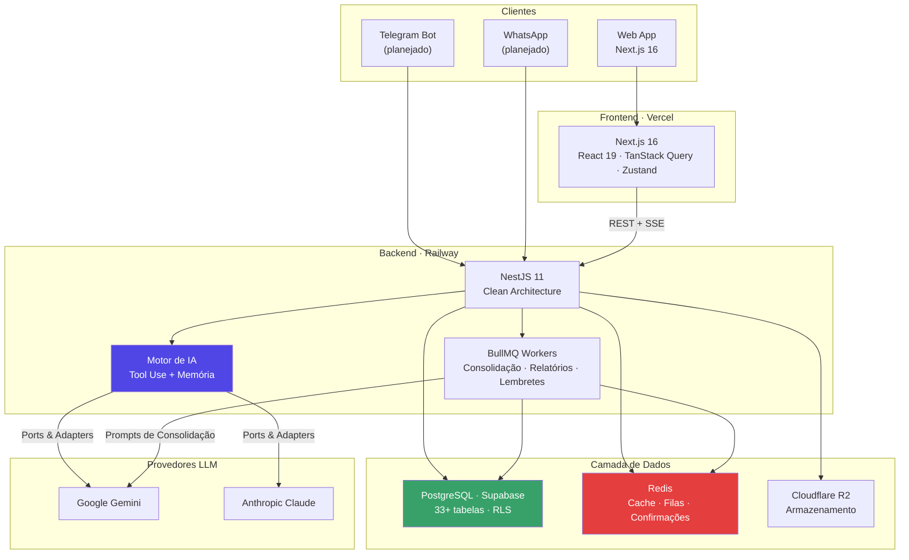
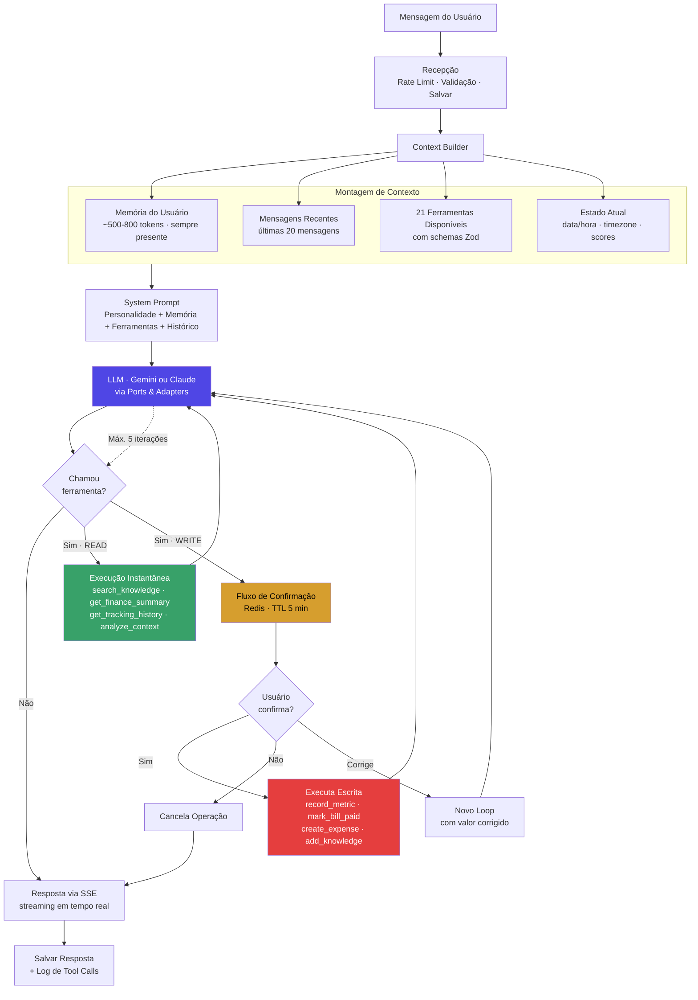
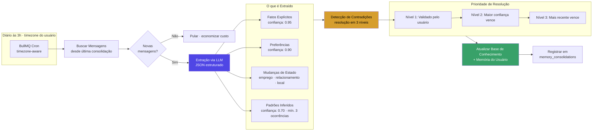
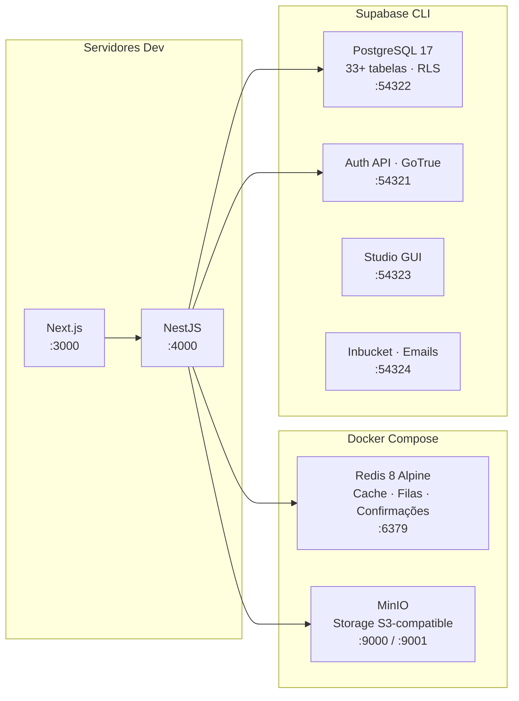
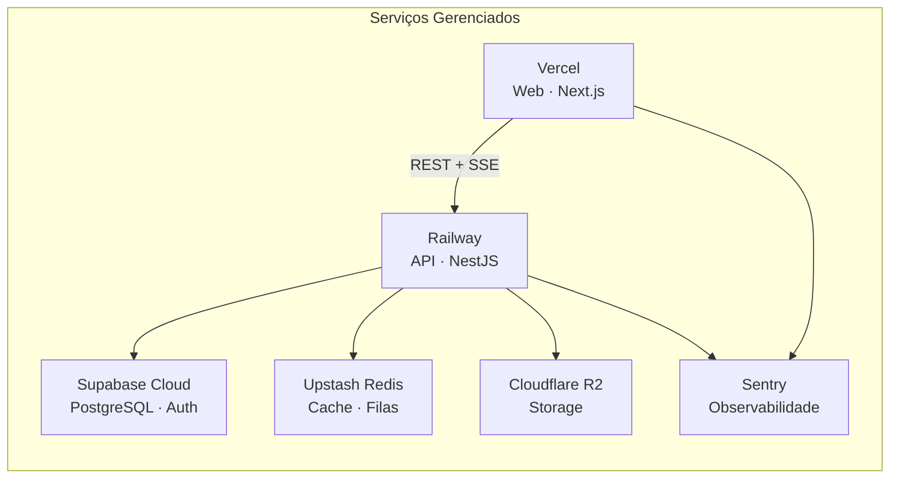

# Life Assistant AI

[](https://github.com/oeduardop1/life-assistant/actions/workflows/ci.yml)
[](https://github.com/oeduardop1/life-assistant/actions/workflows/deploy-web.yml)
[](https://github.com/oeduardop1/life-assistant/actions/workflows/deploy-api.yml)

> Plataforma SaaS com IA integrada que funciona como memória pessoal, conselheira, assistente e tracker de evolução.

`21 ferramentas de IA` | `33+ tabelas com RLS` | `14 ADRs` | `2.000+ testes` | `42 specs de documentação`

**Para instruções de setup e desenvolvimento, veja [DEVELOPMENT.md](DEVELOPMENT.md).**

---

## O Problema

As pessoas não possuem um sistema unificado que realmente as conheça.

- **Dados de vida fragmentados** — saúde, finanças, hábitos e metas espalhados em 10+ apps sem nenhuma visão cruzada entre domínios.
- **IA sem memória** — cada conversa com IA recomeça do zero. Nenhum assistente retém conhecimento de longo prazo sobre o usuário.
- **Padrões invisíveis** — correlações entre sono, gastos, humor e produtividade passam completamente despercebidas.
- **Decisões sem contexto** — decisões importantes da vida são tomadas sem referência histórica, levando a erros repetidos.
- **Sem base de conhecimento pessoal** — fatos, preferências e eventos de vida não ficam armazenados em lugar nenhum acessível ou pesquisável.

## A Solução

O Life Assistant AI consolida todas as dimensões da vida do usuário em uma plataforma inteligente.

| Funcionalidade | Descrição |
|----------------|-----------|
| **Memória Persistente** | A IA acumula conhecimento ao longo das conversas com score de confiança por item |
| **21 Ferramentas de IA** | Operações de leitura e escrita em finanças, saúde, hábitos, metas e mais |
| **Fluxo de Confirmação** | Operações de escrita exigem aprovação explícita do usuário (Redis TTL, nível de sistema) |
| **Consolidação de Memória** | Job noturno que extrai fatos, padrões e mudanças de estado automaticamente |
| **Inferência em Tempo Real** | Detecção de padrões e contradições sob demanda via ferramenta `analyze_context` |
| **Life Balance Score** | Score holístico de 0-10 com detalhamento por área da vida |
| **6 Áreas da Vida** | Saúde, finanças, profissional, aprendizado, espiritual, relacionamentos |
| **Suporte a Decisões** | Análise estruturada de prós e contras com contexto histórico completo |

### Como funciona na prática

```
Usuário: "Fui ao médico hoje, estou pesando 82.1kg"

→ IA detecta métrica (peso) e propõe registro
→ Sistema exibe confirmação: "Registrar peso: 82.1 kg?"
→ Usuário confirma
→ Dado salvo no tracking + IA armazena o fato na memória

Naquela noite (3h):
→ Job de consolidação extrai: "Usuário pesou 82.1kg em 08/02"
→ Detecta padrão: "Peso diminuindo nas últimas 3 semanas"
→ Atualiza memória persistente com score de confiança

Próxima conversa:
→ IA já sabe o peso atual, a tendência, e o contexto médico
```

---

## Arquitetura de IA

> **Diferencial principal:** Tool Use com memória persistente — não é RAG, não é fine-tuning. A LLM decide quais dados buscar, quando, e de qual domínio.

### Arquitetura Geral do Sistema



### Fluxo de Tool Use da IA

Este é o coração da plataforma. Cada mensagem do usuário passa por este pipeline:



### Pipeline de Consolidação de Memória

A cada noite, um job automático transforma conversas em conhecimento persistente:



---

## Destaques da Arquitetura

- **Clean Architecture em 4 camadas** — Apresentação / Aplicação / Domínio / Infraestrutura com separação rigorosa de responsabilidades
- **Monorepo com 6 pacotes** — `apps/web`, `apps/api`, `packages/ai`, `packages/database`, `packages/shared`, `packages/config`
- **LLM-agnóstico** — trocar entre Gemini e Claude mudando uma variável de ambiente, sem alterar código
- **Multi-tenant desde o dia 1** — Row Level Security (RLS) em todas as tabelas, `user_id` obrigatório no nível do banco de dados
- **14 Architecture Decision Records** — cada decisão arquitetural importante documentada com contexto, alternativas e justificativa
- **Conformidade LGPD** — direito ao esquecimento, portabilidade de dados, registro de consentimento

```
life-assistant/
├── apps/
│   ├── web/                  # Next.js 16 · React 19 · Tailwind v4 · shadcn/ui
│   └── api/                  # NestJS 11 · Clean Architecture · BullMQ
├── packages/
│   ├── ai/                   # Abstração LLM · Adaptadores Claude + Gemini · 21 ferramentas
│   ├── database/             # Drizzle ORM · Schemas · Migrations · RLS
│   ├── config/               # Validação de ENV com Zod
│   └── shared/               # Tipos · Enums · Utilitários
├── docs/
│   ├── adr/                  # 14 Architecture Decision Records
│   ├── specs/                # 42 specs (core + domínios + integrações)
│   └── milestones/           # Roadmap e progresso
└── infra/docker/             # Docker Compose (Redis, MinIO)
```

---

## Infraestrutura Docker

O projeto possui Dockerfiles de produção multi-stage e scripts robustos para orquestração local.

### Desenvolvimento Local

O ambiente local combina Docker Compose (Redis + MinIO) com Supabase CLI (PostgreSQL + Auth + Studio):



Scripts de orquestração (`scripts/dev-start.sh` — ~1.000 linhas):
- Pre-flight checks (Docker, portas, Supabase CLI)
- Limpeza de containers zombie
- Inicialização de Docker Compose + Supabase
- Migrations automáticas (Drizzle ORM)
- Seed idempotente (`ON CONFLICT DO NOTHING`)
- Aplicação de políticas RLS
- Limpeza de imagens Docker antigas

```bash
pnpm infra:up              # Inicia tudo + migrations + seed
pnpm infra:up --clean      # Limpa containers zombie antes de iniciar
pnpm infra:down            # Para tudo, preserva dados
pnpm infra:down --reset -f # Reset completo, apaga todos os dados
```

### Produção — Dockerfiles Multi-Stage

Ambos os apps possuem Dockerfiles otimizados para produção com builds multi-stage:

| App | Base | Stages | Usuário | Health Check | Porta |
|-----|------|--------|---------|-------------|-------|
| **API** | `node:24-alpine` | 3 (deps → build → runner) | `nestjs` (uid 1001) | `wget /api/health` (30s) | 4000 |
| **Web** | `node:24-alpine` | 4 (base → deps → build → runner) | `nextjs` (uid 1001) | — | 3000 |

Características de segurança e otimização:
- **Usuários não-root** em ambos os containers
- **Build em ordem de dependência**: shared → config → database → ai → app
- **Next.js standalone mode** para footprint mínimo
- **Health checks** integrados no container da API

### Deploy em Produção



Setup automatizado via script interativo (`scripts/setup-production.sh` — ~1.000 linhas):

```bash
pnpm setup:prod            # Setup completo (Vercel + Railway + GitHub Secrets)
pnpm setup:prod --check    # Verificar status atual das variáveis
pnpm setup:prod --dry-run  # Preview sem executar mudanças
```

---

## Stack Tecnológica

| Camada | Tecnologia | Propósito |
|--------|-----------|-----------|
| **Frontend** | Next.js 16 + React 19 | App Router, Turbopack, SSR |
| **UI** | Tailwind v4 + shadcn/ui | Design system acessível, CSS-first |
| **Estado** | TanStack Query + Zustand | Estado servidor + estado local com persistência |
| **Backend** | NestJS 11 | Modular, injeção de dependência, enterprise-grade |
| **ORM** | Drizzle ORM | Type-safe, source of truth para migrações |
| **Banco de Dados** | PostgreSQL (Supabase) | RLS, Auth integrado, 33+ tabelas |
| **Cache/Filas** | Redis + BullMQ | Confirmações, jobs, rate limiting |
| **IA** | Camada de abstração própria | Adaptadores Claude + Gemini, 21 ferramentas com schemas Zod |
| **Autenticação** | Supabase Auth + jose | JWT, social login, RLS integrado |
| **Tempo Real** | Server-Sent Events (SSE) | Streaming de respostas da IA |
| **Infraestrutura** | Vercel + Railway + Supabase | Managed, auto-scaling |
| **Observabilidade** | Sentry + Axiom | Error tracking + logs estruturados |
| **Testes** | Vitest + Playwright | Unitários, integração, E2E |

---

## Status do Projeto

```
Fase 0: Fundação          ████████████████████  100%   (11 milestones)
Fase 1: IA Conselheira    ████████████████░░░░   80%   (8/10 milestones)
Fase 2: Life Tracker      ██████████████░░░░░░   70%   (3.5/5 milestones)
Fase 3: Assistente        ░░░░░░░░░░░░░░░░░░░░    0%   (planejado)
```

### Em Números

| Métrica | Valor |
|---------|-------|
| Tabelas no banco | 33+ com RLS em todas |
| Ferramentas de IA | 21 (13 leitura + 8 escrita) |
| Testes | 2.000+ (unitários + integração + E2E) |
| ADRs | 14 decisões arquiteturais documentadas |
| Documentação | 42 specs (12 core + 19 domínios + 11 integrações) |
| Entidades de schema | 28 arquivos de domínio |

### Domínios Implementados

| Domínio | Status | Descrição |
|---------|--------|-----------|
| **Chat & Memória** | Completo | Conversa com IA via SSE, memória persistente, consolidação noturna |
| **Tracking & Hábitos** | Completo | 7 tipos de métricas, streaks, calendário mensal, records pessoais |
| **Finanças** | Completo | Receitas, contas fixas, despesas variáveis, dívidas, investimentos, recorrência |
| **Metas** | Completo | Metas mensuráveis com milestones, progresso automático, 6 áreas da vida |
| **Configurações** | Completo | Perfil, email, senha com medidor de força |
| **Dashboard** | Em progresso | Life Balance Score, trends, relatórios |
| **Telegram Bot** | Planejado | Interação via mensageria |
| **Google Calendar** | Planejado | Sincronização de agenda |
| **Vault** | Planejado | Armazenamento criptografado (AES-256-GCM) |
| **Stripe Billing** | Planejado | Planos Free/Pro/Premium |

---

## Decisões Arquiteturais de IA

Cada decisão crítica da camada de IA está documentada em ADRs (Architecture Decision Records) com contexto, alternativas avaliadas e justificativa.

### ADR-012: Tool Use + Consolidação de Memória

> **Substituiu RAG por Tool Use.** RAG injetava chunks aleatórios por similaridade semântica — sem controle, alto custo de embeddings, contexto fragmentado. A nova abordagem: **a LLM decide quais dados buscar** via chamadas de ferramentas.

| Componente | Antes (RAG) | Depois (Tool Use) |
|------------|-------------|-------------------|
| pgvector | Obrigatório | **Removido** |
| LangChain.js | Obrigatório | **Removido** |
| Embeddings | A cada mensagem | Não utilizado |
| Contexto | Chunks por similaridade | Memória do usuário + ferramentas |
| Aprendizado | Manual | Automático (consolidação noturna) |

### ADR-014: Inferência em Tempo Real

> Estende ADR-012 com a ferramenta `analyze_context` para **detecção de padrões e contradições durante a conversa**. Ex: usuário menciona dívida em janeiro e insônia em fevereiro — a IA pode inferir correlação com ansiedade financeira.

Arquitetura em dois níveis:
- **Nível 1 (Batch):** Job às 3h extrai padrões com mín. 3 ocorrências e confiança >= 0.7
- **Nível 2 (Real-time):** Ferramenta `analyze_context` chamada sob demanda, sem persistência

### ADR-015: Tracking de Baixo Atrito

> **Captura conversacional com confirmação.** A IA detecta métricas mencionadas naturalmente ("fui ao médico, estou 82kg") e propõe registro. O sistema garante confirmação — não a IA (que poderia ignorá-la).

Princípios:
- **Detectar, não cobrar** — IA nunca pergunta "você registrou seu peso hoje?"
- **Oferecer, não insistir** — tom de sugestão, não obrigação
- **Confirmar, não assumir** — `requiresConfirmation: true` no nível do sistema
- **Score resiliente** — dados faltantes = score neutro (50), sem penalização

### ADR-016: Decisões via Knowledge Items

> **Não criou módulo dedicado de decisões.** Análise mostrou que `add_knowledge` + `search_knowledge` + Modo Conselheiro já cobrem 100% do caso de uso. Resultado: zero tabelas novas, zero ferramentas novas, zero jobs adicionais.

### Advanced Tool Use (Anthropic Beta)

O adaptador Claude utiliza o beta header `advanced-tool-use-2025-11-20` da Anthropic para suporte nativo a `input_examples` nas definições de ferramentas. Isso permite que o LLM receba exemplos concretos de uso de cada ferramenta, melhorando significativamente a precisão das chamadas.

```
Claude:  input_examples nativo (beta header advanced-tool-use-2025-11-20)
Gemini:  workaround via enrichDescriptionWithExamples() — exemplos inline na description
```

Cada uma das 21 ferramentas inclui exemplos de entrada que demonstram ao LLM exatamente como e quando chamá-las — reduzindo chamadas incorretas e melhorando a qualidade das respostas.

---

## Por que Esta Arquitetura Importa

### Não é RAG

Abordagens tradicionais de RAG recuperam chunks aleatórios por similaridade semântica. O Life Assistant usa **Tool Use**: a LLM decide quais dados buscar, quando, e de qual domínio. O resultado é contexto mais relevante a um custo menor — sem necessidade de computar embeddings por mensagem. pgvector e LangChain foram **removidos** em favor desta abordagem (ADR-012).

### Não é efêmera

Diferente do ChatGPT ou assistentes genéricos, **cada conversa enriquece uma base de conhecimento persistente**. A consolidação de memória extrai fatos toda noite com score de confiança. A IA genuinamente "conhece" o usuário ao longo do tempo — preferências, padrões, decisões passadas, mudanças de estado.

### Sem vendor lock-in

O padrão **Ports & Adapters** significa que trocar de Gemini para Claude (ou qualquer LLM futuro) requer mudar uma variável de ambiente. Zero alteração de código. A camada de abstração (`packages/ai/`) isola completamente a aplicação dos provedores. Funcionalidades específicas como Advanced Tool Use (Claude) ou Function Calling (Gemini) são tratadas internamente pelos adaptadores.

---

## Documentação

| Categoria | Documentos | Cobertura |
|-----------|-----------|-----------|
| Arquitetura Core | 12 specs | Stack, auth, API, erros, realtime, IA, observabilidade |
| Domínios | 19 specs | Finanças, tracking, metas, memória, chat e mais |
| Integrações | 11 specs | Supabase, Gemini, Telegram, Stripe, Calendar e mais |
| ADRs | 14 registros | Cada decisão arquitetural importante |
| Milestones | 4 arquivos de fase | Roadmap completo com tracking de tarefas |

Para instruções de setup, comandos e detalhes de infraestrutura, veja **[DEVELOPMENT.md](DEVELOPMENT.md)**.

---

## Licença

Projeto privado. Todos os direitos reservados.
