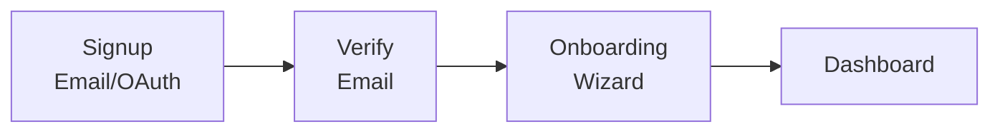
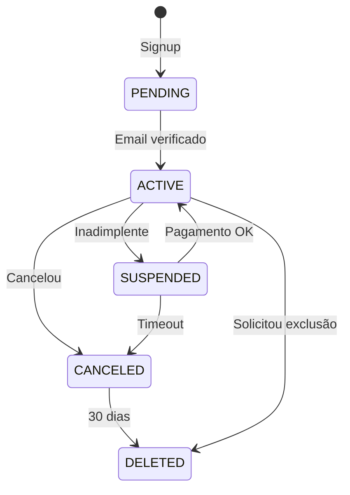
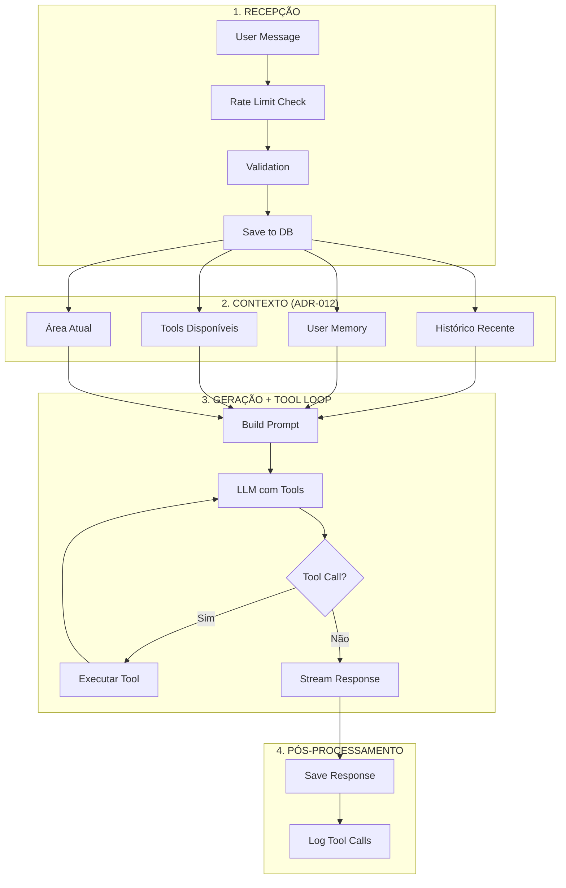

# SYSTEM_SPECS.md — Life Assistant AI
> **Documento normativo.** Define **regras de negócio, fluxos, estados e comportamentos** do sistema.  
> Para **O QUE** a aplicação faz (features), ver `PRODUCT_SPECS.md`.  
> Para **COMO** é construído tecnicamente, ver `ENGINEERING.md`.
>
> **Precedência (em caso de conflito):**
> 1. Escopo/features: `PRODUCT_SPECS.md`
> 2. Regras/fluxos/DoD: `SYSTEM_SPECS.md` ← este documento
> 3. Tech/infra: `ENGINEERING.md`
> 4. Modelo de dados: `DATA_MODEL.md`
> 5. IA/Prompts: `AI_SPECS.md`
> 6. Integrações: `INTEGRATIONS_SPECS.md`
>
> Pendências (TBD): `TBD_TRACKER.md`

---

## 1) Conceitos e Entidades (Modelo Mental)

### 1.1 User (Usuário)
O indivíduo que usa o sistema para gerenciar sua vida.
- **Configurações:**
  - timezone (America/Sao_Paulo padrão)
  - idioma (pt-BR padrão)
  - perspectiva cristã (opcional)
  - pesos das áreas da vida
- **Estados:** `PENDING` → `ACTIVE` → `SUSPENDED` / `CANCELED` / `DELETED`

### 1.2 Área da Vida (Life Area)
Dimensão do Life Balance Score.
- Saúde, Financeiro, Relacionamentos, Carreira, Crescimento Pessoal, Lazer, Espiritualidade, Saúde Mental
- Cada área tem peso configurável (0.0 a 2.0)
- Peso 0.0 = área ignorada no cálculo

### 1.3 Life Balance Score
Pontuação 0-100 que mede o equilíbrio geral da vida.
- Calculado diariamente (job noturno)
- Fórmula: `Σ (Area Score × Area Weight) / Σ Area Weight`
- Histórico: snapshot diário às 00:00 UTC

### 1.4 Tracking Entry
Registro de uma métrica (peso, gasto, exercício, humor, etc.).
- **Campos obrigatórios:** tipo, valor, data, user_id
- **Campos opcionais:** unidade, categoria, metadata, notas
- Eventos de tracking atualizam Area Scores em tempo real

### 1.5 Conversation (Conversa)
Sessão de chat com a IA.
- **Tipos:** `general`, `counselor`, `quick_action`, `report`
- Contém múltiplas mensagens (Message)
- Contexto mantido via histórico + User Memory + Tool Use (ADR-012)

### 1.6 Note (Nota)
Nota automática gerada pela IA.
- Markdown estruturado
- Tags automáticas
- Relacionada a conversas

### 1.7 Person (Pessoa)
Contato no CRM pessoal.
- Relacionamento, preferências, datas importantes
- Lembretes automáticos de contato
- Histórico de interações

### 1.8 Vault Item
Informação sensível criptografada.
- **Não acessível** pela IA sem re-autenticação
- Requer re-autenticação para acesso
- Tipos: credential, document, card, note, file

---

## 2) Defaults Normativos

> Valores padrão que governam o comportamento do sistema. Configuráveis pelo usuário quando indicado.

### 2.1 Sistema

| Configuração | Default | Configurável |
|--------------|---------|--------------|
| Timezone | `America/Sao_Paulo` | ✅ Sim |
| Idioma | `pt-BR` | ✅ Sim |
| Moeda | `BRL` | ✅ Sim |
| Perspectiva cristã | `false` | ✅ Sim |

### 2.2 Life Balance Score

| Configuração | Default | Configurável |
|--------------|---------|--------------|
| Peso Saúde | `1.0` | ✅ Sim (0.0-2.0) |
| Peso Financeiro | `1.0` | ✅ Sim (0.0-2.0) |
| Peso Relacionamentos | `1.0` | ✅ Sim (0.0-2.0) |
| Peso Carreira | `1.0` | ✅ Sim (0.0-2.0) |
| Peso Crescimento Pessoal | `0.8` | ✅ Sim (0.0-2.0) |
| Peso Lazer | `0.8` | ✅ Sim (0.0-2.0) |
| Peso Espiritualidade | `0.5` | ✅ Sim (0.0-2.0) |
| Peso Saúde Mental | `1.0` | ✅ Sim (0.0-2.0) |
| Frequência de cálculo | Diário (00:00 UTC) | ❌ Não |

### 2.3 Tracking

| Métrica | Meta Default | Configurável |
|---------|--------------|--------------|
| Água diária | `2000ml` | ✅ Sim |
| Sono diário | `8h` | ✅ Sim |
| Exercício semanal | `150min` | ✅ Sim |
| Budget mensal | Não definido | ✅ Sim |

### 2.4 Notificações

| Configuração | Default | Configurável |
|--------------|---------|--------------|
| Morning Summary | `07:00` (timezone usuário) | ✅ Sim |
| Weekly Report | Domingo `20:00` | ✅ Sim |
| Quiet Hours início | `22:00` | ✅ Sim |
| Quiet Hours fim | `08:00` | ✅ Sim |

### 2.5 Retenção de Dados

| Entidade | Soft Delete | Retenção | Hard Delete |
|----------|-------------|----------|-------------|
| User | Sim | 30 dias | Após retenção |
| Conversation | Sim | 90 dias | Após retenção |
| Message | Não | Com conversation | Imediato |
| Note | Sim (Lixeira) | 30 dias | Após retenção ou manual |
| Tracking Entry | Não | - | Imediato |
| Person | Sim | 30 dias | Após retenção |
| Vault Item | Não | - | Imediato |

### 2.6 Rate Limits

| Plano | Msg/minuto | Msg/hora | Msg/dia |
|-------|------------|----------|---------|
| Free | 5 | 30 | 20 |
| Pro | 10 | 100 | 100 |
| Premium | 20 | Ilimitado | Ilimitado |

### 2.7 Limites de Armazenamento

| Recurso | Free | Pro | Premium |
|---------|------|-----|---------|
| Mensagens IA/dia | 20 | 100 | Ilimitado |
| Tracking entries/mês | 100 | 1.000 | Ilimitado |
| Notas | 50 | 500 | Ilimitado |
| Pessoas (CRM) | 20 | 200 | Ilimitado |
| Storage (arquivos) | 100MB | 1GB | 10GB |
| Histórico conversas | 30 dias | 1 ano | Ilimitado |

---

## 3) Módulos e Fluxos

### 3.1 Autenticação e Onboarding

**O que é:** Sistema de cadastro, login e configuração inicial do usuário.

#### Fluxo de Cadastro



#### Etapas do Onboarding

| Etapa | Campos | Obrigatório |
|-------|--------|-------------|
| 1. Perfil | Nome, Timezone | ✅ Sim |
| 2. Áreas de foco | Selecionar 3-8 áreas | ✅ Sim |
| 3. Telegram | Conectar bot | ❌ Não |
| 4. Tutorial | Tour interativo | ❌ Skip permitido |

#### Onboarding Abandonado

Quando um usuário inicia o onboarding mas não o completa:

| Regra | Comportamento |
|-------|---------------|
| Dados parciais | Salvos automaticamente a cada etapa |
| Expiração | **30 dias** após início do onboarding |
| Após expiração | Dados parciais deletados, usuário reinicia do zero |
| Login sem completar | Redireciona para etapa onde parou |

**Notificações de lembrete:**
- Dia 3: "Complete seu cadastro para começar a usar o app!"
- Dia 7: "Falta pouco! Termine o cadastro."
- Dia 14: "Seus dados expiram em 16 dias. Complete agora!"
- Dia 25: "Última chance! Seus dados serão removidos em 5 dias."

#### Estados do Usuário



#### Critérios de Aceite

- [ ] Signup com email/senha funciona
- [ ] Signup com Google OAuth funciona
- [ ] Verificação de email enviada e validada
- [ ] Onboarding wizard completo com todas etapas
- [ ] Usuário só acessa app após etapas obrigatórias
- [ ] Progresso do onboarding salvo automaticamente
- [ ] Login/logout funcionando
- [ ] Recuperação de senha funcional

---

### 3.2 Chat e IA

**O que é:** Interface de conversação com a IA assistente.

#### Tipos de Conversa

| Tipo | Descrição | Persistência |
|------|-----------|--------------|
| `general` | Chat livre | ✅ Sim |
| `counselor` | Modo conselheira (reflexão profunda) | ✅ Sim |
| `quick_action` | Ação rápida (ex: registrar peso) | ❌ Não |
| `report` | Discussão sobre relatório | ✅ Sim |

#### Fluxo de Mensagem



#### Regras de Rate Limit

- Ao atingir limite: resposta amigável informando
- Cooldown de 1 minuto antes de nova tentativa
- Sugestão de upgrade para Free/Pro

#### Critérios de Aceite

- [ ] Enviar mensagem e receber resposta da IA
- [ ] Streaming de resposta funcionando
- [ ] Histórico de conversa mantido
- [ ] User Memory presente no contexto
- [ ] Tool calls executando corretamente
- [ ] Rate limit aplicado corretamente
- [ ] Diferentes tipos de conversa funcionando

---

### 3.3 Tracking

**O que é:** Sistema de registro de métricas pessoais.

#### Tipos de Tracking

```typescript
enum TrackingType {
  // Saúde
  WEIGHT = 'weight',
  WATER = 'water',
  SLEEP = 'sleep',
  EXERCISE = 'exercise',
  MEAL = 'meal',
  MEDICATION = 'medication',
  
  // Financeiro
  EXPENSE = 'expense',
  INCOME = 'income',
  INVESTMENT = 'investment',
  
  // Hábitos
  HABIT = 'habit',
  
  // Humor
  MOOD = 'mood',
  ENERGY = 'energy',
  
  // Custom
  CUSTOM = 'custom',
}
```

#### Regras de Validação

| Tipo | Campo | Validação |
|------|-------|-----------|
| **weight** | value | `0 < value ≤ 500` (kg) |
| **weight** | date | `≤ now` (não pode ser futuro) |
| **water** | value | `0 < value ≤ 10000` (ml) |
| **expense** | value | `value > 0` |
| **expense** | category | Enum válido |
| **exercise** | duration | `0 < duration ≤ 1440` (min) |
| **exercise** | intensity | `low \| medium \| high` |
| **sleep** | duration | `0 < duration ≤ 24` (hours) |
| **sleep** | quality | `1-10` |
| **mood** | value | `1-10` |
| **energy** | value | `1-10` |

#### Categorias de Despesa

```typescript
enum ExpenseCategory {
  FOOD = 'food',                   // Alimentação
  TRANSPORT = 'transport',         // Transporte
  HOUSING = 'housing',             // Moradia
  HEALTH = 'health',               // Saúde
  EDUCATION = 'education',         // Educação
  ENTERTAINMENT = 'entertainment', // Entretenimento
  SHOPPING = 'shopping',           // Compras
  BILLS = 'bills',                 // Contas
  SUBSCRIPTIONS = 'subscriptions', // Assinaturas
  TRAVEL = 'travel',               // Viagens
  GIFTS = 'gifts',                 // Presentes
  INVESTMENTS = 'investments',     // Investimentos
  OTHER = 'other',                 // Outros
}
```

#### Agregações Calculadas

| Métrica | Cálculo | Período |
|---------|---------|---------|
| Peso médio | `AVG(weight)` | 7 dias |
| Variação peso | `(atual - anterior) / anterior × 100` | Semanal |
| Água diária | `SUM(water)` | Dia |
| Gasto total | `SUM(expense)` | Mês |
| Gasto por categoria | `SUM(expense) GROUP BY category` | Mês |
| Exercício semanal | `SUM(duration)` | Semana |
| Sono médio | `AVG(duration)` | 7 dias |
| Humor médio | `AVG(mood)` | 7 dias |

#### Critérios de Aceite

- [ ] Registrar peso via chat e formulário
- [ ] Registrar água via chat e formulário
- [ ] Registrar gasto com categoria
- [ ] Registrar exercício com tipo e duração
- [ ] Registrar sono com qualidade
- [ ] Registrar humor/energia
- [ ] Visualizar histórico de cada métrica
- [ ] Gráficos de evolução
- [ ] Comparativo com período anterior
- [ ] Validações aplicadas corretamente
- [ ] Atualização do Area Score em tempo real

---

### 3.4 Life Balance Score

**O que é:** Sistema de pontuação que mede o equilíbrio entre as áreas da vida.

#### Fórmula Geral

```
Life Balance Score = Σ (Area Score × Area Weight) / Σ Area Weight
```

#### Cálculo por Área

##### Saúde (health)

| Componente | Peso | Cálculo |
|------------|------|---------|
| Peso | 20% | Baseado no IMC (ver fórmula abaixo) |
| Exercício | 30% | `(min_semana / meta_min) × 100`, max 100 |
| Sono | 25% | `(horas_media / meta_horas) × 100`, ajustado por qualidade |
| Água | 15% | `(ml_diario / meta_ml) × 100`, max 100 |
| Alimentação | 10% | Baseado em registros de refeições (ver abaixo) |

**Cálculo do componente Peso (IMC):**
```
IMC = peso(kg) / altura(m)²

- IMC 18.5-24.9 (ideal): score = 100
- IMC < 18.5 (abaixo): score = 100 - ((18.5 - IMC) × 10), mín 0
- IMC 25-29.9 (sobrepeso): score = 100 - ((IMC - 24.9) × 8), mín 50
- IMC ≥ 30 (obesidade): score = 50 - ((IMC - 30) × 5), mín 0

Se altura não cadastrada: score = 50 (neutro, solicitar preenchimento)
```

**Cálculo do componente Alimentação:**
```
Se há registros de refeições nos últimos 7 dias:
  score = (dias_com_registro / 7) × 100

Se não há registros:
  score = 50 (neutro)
```

**Nota:** Não há diferenciação entre cardio/strength no cálculo de exercício - apenas o total de minutos é considerado.

##### Financeiro (financial)

| Componente | Peso | Cálculo |
|------------|------|---------|
| Budget | 40% | `100 - (gastos_mes / budget_mes × 100)`, min 0 |
| Savings | 30% | `(poupança_mes / meta_poupança) × 100` |
| Debt | 20% | `100 - (dívida / renda_mes × 100)`, min 0 |
| Investments | 10% | Presença de investimentos regulares |

##### Relacionamentos (relationships)

| Componente | Peso | Cálculo |
|------------|------|---------|
| Interações | 50% | Frequência de contato com pessoas importantes |
| Qualidade | 50% | Autoavaliação periódica |

**Comportamento quando não há pessoas cadastradas:**
```
Se usuário não tem pessoas cadastradas no CRM:
  score = 100 (assume relacionamentos saudáveis fora do sistema)

Mensagem: "Cadastre pessoas importantes para acompanhar relacionamentos"
```

##### Carreira (career)

| Componente | Peso | Cálculo |
|------------|------|---------|
| Satisfação | 50% | Autoavaliação periódica |
| Progresso | 30% | Metas de carreira atingidas |
| Work-life | 20% | Horas trabalhadas vs ideal |

##### Saúde Mental (mental_health)

| Componente | Peso | Cálculo |
|------------|------|---------|
| Humor | 40% | Média dos últimos 7 dias |
| Energia | 30% | Média dos últimos 7 dias |
| Stress | 30% | Inverso do nível reportado |

#### Frequência de Atualização

| Score | Frequência | Trigger |
|-------|------------|---------|
| Area Score | Tempo real | Novo tracking entry |
| Life Balance Score | Diário | Job às 00:00 UTC |
| Histórico | Diário | Snapshot às 00:00 UTC |

#### Comportamento com Dados Insuficientes

Quando não há dados suficientes para calcular um componente ou área:

| Situação | Comportamento |
|----------|---------------|
| Componente sem dados | Retorna **50** (neutro) e exibe aviso |
| Área inteira sem dados | Retorna **50** para a área |
| Menos de 7 dias de dados | Calcula com dados disponíveis + aviso |
| Usuário novo (< 3 dias) | Não calcula Life Balance, mostra onboarding |

**Mensagens de aviso:**
- "Dados insuficientes para cálculo preciso. Continue registrando!"
- "Área [X] sem dados suficientes - registre para melhorar a precisão"

#### Critérios de Aceite

- [ ] Life Balance Score calculado corretamente
- [ ] Cada Area Score calculado com componentes
- [ ] Pesos configuráveis pelo usuário
- [ ] Histórico de scores armazenado
- [ ] Gráfico de evolução no dashboard
- [ ] Atualização em tempo real ao registrar tracking
- [ ] Comparativo com semana/mês anterior

---

### 3.5 Memória (Knowledge Items) — ADR-012

**O que é:** Sistema de conhecimento gerenciado automaticamente pela IA.

> **Arquitetura:** Tool Use + Memory Consolidation (ver ADR-012)

#### Estrutura de um Knowledge Item

```typescript
interface KnowledgeItem {
  id: string;
  userId: string;

  // Classificação
  type: 'fact' | 'preference' | 'memory' | 'insight' | 'person';
  area?: LifeArea;  // health, financial, career, etc.

  // Conteúdo
  title?: string;
  content: string;

  // Rastreabilidade
  source: 'conversation' | 'user_input' | 'ai_inference';
  sourceRef?: string;       // conversation_id ou message_id
  inferenceEvidence?: string;

  // Confiança
  confidence: number;       // 0.0 - 1.0
  validatedByUser: boolean;

  // Relacionamentos
  relatedItems: string[];
  tags: string[];

  createdAt: Date;
  updatedAt: Date;
  deletedAt?: Date;         // Soft delete
}
```

#### Tipos de Conhecimento

| Tipo | Descrição | Exemplo |
|------|-----------|---------|
| `fact` | Informação objetiva | "Mora em São Paulo" |
| `preference` | Escolha pessoal | "Prefere reuniões pela manhã" |
| `memory` | Evento significativo | "Casou em 15/03/2018" |
| `insight` | Padrão inferido | "Gasta mais quando estressado" |
| `person` | Sobre alguém importante | "João é sócio desde 2020" |

#### Níveis de Confiança

| Confiança | Range | Exibição |
|-----------|-------|----------|
| Alta | >= 0.8 | ✓ Verde |
| Média | 0.6 - 0.79 | ○ Amarelo |
| Baixa | < 0.6 | ? Vermelho |

#### Ações do Usuário

| Ação | Comportamento |
|------|---------------|
| **Validar** | Marca `validatedByUser: true`, aumenta confidence |
| **Corrigir** | Atualiza conteúdo, marca `source: 'user_input'` |
| **Deletar** | Soft delete, item não aparece mais em buscas |
| **Ver fonte** | Link para conversa original (se aplicável) |

#### Critérios de Aceite

- [ ] Lista de knowledge_items por área funciona
- [ ] Filtros por tipo, confiança, fonte funcionam
- [ ] Busca por texto funciona
- [ ] Validar item atualiza flag
- [ ] Corrigir item atualiza conteúdo
- [ ] Deletar item remove da visualização
- [ ] Ver fonte navega para conversa original

---

### 3.6 Pessoas (CRM)

**O que é:** Gerenciamento de relacionamentos pessoais.

#### Estrutura de uma Pessoa

```typescript
interface Person {
  id: string;
  userId: string;
  
  name: string;
  nickname?: string;
  relationship: 'family' | 'friend' | 'work' | 'acquaintance' | 'romantic' | 'mentor' | 'other';
  
  // Contato
  email?: string;
  phone?: string;
  
  // Datas importantes
  birthday?: Date;
  anniversary?: Date;
  
  // Preferências
  interests: string[];
  dislikes: string[];
  giftIdeas: string[];
  dietaryRestrictions: string[];
  
  // Frequência de contato
  lastContact?: Date;
  contactFrequencyDays?: number;  // Meta
  
  // Organização
  tags: string[];
  notes: string;
  linkedNotes: string[];  // IDs de notas
  
  isArchived: boolean;
  createdAt: Date;
  updatedAt: Date;
}
```

#### Lembretes Automáticos

| Tipo | Antecedência | Frequência |
|------|--------------|------------|
| Aniversário | 7 dias + 1 dia | Anual |
| Aniversário relacionamento | 7 dias + 1 dia | Anual |
| Tempo sem contato | Quando exceder meta | Contínuo |

#### Critérios de Aceite

- [ ] CRUD de pessoas
- [ ] Registrar relacionamento e preferências
- [ ] Lembrete de aniversário funcional
- [ ] Lembrete de tempo sem contato
- [ ] Registrar interações
- [ ] Vincular notas a pessoas
- [ ] Busca por nome/tag
- [ ] IA sugere presentes baseado em preferências

---

### 3.7 Vault (Informações Sensíveis)

**O que é:** Área segura para informações sensíveis.

#### Regras de Segurança

| Regra | Descrição |
|-------|-----------|
| Criptografia | AES-256-GCM em repouso (ver detalhes abaixo) |
| Acesso | Requer re-autenticação |
| Timeout | Sessão expira em 5 min de inatividade |
| IA | **NÃO** acessível via tools sem re-autenticação |
| Export | Requer confirmação adicional |
| Audit | Acesso logado em audit log |

#### Especificação de Criptografia do Vault

| Componente | Especificação |
|------------|---------------|
| **Algoritmo** | AES-256-GCM (Galois/Counter Mode) |
| **IV (Initialization Vector)** | 12 bytes aleatórios, único por item, armazenado junto ao ciphertext |
| **KDF (Key Derivation)** | Argon2id para derivar chave a partir da senha do usuário |
| **Parâmetros Argon2id** | memory: 64MB, iterations: 3, parallelism: 4 |
| **Salt** | 16 bytes aleatórios, único por usuário |
| **Gerenciamento de chaves** | Supabase Vault ou AWS KMS (produção) |
| **Rotação de chaves** | Anual ou sob demanda (ex: suspeita de comprometimento) |

**Estrutura do dado criptografado:**
```
[salt (16 bytes)][iv (12 bytes)][ciphertext][auth_tag (16 bytes)]
```

**Processo de criptografia:**
1. Derivar chave AES a partir da senha do usuário usando Argon2id
2. Gerar IV aleatório de 12 bytes
3. Criptografar dados com AES-256-GCM
4. Concatenar: salt + iv + ciphertext + auth_tag
5. Armazenar no campo `encrypted_data` (bytea)

#### Tipos de Item

| Tipo | Campos |
|------|--------|
| `credential` | Site, username, password, notes |
| `document` | Tipo, número, validade, arquivo |
| `card` | Tipo, número, validade, CVV |
| `note` | Título, conteúdo criptografado |
| `file` | Nome, tipo, arquivo criptografado |

#### Categorias

```typescript
enum VaultCategory {
  PERSONAL = 'personal',     // Documentos pessoais
  FINANCIAL = 'financial',   // Bancos, cartões
  WORK = 'work',             // Credenciais de trabalho
  HEALTH = 'health',         // Informações médicas
  LEGAL = 'legal',           // Contratos, documentos legais
  OTHER = 'other',
}
```

#### Critérios de Aceite

- [ ] Criar itens de cada tipo
- [ ] Re-autenticação ao acessar vault
- [ ] Timeout de sessão funcionando
- [ ] Dados criptografados no banco
- [ ] Vault NÃO acessível via tools de IA
- [ ] Audit log de acessos
- [ ] Export com confirmação adicional

---

### 3.8 Metas e Hábitos

**O que é:** Sistema de definição e acompanhamento de metas e hábitos.

#### Estrutura de Meta

```typescript
interface Goal {
  id: string;
  userId: string;
  
  title: string;
  description?: string;
  area: LifeArea;
  
  // Target
  targetValue: number;
  currentValue: number;
  unit: string;
  
  // Prazo
  startDate: Date;
  endDate: Date;
  
  // Progresso
  milestones: { title: string; targetValue: number; completed: boolean }[];
  
  status: 'not_started' | 'in_progress' | 'completed' | 'failed' | 'canceled';
  
  createdAt: Date;
  updatedAt: Date;
}
```

#### Estrutura de Hábito

```typescript
interface Habit {
  id: string;
  userId: string;
  
  title: string;
  description?: string;
  area: LifeArea;
  
  // Frequência
  frequency: 'daily' | 'weekly' | 'custom';
  daysOfWeek?: number[];     // [0-6] se weekly
  timesPerPeriod?: number;
  
  // Tracking
  currentStreak: number;
  longestStreak: number;
  totalCompletions: number;
  
  // Reminder
  reminderTime?: string;     // "09:00"
  reminderEnabled: boolean;
  
  isActive: boolean;
  createdAt: Date;
  updatedAt: Date;
}
```

#### Regras de Streak

| Regra | Descrição |
|-------|-----------|
| Daily | Dias consecutivos completados |
| Weekly | Semanas consecutivas com meta atingida |
| Grace period | 1 dia de atraso não quebra streak |
| Freeze | Usuário pode "congelar" (max 3/mês) |

#### Critérios de Aceite

- [ ] CRUD de metas com milestones
- [ ] CRUD de hábitos
- [ ] Marcar hábito como completo
- [ ] Cálculo de streak correto
- [ ] Grace period funcionando
- [ ] Freeze de streak
- [ ] Lembretes de hábito
- [ ] Progresso de meta atualizado
- [ ] Visualização de histórico

---

### 3.9 Relatórios

**O que é:** Sistema de geração de relatórios periódicos.

#### Morning Summary (Resumo da Manhã)

**Horário:** Configurável (default 07:00 timezone usuário)

**Distribuição de envio:**
Para evitar picos de carga, o envio é distribuído em uma janela de 20 minutos:
- Usuário configura 07:00 → envio entre **06:50 e 07:10**
- Distribuição aleatória dentro da janela
- Cada usuário mantém seu horário relativo consistente entre dias

**Conteúdo:**
```
# Bom dia, [Nome]! ☀️

## Hoje
- 📅 3 eventos no calendário
- ✅ 2 tarefas pendentes
- 🎂 Aniversário do João

## Ontem
- Peso: 82.3kg (↓0.2kg)
- Exercício: 45min corrida
- Gastos: R$ 127,00

## Esta semana
- Life Balance: 72/100 (↑3)
- Streak meditação: 5 dias 🔥

## Sugestão do dia
Que tal uma caminhada de 20min?
```

#### Weekly Report (Relatório Semanal)

**Horário:** Domingo 20:00 (timezone usuário)

**Conteúdo:**
- Life Balance Score com variação
- Score por área com variação
- Destaques (metas atingidas, streaks)
- Alertas (gastos acima, etc.)
- Tendências (gráfico 4 semanas)
- Insights baseados em dados
- Sugestões para próxima semana

#### Monthly Report (Relatório Mensal)

**Horário:** Dia 1 do mês, 10:00

**Conteúdo adicional:**
- Comparativo com mês anterior
- Progresso em metas de longo prazo
- Análise de padrões mensais
- Sugestões para o próximo mês

#### Critérios de Aceite

- [ ] Morning summary gerado e enviado
- [ ] Weekly report gerado e enviado
- [ ] Monthly report gerado e enviado
- [ ] Horários configuráveis
- [ ] Envio via Telegram funcional
- [ ] Envio via email funcional
- [ ] Conteúdo personalizado por usuário
- [ ] Opt-out por tipo de relatório

---

### 3.10 Notificações

**O que é:** Sistema de alertas e lembretes.

#### Tipos de Notificação

| Tipo | Canal | Prioridade |
|------|-------|------------|
| `reminder` | Push, Telegram | Alta |
| `alert` | Push, Telegram | Alta |
| `report` | Telegram, Email | Média |
| `insight` | Push | Baixa |
| `milestone` | Push, Telegram | Média |
| `social` | Push | Baixa |

#### Canais

| Canal | Uso |
|-------|-----|
| **Push (Web)** | Notificações instantâneas |
| **Telegram** | Relatórios, alertas |
| **Email** | Relatórios semanais, recuperação |
| **In-app** | Todas as notificações |

#### Regras de Quiet Hours

| Regra | Descrição |
|-------|-----------|
| Urgente | Passa durante quiet hours |
| Normal | Enfileirada, enviada após quiet hours |
| Urgente = | Alertas de segurança, lembretes críticos |

#### Critérios de Aceite

- [ ] Notificações push funcionando
- [ ] Envio via Telegram
- [ ] Envio via email
- [ ] Quiet hours respeitado
- [ ] Preferências por tipo configuráveis
- [ ] Opt-out total funcional

---

## 4) Comportamentos de UX (Estados Obrigatórios)

### 4.1 Empty States

| Contexto | Mensagem | CTA |
|----------|----------|-----|
| Sem tracking | "Comece a registrar seu dia!" | "Registrar primeiro peso" |
| Sem memória | "A IA ainda está aprendendo sobre você" | "Iniciar conversa" |
| Sem pessoas | "Adicione pessoas importantes" | "Adicionar pessoa" |
| Sem conversas | "Converse com sua assistente" | "Iniciar conversa" |
| Sem pendências | "Tudo em dia!" | - |

### 4.2 Loading States

| Contexto | Indicador |
|----------|-----------|
| Chat respondendo | Typing indicator + streaming |
| Gerando análise | Progress bar + "Analisando..." |
| Salvando dados | Spinner discreto |
| Carregando lista | Skeleton loading |
| Gerando relatório | Progress + "Gerando relatório..." |

### 4.3 Error States

| Erro | Mensagem | Ação |
|------|----------|------|
| Rede | "Sem conexão. Verifique sua internet." | Retry |
| Servidor | "Algo deu errado. Tente novamente." | Retry |
| Validação | "[Campo] inválido: [motivo específico]" | Corrigir campo |
| Rate limit | "Limite atingido. Aguarde 1 minuto." | Aguardar |
| Auth | "Sessão expirada. Faça login novamente." | Login |
| Permissão | "Você não tem permissão para isso." | - |
| Not found | "Item não encontrado ou foi removido." | Voltar |

### 4.4 Partial Data

| Contexto | Indicador |
|----------|-----------|
| Score incompleto | Banner: "Dados insuficientes para cálculo preciso" |
| Área sem dados | Ícone ⚠️ + "Sem dados suficientes" |
| Histórico limitado | "Mostrando últimos 30 dias" |

### 4.5 Success States

| Ação | Feedback |
|------|----------|
| Tracking salvo | Toast: "Peso registrado! 82.5kg" |
| Nota criada | Toast: "Nota criada" |
| Configuração salva | Toast: "Preferências atualizadas" |

### 4.6 Confirmations

| Ação | Confirmação |
|------|-------------|
| Deletar nota | Modal: "Tem certeza? A nota irá para a lixeira." |
| Deletar vault item | Modal: "Ação irreversível. Confirmar exclusão?" |
| Deletar conta | Modal + redigitar email para confirmar |

---

## 5) Regras Funcionais (Minuciosas)

### 5.1 Deduplicação

- Tracking entries: `user_id + type + date + value` (mesmo minuto)
- Notas: Título único por folder
- Pessoas: Email ou nome+relacionamento únicos

### 5.2 Edição Manual (Sempre Auditada)

Qualquer alteração manual em dados sensíveis exige:
- Registro do valor anterior
- Registro do novo valor
- Autor (userId)
- Timestamp
- Motivo (quando aplicável)

### 5.3 Cálculo de Life Balance Score

- Executado diariamente às 00:00 UTC
- Area Scores atualizados em tempo real a cada tracking
- Se dados insuficientes: área ignorada ou score parcial
- Histórico mantido por tempo indefinido

### 5.4 Sistema de Memória (ADR-012)

> **Arquitetura:** Tool Use + Memory Consolidation (não RAG tradicional).

**User Memory (sempre no contexto):**
- Dados compactos do usuário (~500-800 tokens)
- Nome, idade, localização, ocupação
- Objetivos e desafios atuais
- Preferências de comunicação
- Padrões aprendidos

**Knowledge Items (buscáveis via tools):**
- Fatos, preferências, insights sobre o usuário
- Confidence score (0.0 a 1.0)
- Source tracking (conversa, input, inferência)
- Buscáveis via tool `search_knowledge`

**Memory Consolidation (job 24h):**
- Extrai conhecimento de conversas
- Atualiza user_memories e knowledge_items
- Cria inferências com confidence >= 0.7
- Log em memory_consolidations

**NÃO acessível pela IA:**
- Vault (requer re-autenticação)
- Dados deletados

### 5.5 Timezone

- Armazenamento: Sempre UTC
- Exibição: Sempre no timezone do usuário
- Jobs agendados: Executados no timezone do usuário
- Relatórios: Gerados no timezone do usuário

### 5.6 Idioma

- IA responde no idioma da mensagem do usuário
- UI configurável nas preferências
- Relatórios no idioma configurado

---

## 6) Segurança e Privacidade

### 6.1 Princípios

| Princípio | Implementação |
|-----------|---------------|
| Privacidade por padrão | Todos os dados são privados |
| Usuário é dono dos dados | Export completo sempre disponível |
| Mínimo privilégio | Acessos limitados ao necessário |
| Defense in depth | Múltiplas camadas de proteção |

### 6.2 Autenticação

| Requisito | Implementação |
|-----------|---------------|
| Senhas | Mínimo 8 chars, hash bcrypt |
| OAuth | Google, Apple (futuro) |
| Sessões | JWT com refresh token |
| 2FA | TOTP opcional (futuro) |

### 6.3 Autorização

| Recurso | Regra |
|---------|-------|
| Dados do usuário | RLS por `user_id` |
| Vault | Re-autenticação + timeout 5min |
| Admin | Roles específicas |

### 6.4 Criptografia

| Dado | Método |
|------|--------|
| Senhas | bcrypt |
| Vault | AES-256 em repouso |
| Tráfego | TLS 1.3 |
| Backups | Criptografados |

### 6.5 Audit Log

**Ações auditadas:**
- Login, logout, password change
- Acesso ao Vault
- Export de dados
- Alterações em configurações
- Deleção de dados

**Estrutura:**
```typescript
interface AuditLog {
  id: string;
  userId: string;
  action: string;        // "vault.access"
  resource: string;      // "vault_item"
  resourceId?: string;
  metadata: object;
  ip: string;
  userAgent: string;
  createdAt: Date;
}
```

**Retenção:**
- Security logs: 2 anos
- Data logs: 1 ano
- General logs: 90 dias

### 6.6 Regras Invioláveis

- ❌ Nunca logar secrets (keys, tokens, senhas)
- ❌ Nunca expor stack traces ao usuário
- ❌ Nunca armazenar dados em cache como source of truth
- ❌ Nunca permitir query sem `user_id` em tabelas sensíveis
- ✅ Sempre validar input no backend
- ✅ Sempre usar prepared statements
- ✅ Sempre sanitizar output

### 6.7 LGPD / Compliance

#### Princípios de Privacidade

| Princípio | Implementação |
|-----------|---------------|
| Consentimento | Explícito no cadastro, armazenado com timestamp |
| Finalidade | Dados coletados apenas para funcionalidades do app |
| Minimização | Apenas dados necessários são coletados |
| Transparência | Usuário sabe quais dados são armazenados |

#### Consentimento

O consentimento é capturado e armazenado durante o cadastro:

```typescript
interface Consent {
  userId: string;
  termsAccepted: boolean;
  termsVersion: string;        // "1.0.0"
  privacyAccepted: boolean;
  privacyVersion: string;
  marketingOptIn: boolean;     // Opcional
  consentedAt: Date;
  ipAddress: string;
  userAgent: string;
}
```

#### Direito ao Esquecimento

| Etapa | Ação |
|-------|------|
| 1. Solicitação | Usuário solicita exclusão via configurações |
| 2. Confirmação | Re-autenticação + confirmação por email |
| 3. Soft Delete | Dados marcados como deletados imediatamente |
| 4. Período de Graça | **30 dias** para recuperação (usuário pode cancelar) |
| 5. Hard Delete | Após 30 dias, dados permanentemente removidos |
| 6. Confirmação | Email confirmando exclusão completa |

**Exceções ao hard delete:**
- Audit logs de segurança (mantidos por 5 anos, anonimizados)
- Dados necessários para compliance legal

#### Portabilidade de Dados (Export)

| Aspecto | Especificação |
|---------|---------------|
| Formato | **JSON estruturado** |
| Conteúdo | Todos os dados do usuário |
| Prazo | Disponível em até 72 horas |
| Validade | Link expira em 7 dias |
| Segurança | Download requer re-autenticação |

**Estrutura do export:**
```json
{
  "exportedAt": "2026-01-06T12:00:00Z",
  "user": { ... },
  "conversations": [ ... ],
  "trackingEntries": [ ... ],
  "notes": [ ... ],
  "people": [ ... ],
  "goals": [ ... ],
  "habits": [ ... ]
}
```

**Nota:** Vault items são exportados criptografados - usuário precisa da senha para descriptografar.

#### Retenção de Dados Diferenciada

| Tipo de dado | Retenção | Justificativa |
|--------------|----------|---------------|
| **Audit logs de segurança** | 5 anos | Compliance, investigações |
| **Logs operacionais** | 1 ano | Debug, suporte |
| **Logs de acesso geral** | 90 dias | Análise de uso |
| **Dados de usuário ativo** | Indefinido | Até solicitação de exclusão |
| **Dados de usuário deletado** | 30 dias (soft delete) | Período de recuperação |
| **Backups** | 90 dias | Disaster recovery |

#### Tabela de Solicitações (export_requests)

Todas as solicitações de export/exclusão são rastreadas:

| Campo | Tipo |
|-------|------|
| type | `full_data`, `partial_data`, `deletion_request` |
| status | `pending`, `processing`, `completed`, `failed`, `expired` |
| requestedAt | Timestamp da solicitação |
| completedAt | Timestamp da conclusão |
| fileUrl | URL assinada para download (expira em 7 dias) |

---

## 7) Integrações: Comportamento Esperado

### 7.1 Telegram Bot

**Comandos:**
```
/start     - Vincular conta
/peso X    - Registrar peso
/agua X    - Registrar água
/gasto X   - Registrar gasto
/humor X   - Registrar humor (1-10)
/sono X    - Registrar horas de sono
/nota X    - Criar nota rápida
/score     - Ver Life Balance Score
/help      - Lista de comandos
```

**Comportamento:**
- Texto livre → Conversa com IA
- Áudio → Transcrição + processamento
- Imagem → Análise pela IA (se suportado)
- Documento → Salvo no vault ou notas

### 7.2 Google Calendar

| Configuração | Valor |
|--------------|-------|
| Direção | Google → App (leitura) |
| Frequência | A cada 15 minutos |
| Horizonte | Próximos 30 dias |

**Uso:**
- Morning summary inclui eventos
- IA considera agenda em sugestões
- Conflitos detectados e alertados

### 7.3 WhatsApp (Futuro)

Comportamento similar ao Telegram.

---

## 8) Definition of Done (Por Módulo)

### 8.1 Autenticação

- [ ] Signup email/senha funciona
- [ ] Signup Google OAuth funciona
- [ ] Verificação de email
- [ ] Login/logout
- [ ] Recuperação de senha
- [ ] Onboarding wizard completo
- [ ] Estados do usuário funcionando

### 8.2 Chat e IA

- [ ] Enviar/receber mensagens
- [ ] Streaming de resposta
- [ ] Comandos reconhecidos
- [ ] Histórico mantido
- [ ] User Memory no contexto
- [ ] Tool calls funcionando
- [ ] Rate limit aplicado
- [ ] Tipos de conversa

### 8.3 Tracking

- [ ] Registrar cada tipo de métrica
- [ ] Validações aplicadas
- [ ] Histórico e gráficos
- [ ] Comparativos
- [ ] Atualização de Area Score

### 8.4 Life Balance Score

- [ ] Cálculo correto
- [ ] Pesos configuráveis
- [ ] Histórico armazenado
- [ ] Gráfico de evolução
- [ ] Comparativos

### 8.5 Memória (ADR-012)

- [ ] Lista de knowledge_items
- [ ] Filtros (área, tipo, confiança)
- [ ] Busca por texto
- [ ] Validar item
- [ ] Corrigir item
- [ ] Deletar item

### 8.6 Pessoas (CRM)

- [ ] CRUD completo
- [ ] Lembretes automáticos
- [ ] Registro de interações
- [ ] Vínculo com notas

### 8.7 Vault

- [ ] CRUD de itens
- [ ] Re-autenticação
- [ ] Timeout de sessão
- [ ] Criptografia
- [ ] Não acessível via tools de IA
- [ ] Audit log

### 8.8 Metas e Hábitos

- [ ] CRUD de metas
- [ ] CRUD de hábitos
- [ ] Streaks corretos
- [ ] Lembretes

### 8.9 Relatórios

- [ ] Morning summary
- [ ] Weekly report
- [ ] Monthly report
- [ ] Envio Telegram/email
- [ ] Configuração de horários

### 8.10 Notificações

- [ ] Push web
- [ ] Telegram
- [ ] Email
- [ ] Quiet hours
- [ ] Preferências

---

## 9) Glossário

| Termo | Definição |
|-------|-----------|
| **Area Score** | Pontuação 0-100 de uma área específica da vida |
| **Conversation** | Sessão de chat com a IA |
| **Grace Period** | Período de tolerância que não quebra streak |
| **Knowledge Item** | Fato, preferência ou insight armazenado sobre o usuário |
| **Life Balance Score** | Pontuação geral 0-100 do equilíbrio de vida |
| **Memory Consolidation** | Job que extrai conhecimento de conversas (24h) |
| **Message** | Mensagem individual em uma conversa |
| **Morning Summary** | Relatório diário enviado pela manhã |
| **Note** | Nota automática gerada pela IA |
| **Person** | Contato no CRM pessoal |
| **Proactive Check-in** | Mensagem iniciada pela IA |
| **Streak** | Sequência de dias/semanas cumprindo hábito |
| **Tool Call** | Chamada de função nativa da LLM |
| **Tracking Entry** | Registro de uma métrica |
| **User Memory** | Contexto compacto do usuário (~500-800 tokens) |
| **Vault** | Área segura para informações sensíveis |
| **Weekly Report** | Relatório semanal com análise |

---

*Última atualização: 15 Janeiro 2026*
*Revisão: Remoção do Sistema de Decisões*
