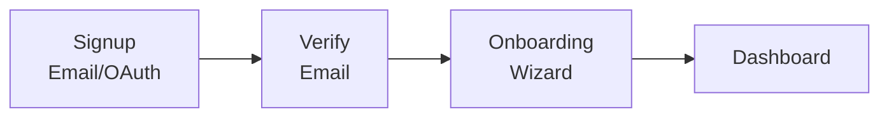
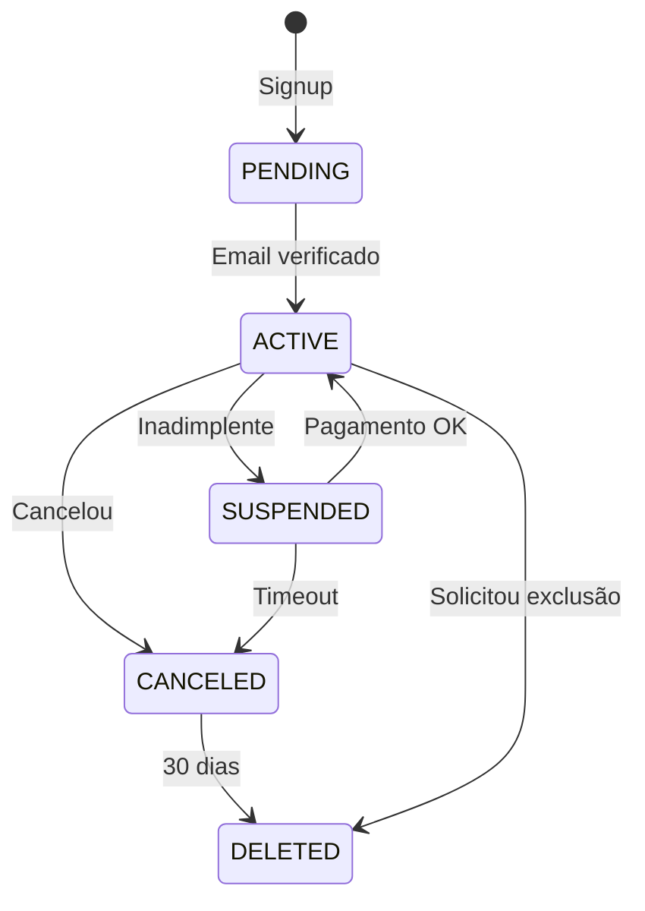

# Authentication & Security

> Authentication flows, authorization rules, encryption standards, and LGPD compliance.

---

## 1. Authentication Flow

### 1.1 Signup Flow



### 1.2 Onboarding Steps

| Etapa | Campos | Obrigatório |
|-------|--------|-------------|
| 1. Perfil | Nome, Timezone | ✅ Sim |
| 2. Áreas de foco | Selecionar 3-6 áreas (ADR-017) | ✅ Sim |
| 3. Telegram | Conectar bot | ❌ Não |
| 4. Tutorial | Tour interativo | ❌ Skip permitido |

### 1.3 Abandoned Onboarding

| Regra | Comportamento |
|-------|---------------|
| Dados parciais | Salvos automaticamente a cada etapa |
| Expiração | **30 dias** após início do onboarding |
| Após expiração | Dados parciais deletados, usuário reinicia do zero |
| Login sem completar | Redireciona para etapa onde parou |

**Notificações de lembrete:**
- Dia 3: "Complete seu cadastro para começar a usar o app!"
- Dia 7: "Falta pouco! Termine o cadastro."
- Dia 14: "Seus dados expiram em 16 dias. Complete agora!"
- Dia 25: "Última chance! Seus dados serão removidos em 5 dias."

### 1.4 User States



---

### 1.5 Onboarding Complete Flag

O campo `onboarding_complete` na tabela `users` controla se o usuário finalizou o wizard:

```typescript
// users table
onboarding_complete: boolean  // false até completar todas etapas obrigatórias
```

**Comportamento:**
- `false` → Redireciona para wizard de onboarding
- `true` → Acesso normal ao dashboard

### 1.6 System Defaults

| Configuração | Default | Configurável |
|--------------|---------|--------------|
| Timezone | `America/Sao_Paulo` | ✅ Sim |
| Idioma | `pt-BR` | ✅ Sim |
| Moeda | `BRL` | ✅ Sim |
| Perspectiva cristã | `false` | ✅ Sim |

### 1.7 Localization Rules

- Armazenamento: Sempre UTC
- Exibição: Sempre no timezone do usuário
- Jobs agendados: Executados no timezone do usuário
- Relatórios: Gerados no timezone do usuário
- IA responde no idioma da mensagem do usuário
- UI configurável nas preferências
- Relatórios no idioma configurado

---

## 2. Authentication Requirements

| Requisito | Implementação |
|-----------|---------------|
| Senhas | Mínimo 8 chars, hash bcrypt |
| OAuth | Google, Apple (futuro) |
| Magic Link | Email link (futuro) |
| Sessões | JWT com refresh token |
| 2FA | TOTP opcional (futuro) |

### 2.1 JWT Validation

The API validates Supabase JWTs using the `jose` library:

```typescript
// Validate Supabase JWT
import * as jose from 'jose';

const JWKS = jose.createRemoteJWKSet(
  new URL(`${SUPABASE_URL}/auth/v1/.well-known/jwks.json`)
);

const { payload } = await jose.jwtVerify(token, JWKS);
```

---

## 3. Multi-tenant & RLS

### 3.1 Rules

| Regra | Descrição |
|-------|-----------|
| `user_id` obrigatório | Toda tabela sensível tem `user_id` |
| RLS habilitado | Postgres Row Level Security em todas as tabelas |
| Context obrigatório | Toda query roda com `SET LOCAL app.user_id` |
| Proibido query sem escopo | Repositories exigem `userId` em todo método |

### 3.2 RLS Policy Examples

#### Supabase Native (Frontend/Direct Access)

Usa `auth.uid()` para queries diretas via Supabase client:

```sql
-- Habilitar RLS
ALTER TABLE tracking_entries ENABLE ROW LEVEL SECURITY;

-- Policy usando auth.uid() (Supabase nativo)
CREATE POLICY "Users can only access own data" ON tracking_entries
  FOR ALL USING (user_id = auth.uid());

-- Alternativa: auth.user_id() para compatibilidade
CREATE POLICY "Users can only access own data" ON users
  FOR ALL USING (id = (SELECT auth.user_id()));
```

#### API Backend (Session Variable)

Para queries via API NestJS, usamos session variable:

```sql
-- Policy usando session variable (API backend)
CREATE POLICY "Users can only access own data" ON tracking_entries
  FOR ALL USING (user_id = current_setting('app.user_id')::uuid);
```

### 3.3 Repository Pattern

```typescript
// Toda query DEVE ter userId
export interface TrackingRepositoryPort {
  save(userId: string, entry: TrackingEntry): Promise<void>;
  findByUser(userId: string, filters: Filters): Promise<TrackingEntry[]>;
  // NUNCA: findAll() sem userId
}
```

### 3.4 Database Context Helper

```typescript
// packages/database/src/client.ts
export async function withUserId<T>(
  userId: string,
  callback: (db: Database) => Promise<T>
): Promise<T> {
  const db = getDb();
  await db.execute(sql`SET LOCAL app.user_id = ${userId}`);
  return callback(db);
}
```

---

## 4. Authorization

| Recurso | Regra |
|---------|-------|
| Dados do usuário | RLS por `user_id` |
| Vault | Re-autenticação + timeout 5min |
| Admin | Roles específicas |

---

## 5. Rate Limiting

### 5.1 Distributed Rate Limiting

Para ambientes com múltiplas instâncias, usar storage Redis:

```typescript
ThrottlerModule.forRoot({
  throttlers: [
    { name: 'short', ttl: 1000, limit: 10 },
    { name: 'medium', ttl: 60000, limit: 100 },
    { name: 'long', ttl: 3600000, limit: 1000 },
  ],
  storage: new ThrottlerStorageRedisService(redis),
}),
```

### 5.2 Rate Limits by Plan

| Plano | Msg/minuto | Msg/hora | Msg/dia |
|-------|------------|----------|---------|
| Free | 5 | 30 | 20 |
| Pro | 10 | 100 | 100 |
| Premium | 20 | Ilimitado | Ilimitado |

### 5.3 Behind Proxy Guard

```typescript
@Injectable()
export class ThrottlerBehindProxyGuard extends ThrottlerGuard {
  protected async getTracker(req: Record<string, any>): Promise<string> {
    // Extrair IP do X-Forwarded-For quando atrás de proxy
    return req.ips.length ? req.ips[0] : req.ip;
  }
}
```

---

## 6. Encryption Standards

| Dado | Método |
|------|--------|
| Senhas | bcrypt |
| Vault | AES-256 em repouso |
| Tráfego | TLS 1.3 |
| Backups | Criptografados |

### Especificação de Criptografia do Vault

| Componente | Especificação |
|------------|---------------|
| **Algoritmo** | AES-256-GCM (Galois/Counter Mode) |
| **IV (Initialization Vector)** | 12 bytes aleatórios, único por item, armazenado junto ao ciphertext |
| **KDF (Key Derivation)** | Argon2id para derivar chave a partir da senha do usuário |
| **Parâmetros Argon2id** | memory: 64MB, iterations: 3, parallelism: 4 |
| **Salt** | 16 bytes aleatórios, único por usuário |
| **Gerenciamento de chaves** | Supabase Vault ou AWS KMS (produção) |
| **Rotação de chaves** | Anual ou sob demanda (ex: suspeita de comprometimento) |

**Estrutura do dado criptografado:**
```
[salt (16 bytes)][iv (12 bytes)][ciphertext][auth_tag (16 bytes)]
```

**Processo de criptografia:**
1. Derivar chave AES a partir da senha do usuário usando Argon2id
2. Gerar IV aleatório de 12 bytes
3. Criptografar dados com AES-256-GCM
4. Concatenar: salt + iv + ciphertext + auth_tag
5. Armazenar no campo `encrypted_data` (bytea)

---

## 7. Audit Logging

### 7.1 Audited Actions

- Login, logout, password change
- Acesso ao Vault
- Export de dados
- Alterações em configurações
- Deleção de dados

### 7.2 Audit Log Structure

```typescript
interface AuditLog {
  id: string;
  userId: string;
  action: string;        // "vault.access"
  resource: string;      // "vault_item"
  resourceId?: string;
  metadata: object;
  ip: string;
  userAgent: string;
  createdAt: Date;
}
```

### 7.3 Retention

| Tipo | Retenção |
|------|----------|
| Security logs | 2 anos |
| Data logs | 1 ano |
| General logs | 90 dias |

---

## 8. Security Rules (Non-Negotiable)

- ❌ Nunca logar secrets (keys, tokens, senhas)
- ❌ Nunca expor stack traces ao usuário
- ❌ Nunca armazenar dados em cache como source of truth
- ❌ Nunca permitir query sem `user_id` em tabelas sensíveis
- ✅ Sempre validar input no backend
- ✅ Sempre usar prepared statements
- ✅ Sempre sanitizar output

---

## 9. LGPD Compliance

### 9.1 Privacy Principles

| Princípio | Implementação |
|-----------|---------------|
| Consentimento | Explícito no cadastro, armazenado com timestamp |
| Finalidade | Dados coletados apenas para funcionalidades do app |
| Minimização | Apenas dados necessários são coletados |
| Transparência | Usuário sabe quais dados são armazenados |

### 9.2 Consent Recording

```typescript
interface Consent {
  userId: string;
  termsAccepted: boolean;
  termsVersion: string;        // "1.0.0"
  privacyAccepted: boolean;
  privacyVersion: string;
  marketingOptIn: boolean;     // Opcional
  consentedAt: Date;
  ipAddress: string;
  userAgent: string;
}
```

### 9.3 Right to be Forgotten

| Etapa | Ação |
|-------|------|
| 1. Solicitação | Usuário solicita exclusão via configurações |
| 2. Confirmação | Re-autenticação + confirmação por email |
| 3. Soft Delete | Dados marcados como deletados imediatamente |
| 4. Período de Graça | **30 dias** para recuperação (usuário pode cancelar) |
| 5. Hard Delete | Após 30 dias, dados permanentemente removidos |
| 6. Confirmação | Email confirmando exclusão completa |

**Exceções ao hard delete:**
- Audit logs de segurança (mantidos por 5 anos, anonimizados)
- Dados necessários para compliance legal

### 9.4 Data Portability (Export)

| Aspecto | Especificação |
|---------|---------------|
| Formato | **JSON estruturado** |
| Conteúdo | Todos os dados do usuário |
| Prazo | Disponível em até 72 horas |
| Validade | Link expira em 7 dias |
| Segurança | Download requer re-autenticação |

**Export structure:**
```json
{
  "exportedAt": "2026-01-06T12:00:00Z",
  "user": { ... },
  "conversations": [ ... ],
  "trackingEntries": [ ... ],
  "notes": [ ... ],
  "people": [ ... ],
  "goals": [ ... ],
  "habits": [ ... ]
}
```

> **Nota:** Vault items são exportados criptografados - usuário precisa da senha para descriptografar.

### 9.5 Data Retention

| Tipo de dado | Retenção | Justificativa |
|--------------|----------|---------------|
| Audit logs de segurança | 5 anos | Compliance, investigações |
| Logs operacionais | 1 ano | Debug, suporte |
| Logs de acesso geral | 90 dias | Análise de uso |
| Dados de usuário ativo | Indefinido | Até solicitação de exclusão |
| Dados de usuário deletado | 30 dias (soft delete) | Período de recuperação |
| Backups | 90 dias | Disaster recovery |

### 9.6 Retention by Entity

| Entidade | Soft Delete | Retenção | Hard Delete |
|----------|-------------|----------|-------------|
| User | Sim | 30 dias | Após retenção |
| Conversation | Sim | 90 dias | Após retenção |
| Message | Não | Com conversation | Imediato |
| Note | Sim (Lixeira) | 30 dias | Após retenção ou manual |
| Tracking Entry | Não | - | Imediato |
| Person | Sim | 30 dias | Após retenção |
| Vault Item | Não | - | Imediato |

### 9.7 Export Requests

#### Schema

```typescript
// packages/database/src/schema/exports.ts

import { pgTable, uuid, varchar, timestamp, jsonb, integer, text, index, pgEnum } from 'drizzle-orm/pg-core';
import { users } from './users';

// Status do export
export const exportStatusEnum = pgEnum('export_status', [
  'pending', 'processing', 'completed', 'failed', 'expired'
]);

// Tipo de export
export const exportTypeEnum = pgEnum('export_type', [
  'full_data', 'partial_data', 'deletion_request'
]);

export const exportRequests = pgTable('export_requests', {
  id: uuid('id').primaryKey().defaultRandom(),
  userId: uuid('user_id').notNull().references(() => users.id, { onDelete: 'cascade' }),

  // Type & Status
  type: exportTypeEnum('type').notNull(),
  status: exportStatusEnum('status').notNull().default('pending'),

  // Request details
  requestedAt: timestamp('requested_at', { withTimezone: true }).notNull().defaultNow(),
  processedAt: timestamp('processed_at', { withTimezone: true }),
  completedAt: timestamp('completed_at', { withTimezone: true }),

  // Result
  fileUrl: varchar('file_url', { length: 1000 }), // Signed URL to download
  fileExpiresAt: timestamp('file_expires_at', { withTimezone: true }),
  fileSizeBytes: integer('file_size_bytes'),

  // Error handling
  errorMessage: text('error_message'),
  retryCount: integer('retry_count').notNull().default(0),

  // Metadata (sections included, format, etc)
  metadata: jsonb('metadata'),

  // Timestamps
  createdAt: timestamp('created_at', { withTimezone: true }).notNull().defaultNow(),
  updatedAt: timestamp('updated_at', { withTimezone: true }).notNull().defaultNow(),
}, (table) => ({
  userIdIdx: index('export_requests_user_id_idx').on(table.userId),
  statusIdx: index('export_requests_status_idx').on(table.status),
  requestedAtIdx: index('export_requests_requested_at_idx').on(table.requestedAt),
}));

// Types
export type ExportRequest = typeof exportRequests.$inferSelect;
export type NewExportRequest = typeof exportRequests.$inferInsert;
```

#### Fields Summary

| Campo | Tipo | Descrição |
|-------|------|-----------|
| type | enum | `full_data`, `partial_data`, `deletion_request` |
| status | enum | `pending`, `processing`, `completed`, `failed`, `expired` |
| requestedAt | timestamp | Quando solicitou |
| completedAt | timestamp | Quando concluiu |
| fileUrl | varchar | URL assinada para download (expira em 7 dias) |
| fileSizeBytes | integer | Tamanho do arquivo em bytes |
| errorMessage | text | Mensagem de erro (se falhou) |
| retryCount | integer | Tentativas de processamento |

---

## 10. Definition of Done

### Authentication
- [ ] Signup email/senha funciona
- [ ] Signup Google OAuth funciona
- [ ] Verificação de email
- [ ] Login/logout
- [ ] Recuperação de senha
- [ ] Onboarding wizard completo
- [ ] Estados do usuário funcionando

### Vault
- [ ] CRUD de itens
- [ ] Re-autenticação
- [ ] Timeout de sessão (5min)
- [ ] Criptografia AES-256
- [ ] Não acessível via tools de IA
- [ ] Audit log

---

*Última atualização: 27 Janeiro 2026*
