# Data Conventions

> Database overview, naming conventions, ER diagram, common enums, and migration workflow.

---

## 1. Database Overview

### 1.1 Technology

- **SGBD:** PostgreSQL 16+
- **ORM:** Drizzle ORM
- **Extensões:** `uuid-ossp`
- **Hospedagem:** Supabase

> **Nota (ADR-012):** pgvector foi removido. A arquitetura migrou de RAG para Tool Use + Memory Consolidation.

### 1.2 Single Source of Truth

**CRITICAL: All schema changes go through Drizzle ORM only.**

- **Schema files**: `packages/database/src/schema/*.ts`
- **Migrations**: `packages/database/src/migrations/*.sql`
- **RLS policies**: `packages/database/scripts/apply-rls.ts`

**NEVER create SQL files in `supabase/migrations/`** - that folder must remain empty.

---

## 2. Naming Conventions

| Convenção | Padrão | Exemplo |
|-----------|--------|---------|
| Nomes de tabela | snake_case, plural | `tracking_entries` |
| Nomes de coluna | snake_case | `created_at` |
| Primary keys | `id` UUID | `id uuid primary key` |
| Foreign keys | `{tabela}_id` | `user_id` |
| Timestamps | `created_at`, `updated_at` | Sempre presentes |
| Soft delete | `deleted_at` | Nullable timestamp |
| Enums | PascalCase no código | `LifeArea`, `TrackingType` |

### 2.1 Code Naming

| Tipo | Convenção | Exemplo |
|------|-----------|---------|
| Arquivos | kebab-case | `record-weight.use-case.ts` |
| Classes | PascalCase | `RecordWeightUseCase` |
| Interfaces | PascalCase + sufixo Port | `TrackingRepositoryPort` |
| Métodos | camelCase | `calculateScore()` |
| Constantes | SCREAMING_SNAKE_CASE | `MAX_RETRY_ATTEMPTS` |
| Enums | PascalCase | `TrackingType.WEIGHT` |

---

## 3. Global Rules

- **Todas as tabelas** têm `id`, `created_at`, `updated_at`
- **Tabelas de usuário** têm `user_id` com RLS
- **Soft delete** usa `deleted_at` (nullable)
- **UUIDs** gerados com `gen_random_uuid()`
- **Timestamps** sempre em UTC

---

## 4. ER Diagram

```mermaid
erDiagram
    users ||--o{ conversations : has
    users ||--o{ tracking_entries : has
    users ||--o{ notes : has
    users ||--o{ people : has
    users ||--o{ vault_items : has
    users ||--o{ goals : has
    users ||--o{ habits : has
    users ||--o{ habit_freezes : has
    users ||--o{ notifications : has
    users ||--o{ reminders : has
    users ||--o{ life_balance_history : has
    users ||--o{ user_integrations : has
    users ||--o{ audit_logs : has
    users ||--o{ calendar_events : has
    users ||--o{ budgets : has
    users ||--o{ subscriptions : has
    users ||--o{ export_requests : has
    users ||--|| user_memories : has
    users ||--o{ knowledge_items : has
    users ||--o{ memory_consolidations : has
    users ||--o{ incomes : has
    users ||--o{ bills : has
    users ||--o{ variable_expenses : has
    users ||--o{ debts : has
    users ||--o{ investments : has
    users ||--o{ decisions : has

    debts ||--o{ debt_payments : has
    decisions ||--o{ decision_options : has
    decisions ||--o{ decision_criteria : has
    decision_options ||--o{ decision_scores : has
    decision_criteria ||--o{ decision_scores : evaluates
    conversations ||--o{ messages : contains
    notes ||--o{ knowledge_items : generates
    notes ||--o{ person_notes : links
    habits ||--o{ habit_completions : has
    habits ||--o{ habit_freezes : has
    goals ||--o{ goal_milestones : has
    goals ||--o{ tracking_entries : updates
    people ||--o{ person_notes : has
    people ||--o{ person_interactions : has
```



---

## 5. Common Enums

### 5.1 Life Areas (ADR-017)

```typescript
// 6 main areas
export const lifeAreaEnum = pgEnum('life_area', [
  'health', 'finance', 'professional', 'learning', 'spiritual', 'relationships'
]);

// 17 sub-areas
export const subAreaEnum = pgEnum('sub_area', [
  // health
  'physical', 'mental', 'leisure',
  // finance
  'budget', 'savings', 'debts', 'investments',
  // professional
  'career', 'business',
  // learning
  'formal', 'informal',
  // spiritual
  'practice', 'community',
  // relationships
  'family', 'romantic', 'social'
]);
```

### 5.2 User Status

```typescript
export const userStatusEnum = pgEnum('user_status', [
  'pending', 'active', 'suspended', 'canceled', 'deleted'
]);
```

### 5.3 Tracking Types

```typescript
export const trackingTypeEnum = pgEnum('tracking_type', [
  'weight', 'water', 'sleep', 'exercise', 'meal', 'medication',
  'expense', 'income', 'investment', 'habit', 'mood', 'energy', 'custom'
]);
```

### 5.4 Conversation Types

```typescript
export const conversationTypeEnum = pgEnum('conversation_type', [
  'general', 'counselor', 'quick_action', 'report'
]);
```

### 5.5 Message Roles

```typescript
export const messageRoleEnum = pgEnum('message_role', [
  'user', 'assistant', 'system'
]);
```

### 5.6 Relationship & Interaction Types

```typescript
export const relationshipTypeEnum = pgEnum('relationship_type', [
  'family', 'friend', 'work', 'acquaintance', 'romantic', 'mentor', 'other'
]);

export const interactionTypeEnum = pgEnum('interaction_type', [
  'call', 'message', 'meeting', 'email', 'gift', 'other'
]);
```

### 5.7 Vault Enums

```typescript
export const vaultItemTypeEnum = pgEnum('vault_item_type', [
  'credential', 'document', 'card', 'note', 'file'
]);

export const vaultCategoryEnum = pgEnum('vault_category', [
  'personal', 'financial', 'work', 'health', 'legal', 'other'
]);
```

### 5.8 Goals & Habits

```typescript
export const goalStatusEnum = pgEnum('goal_status', [
  'not_started', 'in_progress', 'completed', 'failed', 'canceled'
]);

export const habitFrequencyEnum = pgEnum('habit_frequency', [
  'daily', 'weekly', 'custom'
]);
```

### 5.9 Notification Enums

```typescript
export const notificationTypeEnum = pgEnum('notification_type', [
  'reminder', 'alert', 'report', 'insight', 'milestone', 'social'
]);

export const notificationStatusEnum = pgEnum('notification_status', [
  'pending', 'sent', 'read', 'dismissed'
]);
```

### 5.10 Tracking Detail Enums

```typescript
export const expenseCategoryEnum = pgEnum('expense_category', [
  'food', 'transport', 'housing', 'health', 'education',
  'entertainment', 'shopping', 'bills', 'subscriptions',
  'travel', 'gifts', 'investments', 'other'
]);

export const exerciseIntensityEnum = pgEnum('exercise_intensity', [
  'low', 'medium', 'high'
]);

export const exerciseTypeEnum = pgEnum('exercise_type', [
  'cardio', 'strength', 'flexibility', 'sports', 'other'
]);
```

### 5.11 User Plans & Subscriptions

```typescript
export const userPlanEnum = pgEnum('user_plan', [
  'free', 'pro', 'premium'
]);

export const subscriptionStatusEnum = pgEnum('subscription_status', [
  'active', 'past_due', 'canceled', 'incomplete', 'incomplete_expired',
  'trialing', 'unpaid', 'paused'
]);
```

### 5.12 Knowledge Item Enums (ADR-012)

```typescript
export const knowledgeItemTypeEnum = pgEnum('knowledge_item_type', [
  'fact', 'preference', 'memory', 'insight', 'person'
]);

export const knowledgeItemSourceEnum = pgEnum('knowledge_item_source', [
  'conversation', 'user_input', 'ai_inference'
]);

export const consolidationStatusEnum = pgEnum('consolidation_status', [
  'completed', 'failed', 'partial'
]);
```

### 5.13 Finance Enums (M2.2)

```typescript
export const billStatusEnum = pgEnum('bill_status', [
  'pending', 'paid', 'overdue', 'canceled'
]);

export const billCategoryEnum = pgEnum('bill_category', [
  'housing', 'utilities', 'subscription', 'insurance', 'other'
]);

export const incomeTypeEnum = pgEnum('income_type', [
  'salary', 'freelance', 'bonus', 'passive', 'investment', 'gift', 'other'
]);

export const incomeFrequencyEnum = pgEnum('income_frequency', [
  'monthly', 'biweekly', 'weekly', 'annual', 'irregular'
]);

export const debtStatusEnum = pgEnum('debt_status', [
  'active', 'paid_off', 'settled', 'defaulted'
]);

export const investmentTypeEnum = pgEnum('investment_type', [
  'emergency_fund', 'retirement', 'short_term', 'long_term', 'education', 'custom'
]);
```

### 5.14 Export Enums

```typescript
export const exportStatusEnum = pgEnum('export_status', [
  'pending', 'processing', 'completed', 'failed', 'expired'
]);

export const exportTypeEnum = pgEnum('export_type', [
  'full_data', 'partial_data', 'deletion_request'
]);
```

### 5.15 Decision Status (ADR-016)

```typescript
export const decisionStatus = pgEnum('decision_status', [
  'draft', 'analyzing', 'ready', 'decided', 'postponed', 'canceled', 'reviewed'
]);
```

---

## 6. Type Conventions

### 6.1 Decimal/Money Fields

PostgreSQL `DECIMAL` columns are returned as **strings** by Drizzle. Always use `parseFloat()` when doing arithmetic:

```typescript
// WRONG: string concatenation
const total = acc + row.amount; // "0" + "100" = "0100"

// CORRECT: parse first
const total = acc + parseFloat(row.amount); // 0 + 100 = 100
```

### 6.2 Timestamps

- Always use UTC in database
- Convert to user timezone in presentation layer
- Use `timestamp with time zone` in PostgreSQL

### 6.3 UUIDs

- Use `uuid_generate_v4()` or `gen_random_uuid()` for generation
- Primary keys are always UUID
- Foreign keys reference UUIDs

### 6.4 Preferences JSONB Schema

`users.preferences` usa JSONB com validação por Zod para garantir consistência.

```typescript
// packages/database/src/schema/preferences.ts

import { z } from 'zod';

export const userPreferencesSchema = z.object({
  christianPerspective: z.boolean().default(false),

  // ADR-017: 6 áreas da vida
  areaWeights: z.object({
    health: z.number().min(0).max(1).default(1.0),
    finance: z.number().min(0).max(1).default(1.0),
    professional: z.number().min(0).max(1).default(1.0),
    learning: z.number().min(0).max(1).default(0.8),
    spiritual: z.number().min(0).max(1).default(0.5),
    relationships: z.number().min(0).max(1).default(1.0),
  }).default({}),

  notifications: z.object({
    pushEnabled: z.boolean().default(true),
    telegramEnabled: z.boolean().default(false),
    emailEnabled: z.boolean().default(true),
    quietHoursEnabled: z.boolean().default(true),
    quietHoursStart: z.string().regex(/^\\d{2}:\\d{2}$/).default('22:00'),
    quietHoursEnd: z.string().regex(/^\\d{2}:\\d{2}$/).default('08:00'),
    morningSummary: z.boolean().default(true),
    morningSummaryTime: z.string().regex(/^\\d{2}:\\d{2}$/).default('07:00'),
    weeklyReport: z.boolean().default(true),
    monthlyReport: z.boolean().default(true),
  }).default({}),

  tracking: z.object({
    waterGoal: z.number().int().positive().default(2000), // ml
    sleepGoal: z.number().positive().default(8), // horas
    exerciseGoalWeekly: z.number().int().positive().default(150), // minutos
  }).default({}),

  onboarding: z.object({
    profileComplete: z.boolean().default(false),
    areasComplete: z.boolean().default(false),
    telegramComplete: z.boolean().default(false),
    telegramSkipped: z.boolean().default(false),
    tutorialComplete: z.boolean().default(false),
    tutorialSkipped: z.boolean().default(false),
  }).default({}),
});

export type UserPreferences = z.infer<typeof userPreferencesSchema>;
export const defaultUserPreferences: UserPreferences = userPreferencesSchema.parse({});

export function parseUserPreferences(data: unknown): UserPreferences {
  return userPreferencesSchema.parse(data);
}

export function validatePartialPreferences(data: unknown): Partial<UserPreferences> {
  return userPreferencesSchema.partial().parse(data);
}
```

**Uso na API:**

```typescript
const preferences = parseUserPreferences(req.body.preferences ?? {});

const updates = validatePartialPreferences(req.body);
const merged = { ...existingPreferences, ...updates };
```

---

## 7. Migration Workflow

### 7.1 Commands

| Command | Purpose | Safe? |
|---------|---------|-------|
| `db:generate` | Generate migration from schema diff | ✅ Yes |
| `db:migrate` | Apply pending migrations | ✅ Yes |
| `db:studio` | Visual database explorer | ✅ Yes |
| `db:seed` | Run seed scripts | ✅ Yes |
| `db:apply-rls` | Apply RLS policies | ✅ Yes |
| `db:push` | Push schema directly | ⚠️ Interactive only |

### 7.2 Schema Changes Workflow

ALWAYS follow these steps for ANY schema change:

1. **Create or modify** schema file in `packages/database/src/schema/`
   - New table? Create `my-table.ts` and export from `index.ts`
   - Existing table? Edit the relevant `.ts` file
2. **Export types** from `packages/database/src/index.ts` (if API needs them)
3. **Generate migration**: `pnpm --filter database db:generate`
4. **Review** the generated SQL in `packages/database/src/migrations/`
5. **Apply**: `pnpm --filter database db:migrate`

### 7.3 Key Rules

1. **NEVER use `db:push` in scripts or CI** - can TRUNCATE/DROP and cause data loss
2. **Always use `db:migrate`** - only applies pending SQL, never destructive
3. **Migrations are idempotent** - safe to re-run on existing databases
4. If `db:generate` asks about renames vs. creates, answer based on actual intent

---

## 8. Schema File Organization

```
packages/database/src/schema/
├── index.ts              # Re-exports all schemas
├── enums.ts              # PostgreSQL enums (CREATE TYPE)
├── users.ts              # Core user table
├── preferences.ts        # JSONB preferences schema
├── conversations.ts      # Chat tables
├── tracking.ts           # Tracking entries
├── scores.ts             # Life balance history
├── notes.ts              # Notes table
├── knowledge-items.ts    # Knowledge items (ADR-012)
├── user-memories.ts      # User memories (ADR-012)
├── memory-consolidations.ts # Consolidation logs (ADR-012)
├── people.ts             # CRM tables (people, person_notes, interactions)
├── vault.ts              # Vault items
├── goals.ts              # Goals, milestones, habits, completions
├── habit-freezes.ts      # Habit freezes
├── notifications.ts      # Notifications
├── reminders.ts          # Reminders
├── integrations.ts       # User integrations (Telegram, Google)
├── calendar.ts           # Calendar sync
├── budgets.ts            # Budgets
├── subscriptions.ts      # Stripe local copy
├── exports.ts            # LGPD export requests
├── audit.ts              # Audit logs
├── incomes.ts            # Finance incomes (M2.2)
├── bills.ts              # Fixed expenses (M2.2)
├── variable-expenses.ts  # Variable expenses (M2.2)
├── debts.ts              # Debts (M2.2)
├── debt-payments.ts      # Debt payments (M2.2)
└── investments.ts        # Investments (M2.2)
```

---

## 9. RLS Policies

### 9.1 Enable RLS

```sql
ALTER TABLE users ENABLE ROW LEVEL SECURITY;
ALTER TABLE conversations ENABLE ROW LEVEL SECURITY;
ALTER TABLE messages ENABLE ROW LEVEL SECURITY;
ALTER TABLE tracking_entries ENABLE ROW LEVEL SECURITY;
ALTER TABLE life_balance_history ENABLE ROW LEVEL SECURITY;
ALTER TABLE notes ENABLE ROW LEVEL SECURITY;
ALTER TABLE people ENABLE ROW LEVEL SECURITY;
ALTER TABLE person_notes ENABLE ROW LEVEL SECURITY;
ALTER TABLE person_interactions ENABLE ROW LEVEL SECURITY;
ALTER TABLE vault_items ENABLE ROW LEVEL SECURITY;
ALTER TABLE goals ENABLE ROW LEVEL SECURITY;
ALTER TABLE goal_milestones ENABLE ROW LEVEL SECURITY;
ALTER TABLE habits ENABLE ROW LEVEL SECURITY;
ALTER TABLE habit_completions ENABLE ROW LEVEL SECURITY;
ALTER TABLE notifications ENABLE ROW LEVEL SECURITY;
ALTER TABLE reminders ENABLE ROW LEVEL SECURITY;
ALTER TABLE user_integrations ENABLE ROW LEVEL SECURITY;
ALTER TABLE audit_logs ENABLE ROW LEVEL SECURITY;
ALTER TABLE calendar_events ENABLE ROW LEVEL SECURITY;
ALTER TABLE budgets ENABLE ROW LEVEL SECURITY;
ALTER TABLE subscriptions ENABLE ROW LEVEL SECURITY;
ALTER TABLE export_requests ENABLE ROW LEVEL SECURITY;
ALTER TABLE habit_freezes ENABLE ROW LEVEL SECURITY;
ALTER TABLE user_memories ENABLE ROW LEVEL SECURITY;
ALTER TABLE knowledge_items ENABLE ROW LEVEL SECURITY;
ALTER TABLE memory_consolidations ENABLE ROW LEVEL SECURITY;
ALTER TABLE incomes ENABLE ROW LEVEL SECURITY;
ALTER TABLE bills ENABLE ROW LEVEL SECURITY;
ALTER TABLE variable_expenses ENABLE ROW LEVEL SECURITY;
ALTER TABLE debts ENABLE ROW LEVEL SECURITY;
ALTER TABLE debt_payments ENABLE ROW LEVEL SECURITY;
ALTER TABLE investments ENABLE ROW LEVEL SECURITY;
```

### 9.2 Helper Function (auth.user_id)

> **Nota de performance:** usar `(SELECT auth.user_id())` evita execução por linha.

```sql
CREATE OR REPLACE FUNCTION auth.user_id() RETURNS uuid AS $$
  SELECT COALESCE(
    NULLIF(current_setting('app.user_id', true), '')::uuid,
    NULLIF(current_setting('request.jwt.claims', true)::json->>'sub', '')::uuid
  );
$$ LANGUAGE sql STABLE;
```

### 9.3 Policy Pattern (Generic)

```sql
CREATE POLICY "Users can only access own data" ON my_table
  FOR ALL USING (user_id = (SELECT auth.user_id()));
```

### 9.4 Policies by Table

```sql
CREATE POLICY "Users can only access own data" ON users
  FOR ALL USING (id = (SELECT auth.user_id()));

CREATE POLICY "Users can only access own conversations" ON conversations
  FOR ALL USING (user_id = (SELECT auth.user_id()));

CREATE POLICY "Users can only access own messages" ON messages
  FOR ALL USING (
    conversation_id IN (
      SELECT id FROM conversations WHERE user_id = (SELECT auth.user_id())
    )
  );

CREATE POLICY "Users can only access own tracking" ON tracking_entries
  FOR ALL USING (user_id = (SELECT auth.user_id()));

CREATE POLICY "Users can only access own scores" ON life_balance_history
  FOR ALL USING (user_id = (SELECT auth.user_id()));

CREATE POLICY "Users can only access own notes" ON notes
  FOR ALL USING (user_id = (SELECT auth.user_id()));

CREATE POLICY "Users can only access own people" ON people
  FOR ALL USING (user_id = (SELECT auth.user_id()));

CREATE POLICY "Users can only access own vault" ON vault_items
  FOR ALL USING (user_id = (SELECT auth.user_id()));

CREATE POLICY "Users can only access own goals" ON goals
  FOR ALL USING (user_id = (SELECT auth.user_id()));

CREATE POLICY "Users can only access own habits" ON habits
  FOR ALL USING (user_id = (SELECT auth.user_id()));

CREATE POLICY "Users can only access own notifications" ON notifications
  FOR ALL USING (user_id = (SELECT auth.user_id()));

CREATE POLICY "Users can only access own reminders" ON reminders
  FOR ALL USING (user_id = (SELECT auth.user_id()));

CREATE POLICY "Users can only access own integrations" ON user_integrations
  FOR ALL USING (user_id = (SELECT auth.user_id()));

CREATE POLICY "Users can only access own audit logs" ON audit_logs
  FOR ALL USING (user_id = (SELECT auth.user_id()));

CREATE POLICY "Users can only access own calendar events" ON calendar_events
  FOR ALL USING (user_id = (SELECT auth.user_id()));

CREATE POLICY "Users can only access own budgets" ON budgets
  FOR ALL USING (user_id = (SELECT auth.user_id()));

CREATE POLICY "Users can only access own subscriptions" ON subscriptions
  FOR ALL USING (user_id = (SELECT auth.user_id()));

CREATE POLICY "Users can only access own export requests" ON export_requests
  FOR ALL USING (user_id = (SELECT auth.user_id()));

CREATE POLICY "Users can only access own habit freezes" ON habit_freezes
  FOR ALL USING (user_id = (SELECT auth.user_id()));

CREATE POLICY "Users can only access own user_memories" ON user_memories
  FOR ALL USING (user_id = (SELECT auth.user_id()));

CREATE POLICY "Users can only access own knowledge_items" ON knowledge_items
  FOR ALL USING (user_id = (SELECT auth.user_id()));

CREATE POLICY "Users can only access own memory_consolidations" ON memory_consolidations
  FOR ALL USING (user_id = (SELECT auth.user_id()));

CREATE POLICY "Users can only access own incomes" ON incomes
  FOR ALL USING (user_id = (SELECT auth.user_id()));

CREATE POLICY "Users can only access own bills" ON bills
  FOR ALL USING (user_id = (SELECT auth.user_id()));

CREATE POLICY "Users can only access own variable_expenses" ON variable_expenses
  FOR ALL USING (user_id = (SELECT auth.user_id()));

CREATE POLICY "Users can only access own debts" ON debts
  FOR ALL USING (user_id = (SELECT auth.user_id()));

CREATE POLICY "Users can only access own debt_payments" ON debt_payments
  FOR ALL USING (user_id = (SELECT auth.user_id()));

CREATE POLICY "Users can only access own investments" ON investments
  FOR ALL USING (user_id = (SELECT auth.user_id()));
```

### 9.5 Setting User Context

```typescript
// In repository/service layer
await db.execute(sql`SET LOCAL app.user_id = ${userId}`);
```

### 9.6 Helper Function

```typescript
export async function withUserId<T>(
  userId: string,
  callback: (db: Database) => Promise<T>
): Promise<T> {
  const db = getDb();
  await db.execute(sql`SET LOCAL app.user_id = ${userId}`);
  return callback(db);
}
```

---

## 10. Soft Delete Pattern

### 10.1 Schema

```typescript
export const notes = pgTable('notes', {
  id: uuid('id').defaultRandom().primaryKey(),
  userId: uuid('user_id').notNull().references(() => users.id),
  // ... other fields
  deletedAt: timestamp('deleted_at'),  // null = not deleted
  createdAt: timestamp('created_at').defaultNow().notNull(),
  updatedAt: timestamp('updated_at').defaultNow().notNull(),
});
```

### 10.2 Querying

```typescript
// Exclude soft-deleted
const activeNotes = await db.select()
  .from(notes)
  .where(isNull(notes.deletedAt));

// Include soft-deleted (admin only)
const allNotes = await db.select().from(notes);

// Soft delete
await db.update(notes)
  .set({ deletedAt: new Date() })
  .where(eq(notes.id, noteId));
```

---

## 11. Triggers

### 11.1 Updated At Trigger

```sql
-- Função para atualizar updated_at automaticamente
CREATE OR REPLACE FUNCTION update_updated_at_column()
RETURNS TRIGGER AS $$
BEGIN
  NEW.updated_at = NOW();
  RETURN NEW;
END;
$$ LANGUAGE plpgsql;

-- Aplicar a todas as tabelas com updated_at
CREATE TRIGGER update_users_updated_at
  BEFORE UPDATE ON users
  FOR EACH ROW EXECUTE FUNCTION update_updated_at_column();

CREATE TRIGGER update_conversations_updated_at
  BEFORE UPDATE ON conversations
  FOR EACH ROW EXECUTE FUNCTION update_updated_at_column();

-- ... aplicar para todas as tabelas com updated_at
```

### 11.2 Note Excerpt Trigger

```sql
-- Gera excerpt automaticamente quando content é atualizado
CREATE OR REPLACE FUNCTION generate_note_excerpt()
RETURNS TRIGGER AS $$
BEGIN
  IF NEW.content IS NOT NULL AND (TG_OP = 'INSERT' OR OLD.content IS DISTINCT FROM NEW.content) THEN
    NEW.excerpt = LEFT(REGEXP_REPLACE(NEW.content, E'[\\n\\r]+', ' ', 'g'), 500);
  END IF;
  RETURN NEW;
END;
$$ LANGUAGE plpgsql;

CREATE TRIGGER note_excerpt_trigger
  BEFORE INSERT OR UPDATE ON notes
  FOR EACH ROW EXECUTE FUNCTION generate_note_excerpt();
```

### 11.3 Habit Streak Trigger

```sql
-- Atualiza streak quando habit_completion é inserido
CREATE OR REPLACE FUNCTION update_habit_streak()
RETURNS TRIGGER AS $$
DECLARE
  v_streak integer;
  v_longest integer;
BEGIN
  -- Calcula streak atual
  WITH consecutive_days AS (
    SELECT date, date - (ROW_NUMBER() OVER (ORDER BY date))::integer AS grp
    FROM habit_completions
    WHERE habit_id = NEW.habit_id AND completed = true
    ORDER BY date DESC
  )
  SELECT COUNT(*) INTO v_streak
  FROM consecutive_days
  WHERE grp = (SELECT grp FROM consecutive_days WHERE date = NEW.date);

  -- Atualiza habit
  UPDATE habits
  SET
    current_streak = v_streak,
    longest_streak = GREATEST(longest_streak, v_streak),
    total_completions = total_completions + 1
  WHERE id = NEW.habit_id;

  RETURN NEW;
END;
$$ LANGUAGE plpgsql;

CREATE TRIGGER habit_streak_trigger
  AFTER INSERT ON habit_completions
  FOR EACH ROW
  WHEN (NEW.completed = true)
  EXECUTE FUNCTION update_habit_streak();
```

---

## 12. Performance Indexes

### 12.1 Full-Text Search Indexes

```sql
-- Notes full-text search
CREATE INDEX notes_content_search_idx ON notes
USING gin(to_tsvector('portuguese', title || ' ' || content));

-- Knowledge items full-text search
CREATE INDEX knowledge_items_content_search_idx ON knowledge_items
USING gin(to_tsvector('portuguese', COALESCE(title, '') || ' ' || content));
```

### 12.2 GIN Indexes for JSONB

```sql
-- User preferences
CREATE INDEX idx_user_preferences_gin ON users USING GIN (preferences);

-- People preferences
CREATE INDEX idx_people_preferences_gin ON people USING GIN (preferences);

-- Vault metadata
CREATE INDEX idx_vault_metadata_gin ON vault_items USING GIN (metadata);

-- Tracking metadata
CREATE INDEX idx_tracking_metadata_gin ON tracking_entries USING GIN (metadata);

-- Notes tags
CREATE INDEX idx_notes_tags_gin ON notes USING GIN (tags);

-- People tags
CREATE INDEX idx_people_tags_gin ON people USING GIN (tags);
```

### 12.3 Composite Indexes

```sql
-- Tracking entries by user and date
CREATE INDEX idx_tracking_user_date ON tracking_entries (user_id, entry_date);

-- Tracking entries by user and type
CREATE INDEX idx_tracking_user_type ON tracking_entries (user_id, type);

-- Knowledge items by user, type, and area
CREATE INDEX idx_knowledge_user_type_area ON knowledge_items (user_id, type, area);

-- Notifications by user and status
CREATE INDEX idx_notifications_user_status ON notifications (user_id, status);

-- Reminders pending
CREATE INDEX idx_reminders_pending ON reminders (user_id, remind_at)
WHERE completed = false;
```

### 12.4 Unique Constraints

```sql
-- One user memory per user
CREATE UNIQUE INDEX idx_user_memories_user_id ON user_memories (user_id);

-- One score per user per day
CREATE UNIQUE INDEX idx_life_balance_user_date ON life_balance_history (user_id, snapshot_date);

-- One integration per provider per user
CREATE UNIQUE INDEX idx_integration_user_provider ON user_integrations (user_id, provider);
```

---

## 13. Search Functions

### 13.1 Search Notes

```sql
CREATE OR REPLACE FUNCTION search_notes(
  p_user_id uuid,
  p_query text,
  p_limit int DEFAULT 20
)
RETURNS SETOF notes AS $$
BEGIN
  RETURN QUERY
  SELECT *
  FROM notes
  WHERE user_id = p_user_id
    AND deleted_at IS NULL
    AND to_tsvector('portuguese', title || ' ' || content)
        @@ plainto_tsquery('portuguese', p_query)
  ORDER BY ts_rank(
    to_tsvector('portuguese', title || ' ' || content),
    plainto_tsquery('portuguese', p_query)
  ) DESC
  LIMIT p_limit;
END;
$$ LANGUAGE plpgsql;
```

### 13.2 Search Knowledge

```sql
CREATE OR REPLACE FUNCTION search_knowledge(
  p_user_id uuid,
  p_query text,
  p_type varchar DEFAULT NULL,
  p_area varchar DEFAULT NULL,
  p_limit int DEFAULT 10
)
RETURNS SETOF knowledge_items AS $$
BEGIN
  RETURN QUERY
  SELECT *
  FROM knowledge_items
  WHERE user_id = p_user_id
    AND deleted_at IS NULL
    AND superseded_by_id IS NULL  -- Exclude superseded items
    AND (p_type IS NULL OR type = p_type::knowledge_item_type)
    AND (p_area IS NULL OR area = p_area::life_area)
    AND to_tsvector('portuguese', COALESCE(title, '') || ' ' || content)
        @@ plainto_tsquery('portuguese', p_query)
  ORDER BY
    ts_rank(
      to_tsvector('portuguese', COALESCE(title, '') || ' ' || content),
      plainto_tsquery('portuguese', p_query)
    ) DESC,
    confidence DESC
  LIMIT p_limit;
END;
$$ LANGUAGE plpgsql;
```

---

## 14. Seeds

### 14.1 Development Seeds

```typescript
// packages/database/src/seeds/dev.ts

export async function seedDevelopment(db: Database) {
  console.log('🌱 Seeding database...');

  const [user] = await db.insert(users).values({
    email: 'test@example.com',
    name: 'Usuário Teste',
    status: 'active',
    emailVerifiedAt: new Date(),
    onboardingCompletedAt: new Date(),
    timezone: 'America/Sao_Paulo',
    preferences: {
      christianPerspective: false,
      areaWeights: {
        health: 1.0,
        finance: 1.0,
        professional: 1.0,
        learning: 0.8,
        spiritual: 0.5,
        relationships: 1.0,
      },
    },
  }).returning();

  console.log(`Created user: ${user.id}`);

  const [conversation] = await db.insert(conversations).values({
    userId: user.id,
    type: 'general',
    title: 'Primeira conversa',
  }).returning();

  await db.insert(messages).values([
    {
      conversationId: conversation.id,
      role: 'user',
      content: 'Olá! Como funciona o app?',
    },
    {
      conversationId: conversation.id,
      role: 'assistant',
      content: 'Oi! Posso te ajudar a acompanhar saúde, finanças e muito mais.',
    },
  ]);

  await db.insert(trackingEntries).values([
    {
      userId: user.id,
      type: 'weight',
      area: 'health',
      value: '82.5',
      unit: 'kg',
      entryDate: new Date().toISOString().split('T')[0],
      source: 'conversation',
    },
    {
      userId: user.id,
      type: 'water',
      area: 'health',
      value: '2000',
      unit: 'ml',
      entryDate: new Date().toISOString().split('T')[0],
      source: 'conversation',
    },
    {
      userId: user.id,
      type: 'mood',
      area: 'health',
      value: '7',
      entryDate: new Date().toISOString().split('T')[0],
      source: 'conversation',
    },
  ]);

  await db.insert(notes).values([
    {
      userId: user.id,
      title: 'Resumo semanal de progresso',
      content: '# Resumo Semanal\n\n## Saúde\n- Peso mantido\n- Hidratação adequada\n\n## Humor\n- Média de 7/10',
      autoGenerated: true,
      tags: ['resumo', 'semanal'],
    },
  ]);

  await db.insert(userMemories).values({
    userId: user.id,
    bio: 'Usuário teste com foco em saúde e finanças pessoais.',
    occupation: 'Desenvolvedor de Software',
    familyContext: 'Casado, sem filhos.',
    currentGoals: ['Melhorar saúde', 'Poupar dinheiro'],
    currentChallenges: ['Falta de tempo', 'Sedentarismo'],
    topOfMind: ['Preparar apresentação sexta'],
    communicationStyle: 'direct',
    christianPerspective: false,
  });

  await db.insert(knowledgeItems).values([
    {
      userId: user.id,
      type: 'fact',
      area: 'health',
      content: 'Peso atual: 82.5kg, meta: 78kg',
      source: 'user_input',
      confidence: 1.0,
    },
    {
      userId: user.id,
      type: 'preference',
      area: 'professional',
      content: 'Prefere trabalhar pela manhã, mais produtivo entre 8h-12h',
      source: 'ai_inference',
      inferenceEvidence: 'Mencionou 3x em conversas diferentes',
      confidence: 0.85,
    },
    {
      userId: user.id,
      type: 'person',
      content: 'Maria é sua esposa, casados há 5 anos',
      source: 'conversation',
      personMetadata: { relationship: 'spouse' },
      confidence: 1.0,
    },
  ]);

  console.log('✅ Seed completed!');
}
```

### 14.2 Production Seeds

```typescript
// packages/database/src/seeds/production.ts

export async function seedProduction(db: Database) {
  // Default expense categories are handled by enums

  // Default notification templates (if needed)
  // await db.insert(notificationTemplates).values([...]);

  console.log('Production seed completed');
}
```

### 14.3 Running Seeds

```bash
# Development
pnpm --filter database db:seed

# Production (only once, idempotent)
pnpm --filter database db:seed:prod
```

---

## 15. Table Summary

| Tabela | Descrição | RLS |
|--------|-----------|-----|
| `users` | Usuários do sistema | ✅ |
| `conversations` | Conversas com a IA | ✅ |
| `messages` | Mensagens das conversas | ✅ |
| `tracking_entries` | Registros de métricas | ✅ |
| `life_balance_history` | Histórico de scores | ✅ |
| `notes` | Notas automáticas (resumos, análises) | ✅ |
| `people` | Contatos (CRM) | ✅ |
| `person_notes` | Notas vinculadas a pessoas | ✅ |
| `person_interactions` | Interações com pessoas | ✅ |
| `vault_items` | Itens sensíveis (criptografados) | ✅ |
| `goals` | Metas | ✅ |
| `goal_milestones` | Milestones de metas | ✅ |
| `habits` | Hábitos | ✅ |
| `habit_completions` | Completions de hábitos | ✅ |
| `notifications` | Notificações | ✅ |
| `reminders` | Lembretes | ✅ |
| `user_integrations` | Integrações externas | ✅ |
| `audit_logs` | Logs de auditoria | ✅ |
| `calendar_events` | Eventos do Google Calendar sincronizados | ✅ |
| `budgets` | Orçamentos mensais por categoria | ✅ |
| `subscriptions` | Cópia local das assinaturas Stripe | ✅ |
| `export_requests` | Solicitações de export LGPD | ✅ |
| `habit_freezes` | Congelamento de streaks de hábitos | ✅ |
| **Memory System (ADR-012)** | | |
| `user_memories` | Contexto compacto do usuário (~500-800 tokens) | ✅ |
| `knowledge_items` | Fatos, preferências, insights do usuário | ✅ |
| `memory_consolidations` | Log de consolidações de memória | ✅ |
| **Finance Module (M2.2)** | | |
| `incomes` | Rendas mensais (salário, freelance, passiva) | ✅ |
| `bills` | Contas fixas com vencimento (aluguel, luz, assinaturas) | ✅ |
| `variable_expenses` | Despesas variáveis planejadas (alimentação, lazer) | ✅ |
| `debts` | Dívidas com parcelas (financiamentos, empréstimos) | ✅ |
| `debt_payments` | Histórico de pagamentos de parcelas por mês | ✅ |
| `investments` | Investimentos com metas e aportes | ✅ |

**Total: 33 tabelas**

---

### 15.1 Users

```typescript
// packages/database/src/schema/users.ts

import { pgTable, uuid, varchar, text, timestamp, jsonb } from 'drizzle-orm/pg-core';
import { userStatusEnum, userPlanEnum } from './enums';

export const users = pgTable('users', {
  id: uuid('id').primaryKey().defaultRandom(),
  
  // Auth (synced from Supabase Auth)
  email: varchar('email', { length: 255 }).notNull().unique(),
  
  // Profile
  name: varchar('name', { length: 255 }).notNull(),
  avatarUrl: text('avatar_url'),

  // Physical data (for health calculations like BMI)
  height: decimal('height', { precision: 5, scale: 2 }), // altura em cm
  birthDate: date('birth_date'), // data de nascimento

  // Settings
  timezone: varchar('timezone', { length: 50 }).notNull().default('America/Sao_Paulo'),
  locale: varchar('locale', { length: 10 }).notNull().default('pt-BR'),
  currency: varchar('currency', { length: 3 }).notNull().default('BRL'),
  
  // Preferences (JSON) - ADR-017: 6 áreas
  preferences: jsonb('preferences').notNull().default({
    christianPerspective: false,
    areaWeights: {
      health: 1.0,
      finance: 1.0,
      professional: 1.0,
      learning: 0.8,
      spiritual: 0.5,
      relationships: 1.0,
    },
    notifications: {
      pushEnabled: true,
      telegramEnabled: false,
      emailEnabled: true,
      quietHoursEnabled: true,
      quietHoursStart: '22:00',
      quietHoursEnd: '08:00',
      morningSummary: true,
      morningSummaryTime: '07:00',
      weeklyReport: true,
      monthlyReport: true,
    },
    tracking: {
      waterGoal: 2000,
      sleepGoal: 8,
      exerciseGoalWeekly: 150,
    },
  }),
  
  // Plan & Billing
  plan: userPlanEnum('plan').notNull().default('free'),
  planExpiresAt: timestamp('plan_expires_at', { withTimezone: true }),
  stripeCustomerId: varchar('stripe_customer_id', { length: 255 }),
  
  // Status
  status: userStatusEnum('status').notNull().default('pending'),
  emailVerifiedAt: timestamp('email_verified_at', { withTimezone: true }),
  onboardingCompletedAt: timestamp('onboarding_completed_at', { withTimezone: true }),
  
  // Soft delete
  deletedAt: timestamp('deleted_at', { withTimezone: true }),
  
  // Timestamps
  createdAt: timestamp('created_at', { withTimezone: true }).notNull().defaultNow(),
  updatedAt: timestamp('updated_at', { withTimezone: true }).notNull().defaultNow(),
});

// Types
export type User = typeof users.$inferSelect;
export type NewUser = typeof users.$inferInsert;
```

### 15.2 Conversations & Messages

```typescript
// packages/database/src/schema/conversations.ts

import { pgTable, uuid, varchar, text, timestamp, jsonb, index } from 'drizzle-orm/pg-core';
import { conversationTypeEnum, messageRoleEnum } from './enums';
import { users } from './users';

export const conversations = pgTable('conversations', {
  id: uuid('id').primaryKey().defaultRandom(),
  userId: uuid('user_id').notNull().references(() => users.id, { onDelete: 'cascade' }),
  
  type: conversationTypeEnum('type').notNull().default('general'),
  title: varchar('title', { length: 255 }),
  
  // Metadata
  metadata: jsonb('metadata'),
  
  // Soft delete
  deletedAt: timestamp('deleted_at', { withTimezone: true }),
  
  // Timestamps
  createdAt: timestamp('created_at', { withTimezone: true }).notNull().defaultNow(),
  updatedAt: timestamp('updated_at', { withTimezone: true }).notNull().defaultNow(),
}, (table) => ({
  userIdIdx: index('conversations_user_id_idx').on(table.userId),
  createdAtIdx: index('conversations_created_at_idx').on(table.createdAt),
}));

export const messages = pgTable('messages', {
  id: uuid('id').primaryKey().defaultRandom(),
  conversationId: uuid('conversation_id').notNull().references(() => conversations.id, { onDelete: 'cascade' }),
  
  role: messageRoleEnum('role').notNull(),
  content: text('content').notNull(),
  
  // Metadata (tokens, model, etc)
  metadata: jsonb('metadata'),
  
  // Actions extracted from response
  actions: jsonb('actions'),
  
  // Timestamps
  createdAt: timestamp('created_at', { withTimezone: true }).notNull().defaultNow(),
}, (table) => ({
  conversationIdIdx: index('messages_conversation_id_idx').on(table.conversationId),
  createdAtIdx: index('messages_created_at_idx').on(table.createdAt),
}));

// Types
export type Conversation = typeof conversations.$inferSelect;
export type NewConversation = typeof conversations.$inferInsert;
export type Message = typeof messages.$inferSelect;
export type NewMessage = typeof messages.$inferInsert;
```

### 15.3 User Integrations

```typescript
// packages/database/src/schema/integrations.ts

import { pgTable, uuid, varchar, timestamp, jsonb, boolean, index } from 'drizzle-orm/pg-core';
import { users } from './users';

export const userIntegrations = pgTable('user_integrations', {
  id: uuid('id').primaryKey().defaultRandom(),
  userId: uuid('user_id').notNull().references(() => users.id, { onDelete: 'cascade' }),
  
  // Integration type
  provider: varchar('provider', { length: 50 }).notNull(), // 'telegram', 'google_calendar', 'whatsapp'
  
  // Provider-specific ID
  externalId: varchar('external_id', { length: 255 }),
  
  // Credentials (encrypted or tokens)
  credentials: jsonb('credentials'), // { accessToken, refreshToken, expiresAt }
  
  // Status
  isActive: boolean('is_active').notNull().default(true),
  lastSyncAt: timestamp('last_sync_at', { withTimezone: true }),
  lastError: text('last_error'),
  
  // Settings
  settings: jsonb('settings').notNull().default({}),
  
  // Timestamps
  createdAt: timestamp('created_at', { withTimezone: true }).notNull().defaultNow(),
  updatedAt: timestamp('updated_at', { withTimezone: true }).notNull().defaultNow(),
}, (table) => ({
  userIdIdx: index('user_integrations_user_id_idx').on(table.userId),
  providerIdx: index('user_integrations_provider_idx').on(table.provider),
  userProviderUnique: index('user_integrations_user_provider_unique').on(table.userId, table.provider),
}));

// Types
export type UserIntegration = typeof userIntegrations.$inferSelect;
export type NewUserIntegration = typeof userIntegrations.$inferInsert;
```

### 15.4 Budgets

```typescript
// packages/database/src/schema/budgets.ts

import { pgTable, uuid, varchar, decimal, integer, date, timestamp, jsonb, index, unique } from 'drizzle-orm/pg-core';
import { expenseCategoryEnum } from './enums';
import { users } from './users';

export const budgets = pgTable('budgets', {
  id: uuid('id').primaryKey().defaultRandom(),
  userId: uuid('user_id').notNull().references(() => users.id, { onDelete: 'cascade' }),

  // Period
  year: integer('year').notNull(),
  month: integer('month').notNull(), // 1-12

  // Category (optional - null means total budget)
  category: expenseCategoryEnum('category'),

  // Amount
  amount: decimal('amount', { precision: 12, scale: 2 }).notNull(),
  currency: varchar('currency', { length: 3 }).notNull().default('BRL'),

  // Tracking
  spentAmount: decimal('spent_amount', { precision: 12, scale: 2 }).notNull().default('0'),

  // Notes
  notes: text('notes'),

  // Timestamps
  createdAt: timestamp('created_at', { withTimezone: true }).notNull().defaultNow(),
  updatedAt: timestamp('updated_at', { withTimezone: true }).notNull().defaultNow(),
}, (table) => ({
  userIdIdx: index('budgets_user_id_idx').on(table.userId),
  yearMonthIdx: index('budgets_year_month_idx').on(table.year, table.month),
  userYearMonthCategoryUnique: unique('budgets_user_year_month_category_unique').on(
    table.userId, table.year, table.month, table.category
  ),
}));

// Types
export type Budget = typeof budgets.$inferSelect;
export type NewBudget = typeof budgets.$inferInsert;
```

### 15.5 Audit Logs

> **Nota sobre LGPD:** O `user_id` é mantido mesmo após exclusão do usuário (não usa CASCADE nem SET NULL).
> Isso permite rastrear ações para investigações de segurança sem identificar a pessoa (dados pessoais são deletados, mas o ID permanece como referência anônima).

```typescript
// packages/database/src/schema/audit.ts

import { pgTable, uuid, varchar, text, timestamp, jsonb, index } from 'drizzle-orm/pg-core';

export const auditLogs = pgTable('audit_logs', {
  id: uuid('id').primaryKey().defaultRandom(),
  // Não usa FK para manter ID mesmo após exclusão do usuário (LGPD compliance)
  // Permite rastrear ações sem identificar pessoa (ID anonimizado)
  userId: uuid('user_id'),
  
  // Action
  action: varchar('action', { length: 100 }).notNull(), // 'vault.access', 'user.login', etc
  resource: varchar('resource', { length: 100 }).notNull(), // 'vault_item', 'user', etc
  resourceId: uuid('resource_id'),
  
  // Details
  metadata: jsonb('metadata'), // { previousValue, newValue, reason }
  
  // Request info
  ip: varchar('ip', { length: 45 }),
  userAgent: text('user_agent'),
  
  // Timestamp
  createdAt: timestamp('created_at', { withTimezone: true }).notNull().defaultNow(),
}, (table) => ({
  userIdIdx: index('audit_logs_user_id_idx').on(table.userId),
  actionIdx: index('audit_logs_action_idx').on(table.action),
  createdAtIdx: index('audit_logs_created_at_idx').on(table.createdAt),
}));

// Types
export type AuditLog = typeof auditLogs.$inferSelect;
export type NewAuditLog = typeof auditLogs.$inferInsert;
```

## 16. Finance Module Tables (M2.2)

### 16.1 Incomes

```typescript
export const incomes = pgTable('incomes', {
  id: uuid('id').primaryKey().defaultRandom(),
  userId: uuid('user_id').notNull().references(() => users.id),

  name: varchar('name', { length: 255 }).notNull(),
  type: incomeTypeEnum('type').notNull(),
  frequency: incomeFrequencyEnum('frequency').notNull(),

  expectedAmount: decimal('expected_amount', { precision: 12, scale: 2 }).notNull(),
  actualAmount: decimal('actual_amount', { precision: 12, scale: 2 }),

  isRecurring: boolean('is_recurring').notNull().default(true),
  dayOfMonth: integer('day_of_month'),  // For recurring

  deletedAt: timestamp('deleted_at'),
  createdAt: timestamp('created_at').defaultNow().notNull(),
  updatedAt: timestamp('updated_at').defaultNow().notNull(),
});
```

### 16.2 Bills (Fixed Expenses)

```typescript
export const bills = pgTable('bills', {
  id: uuid('id').primaryKey().defaultRandom(),
  userId: uuid('user_id').notNull().references(() => users.id),

  name: varchar('name', { length: 255 }).notNull(),
  category: billCategoryEnum('category').notNull(),

  amount: decimal('amount', { precision: 12, scale: 2 }).notNull(),
  dueDay: integer('due_day').notNull(),  // 1-31

  isRecurring: boolean('is_recurring').notNull().default(true),

  deletedAt: timestamp('deleted_at'),
  createdAt: timestamp('created_at').defaultNow().notNull(),
  updatedAt: timestamp('updated_at').defaultNow().notNull(),
});
```

### 16.3 Debts

```typescript
export const debts = pgTable('debts', {
  id: uuid('id').primaryKey().defaultRandom(),
  userId: uuid('user_id').notNull().references(() => users.id),

  name: varchar('name', { length: 255 }).notNull(),
  creditor: varchar('creditor', { length: 255 }),

  totalAmount: decimal('total_amount', { precision: 12, scale: 2 }).notNull(),
  installmentAmount: decimal('installment_amount', { precision: 12, scale: 2 }),
  totalInstallments: integer('total_installments'),
  paidInstallments: integer('paid_installments').default(0),

  interestRate: decimal('interest_rate', { precision: 5, scale: 2 }),
  dueDay: integer('due_day'),
  startDate: date('start_date'),

  isNegotiated: boolean('is_negotiated').notNull().default(false),
  status: debtStatusEnum('status').notNull().default('active'),

  deletedAt: timestamp('deleted_at'),
  createdAt: timestamp('created_at').defaultNow().notNull(),
  updatedAt: timestamp('updated_at').defaultNow().notNull(),
});
```

### 16.4 Investments

```typescript
export const investments = pgTable('investments', {
  id: uuid('id').primaryKey().defaultRandom(),
  userId: uuid('user_id').notNull().references(() => users.id),

  name: varchar('name', { length: 255 }).notNull(),
  type: investmentTypeEnum('type').notNull(),

  currentAmount: decimal('current_amount', { precision: 14, scale: 2 }).notNull().default('0'),
  goalAmount: decimal('goal_amount', { precision: 14, scale: 2 }),
  monthlyContribution: decimal('monthly_contribution', { precision: 12, scale: 2 }),

  deadline: date('deadline'),
  currency: varchar('currency', { length: 3 }).default('BRL'),

  deletedAt: timestamp('deleted_at'),
  createdAt: timestamp('created_at').defaultNow().notNull(),
  updatedAt: timestamp('updated_at').defaultNow().notNull(),
});
```

---

*Última atualização: 27 Janeiro 2026*
