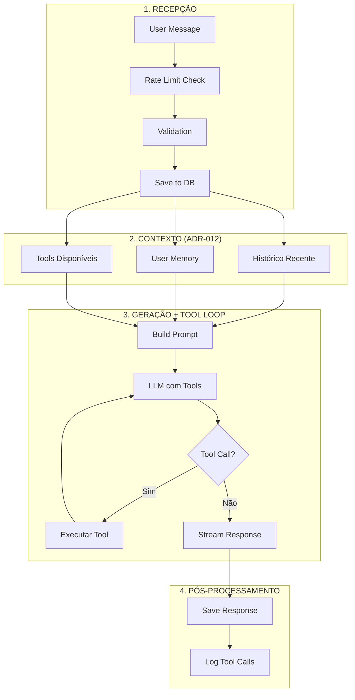

# Chat & Conversations

> Chat interface, conversation types, message handling, and AI interaction.

---

## 1. Overview

O módulo de Chat é a interface principal de interação com a IA:
- Conversação natural via texto
- Streaming de respostas
- Tool calls integradas
- Histórico persistido

### Features

| Feature | Descrição |
|---------|-----------|
| Chat natural | Conversa em linguagem natural com a IA |
| Memória de longo prazo | IA lembra de conversas passadas (via Memory) |
| Busca por tools | Busca via `search_knowledge` e filtros (sem embeddings) |
| Contexto automático | IA traz informações relevantes sem pedir |
| Histórico de conversas | Acesso a todas as conversas anteriores |
| Exportação de conversas | Download em .md ou .pdf |

> **ADR-012:** Sem embeddings. A busca ocorre por tools (ex: `search_knowledge`) e filtros.

---

## 2. Conversation Types

| Tipo | Descrição | Persistência |
|------|-----------|--------------|
| `general` | Chat livre | ✅ Sim |
| `counselor` | Modo conselheira (reflexão profunda) | ✅ Sim |
| `quick_action` | Ação rápida (ex: registrar peso) | ❌ Não |
| `report` | Discussão sobre relatório | ✅ Sim |

---

## 3. Data Model

### Conversation

```typescript
interface Conversation {
  id: string;
  userId: string;
  type: ConversationType;
  title?: string;
  metadata?: Record<string, unknown>;
  deletedAt?: Date;
  createdAt: Date;
  updatedAt: Date;
}
```

### Message

```typescript
interface Message {
  id: string;
  conversationId: string;
  role: 'user' | 'assistant' | 'system';
  content: string;
  metadata?: {
    toolCalls?: ToolCall[];
    tokens?: number;
    latency?: number;
  };
  createdAt: Date;
}
```

---

## 4. Message Flow



---

## 5. Rate Limiting

| Plano | Msg/minuto | Msg/hora | Msg/dia |
|-------|------------|----------|---------|
| Free | 5 | 30 | 20 |
| Pro | 10 | 100 | 100 |
| Premium | 20 | Ilimitado | Ilimitado |

**Ao atingir limite:**
- Resposta amigável informando
- Cooldown de 1 minuto
- Sugestão de upgrade

---

## 6. Response Rendering

Respostas são renderizadas com Markdown usando `streamdown`:

| Elemento | Renderização |
|----------|--------------|
| `**bold**` | Texto em negrito |
| `*italic*` | Texto em itálico |
| `> quote` | Blockquote |
| `- item` | Lista não ordenada |
| `` `code` `` | Inline code |
| ` ```code``` ` | Code block |

**Durante streaming:**
- Markdown incompleto é auto-completado
- Cursor pulsante indica progresso
- Auto-scroll a cada 50 caracteres

---

## 7. Tool Loop

- Máximo 5 iterações de tool calls
- Cada tool call é logada para auditoria
- Tools com `requiresConfirmation` aguardam resposta do usuário

---

## 8. Context Building

Para cada mensagem, o contexto inclui:

1. **User Memory** (~500-800 tokens) — Sempre presente
2. **Histórico recente** — Últimas N mensagens da conversa
3. **Tools disponíveis** — Lista de tools que podem ser usadas
4. **Contexto adicional** — Data/hora, timezone, Life Balance Score

---

## 9. Related Documents

- [ai-personality.md](../core/ai-personality.md) — Persona da IA, system prompt, Tool Use
- [memory.md](memory.md) — Knowledge Items usados no contexto
- [ux-states.md](../core/ux-states.md) — Loading/error states, streaming behavior

---

## 10. Definition of Done

- [ ] Enviar mensagem e receber resposta
- [ ] Streaming de resposta funcionando
- [ ] Histórico de conversa mantido
- [ ] User Memory presente no contexto
- [ ] Tool calls executando corretamente
- [ ] Rate limit aplicado
- [ ] Diferentes tipos de conversa funcionando
- [ ] Markdown renderizando corretamente

---

*Última atualização: 26 Janeiro 2026*
