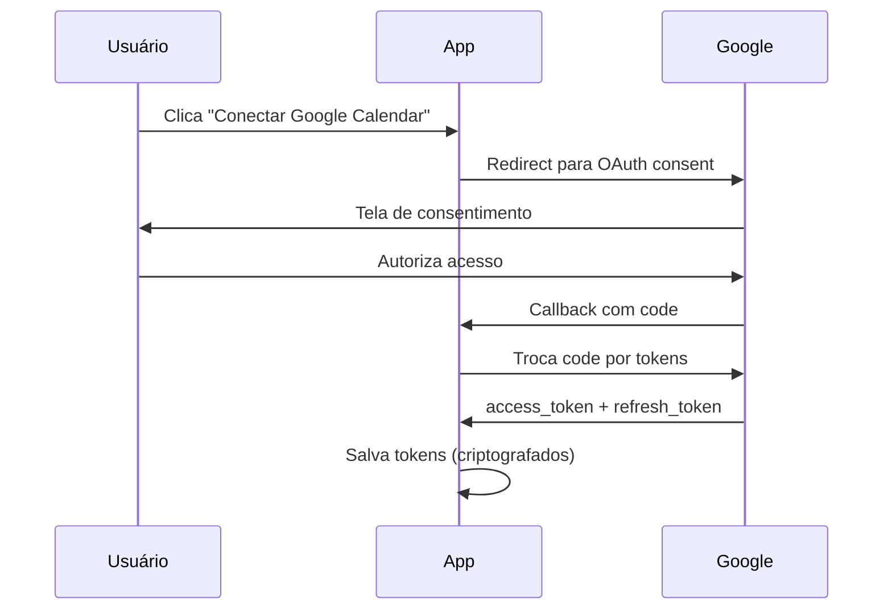

# Google Calendar Integration

> Event synchronization from Google Calendar.

---

## Overview

| Aspecto | Valor |
|---------|-------|
| **Propósito** | Sincronizar eventos do calendário |
| **Direção** | Google → App (somente leitura) |
| **API** | Google Calendar API v3 |
| **Escopo** | `calendar.readonly` |

---

## OAuth Flow



---

## Sync Configuration

| Configuração | Valor |
|--------------|-------|
| Frequência | A cada 15 minutos |
| Horizonte | Próximos 30 dias |
| Calendários | Todos selecionados pelo usuário |

---

## Event Structure

```typescript
interface CalendarEvent {
  id: string;
  title: string;
  description?: string;
  start: Date;
  end: Date;
  location?: string;
  isAllDay: boolean;
  calendarId: string;
  calendarName: string;
}
```

---

## Usage

- Morning summary inclui eventos do dia
- IA considera agenda em sugestões
- Conflitos detectados e alertados

---

## Token Refresh

Tokens são automaticamente renovados quando expirados:

```typescript
if (credentials.expiry_date < Date.now()) {
  const newTokens = await oauth2Client.refreshAccessToken();
  await saveTokens(userId, newTokens);
}
```

---

## Configuration

```typescript
export const googleConfig = {
  clientId: process.env.GOOGLE_CLIENT_ID!,
  clientSecret: process.env.GOOGLE_CLIENT_SECRET!,
  redirectUri: process.env.GOOGLE_REDIRECT_URI!,
  scopes: [
    'https://www.googleapis.com/auth/calendar.readonly',
    'https://www.googleapis.com/auth/calendar.events.readonly',
  ],
};
```

---

## Sync Job

```typescript
interface CalendarSyncJob {
  userId: string;
  integrationId: string;
}

async function processCalendarSync(job: Job<CalendarSyncJob>): Promise<void> {
  const { userId, integrationId } = job.data;

  const integration = await findIntegrationById(integrationId);
  if (!integration?.isActive) return;

  try {
    // Refresh token se necessário
    const accessToken = await calendarService.refreshTokenIfNeeded(integration);

    // Buscar calendários selecionados
    const settings = integration.settings as CalendarSettings;
    const calendarIds = settings.selectedCalendars || ['primary'];

    // Buscar próximos 30 dias
    const timeMin = new Date();
    const timeMax = new Date();
    timeMax.setDate(timeMax.getDate() + 30);

    const events = await withCalendarRetry(() =>
      calendarService.getEvents(accessToken, calendarIds, timeMin, timeMax)
    );

    // Salvar/atualizar eventos localmente
    await syncEventsToDatabase(userId, events);

    // Atualizar last_sync
    await updateIntegrationLastSync(integrationId);

  } catch (error) {
    // Se token revogado, desativar integração
    if (error.code === 401) {
      await deactivateIntegration(integrationId, 'Token revoked');
    }
    throw error;
  }
}

// Agendar sync a cada 15 minutos
async function scheduleCalendarSync(userId: string, integrationId: string): Promise<void> {
  const jobId = `calendar-sync:${userId}`;

  await calendarSyncQueue.add(
    { userId, integrationId },
    {
      jobId,
      repeat: { every: 15 * 60 * 1000 },
    }
  );
}
```

---

## Rate Limiting & Backoff

> **Google Calendar API Limits:** 10.000 queries/dia por projeto.

### Backoff Strategy

```typescript
const CALENDAR_RETRY_CONFIG = {
  maxRetries: 5,
  initialDelayMs: 1000,   // 1 segundo
  maxDelayMs: 30000,      // 30 segundos
  backoffFactor: 2,       // Exponencial: 1s, 2s, 4s, 8s, 16s, 30s
  retryableCodes: [429, 500, 503],
};

async function withCalendarRetry<T>(fn: () => Promise<T>): Promise<T> {
  let delay = CALENDAR_RETRY_CONFIG.initialDelayMs;

  for (let attempt = 1; attempt <= CALENDAR_RETRY_CONFIG.maxRetries; attempt++) {
    try {
      return await fn();
    } catch (error) {
      const isRetryable = CALENDAR_RETRY_CONFIG.retryableCodes.includes(error.code);

      if (!isRetryable || attempt === CALENDAR_RETRY_CONFIG.maxRetries) {
        throw error;
      }

      // Check Retry-After header if present
      const retryAfter = error.response?.headers?.['retry-after'];
      const waitTime = retryAfter ? parseInt(retryAfter) * 1000 : delay;

      console.log(`Calendar API rate limited. Retry ${attempt}/${CALENDAR_RETRY_CONFIG.maxRetries} after ${waitTime}ms`);
      await sleep(waitTime);

      delay = Math.min(delay * CALENDAR_RETRY_CONFIG.backoffFactor, CALENDAR_RETRY_CONFIG.maxDelayMs);
    }
  }

  throw new Error('Max retries exceeded');
}
```

### Staggering de Syncs

Para evitar picos de carga, os syncs são distribuídos uniformemente:

```typescript
const SYNC_INTERVAL_MS = 15 * 60 * 1000; // 15 minutos

async function scheduleAllCalendarSyncs(): Promise<void> {
  const integrations = await getActiveCalendarIntegrations();
  const totalIntegrations = integrations.length;

  // Distribuir syncs uniformemente no intervalo
  const delayBetweenSyncs = SYNC_INTERVAL_MS / Math.max(totalIntegrations, 1);

  for (let i = 0; i < integrations.length; i++) {
    const integration = integrations[i];
    const startDelay = i * delayBetweenSyncs;

    // Adicionar jitter (±10%) para evitar sincronização exata
    const jitter = (Math.random() - 0.5) * 0.2 * delayBetweenSyncs;
    const finalDelay = Math.max(0, startDelay + jitter);

    await calendarSyncQueue.add(
      { userId: integration.userId, integrationId: integration.id },
      {
        jobId: `calendar-sync:${integration.userId}`,
        delay: finalDelay,
        repeat: { every: SYNC_INTERVAL_MS },
      }
    );
  }
}
```

---

## Quota Monitoring

```typescript
const DAILY_QUOTA = 10000;

interface QuotaUsage {
  dailyQueries: number;
  lastReset: Date;
  warningThreshold: number; // 80%
  criticalThreshold: number; // 95%
}

async function checkQuotaUsage(): Promise<QuotaUsage> {
  const usage = await redis.get('calendar:quota:usage');
  const lastReset = await redis.get('calendar:quota:lastReset');

  // Reset diário
  const today = new Date().toDateString();
  if (lastReset !== today) {
    await redis.set('calendar:quota:usage', 0);
    await redis.set('calendar:quota:lastReset', today);
    return { dailyQueries: 0, lastReset: new Date(), warningThreshold: 8000, criticalThreshold: 9500 };
  }

  return {
    dailyQueries: parseInt(usage || '0'),
    lastReset: new Date(lastReset),
    warningThreshold: DAILY_QUOTA * 0.8,
    criticalThreshold: DAILY_QUOTA * 0.95,
  };
}

async function incrementQuota(): Promise<void> {
  await redis.incr('calendar:quota:usage');

  const usage = await checkQuotaUsage();

  if (usage.dailyQueries >= usage.criticalThreshold) {
    console.error('Calendar API quota critical! Pausing syncs.');
    await pauseAllCalendarSyncs();
  } else if (usage.dailyQueries >= usage.warningThreshold) {
    console.warn('Calendar API quota warning: ' + usage.dailyQueries + '/' + DAILY_QUOTA);
  }
}
```

---

## Definition of Done

- [ ] OAuth flow completo funciona
- [ ] Tokens são salvos criptografados
- [ ] Refresh token funciona automaticamente
- [ ] Sync periódico a cada 15 minutos
- [ ] Staggering de syncs implementado
- [ ] Backoff exponencial para rate limits
- [ ] Quota monitoring com alertas
- [ ] Eventos aparecem no morning summary
- [ ] IA tem contexto dos eventos do dia
- [ ] Usuário pode desconectar
- [ ] Token revogado desativa integração

---

## Future: Bidirectional Sync (M3+)

> **Status:** Planejado para milestones futuros. Implementação atual é read-only.

### Objetivo

Permitir criar/editar eventos no Google Calendar a partir do Life Assistant.

### Scopes Adicionais Necessários

```typescript
scopes: [
  'https://www.googleapis.com/auth/calendar.readonly',      // Atual
  'https://www.googleapis.com/auth/calendar.events',        // Futuro: criar/editar
]
```

### Features Planejadas

| Feature | Descrição |
|---------|-----------|
| Criar evento | Comando natural: "Marca reunião quarta 15h" |
| Editar evento | Alterar título, horário, descrição |
| Cancelar evento | Remover do calendário |
| Convidar pessoas | Adicionar participantes |

### Considerações

- Requer re-autorização dos usuários existentes (novo scope)
- Conflitos de sync: priorizar Google Calendar como source of truth
- Rate limits mais restritivos para write operations

---

*Última atualização: 26 Janeiro 2026*
