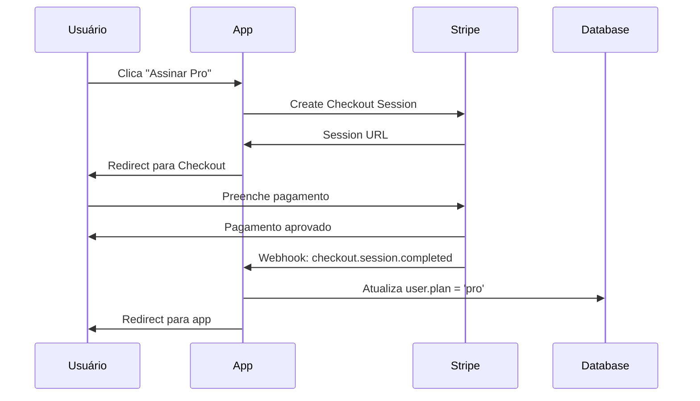

# Stripe Integration

> Payment processing and subscription management.

---

## Overview

| Aspecto | Valor |
|---------|-------|
| **Propósito** | Pagamentos e assinaturas |
| **API** | Stripe API (mais recente) |
| **Modelo** | Subscription (mensal/anual) |
| **Status** | 🟡 Em desenvolvimento |

---

## Plans

| Plano | Preço | Features |
|-------|-------|----------|
| Free | R$ 0 | 100 msg/mês, 30 dias histórico, 3 áreas |
| Pro | R$ 29,90/mês | Ilimitado, 1 ano histórico, todas áreas |
| Premium | R$ 49,90/mês | Ilimitado, histórico ilimitado, modelo premium |

---

## Products & Prices

| Plano | Stripe Product ID | Stripe Price IDs |
|-------|-------------------|------------------|
| **Free** | - | - |
| **Pro** | `prod_pro` | `price_pro_monthly` / `price_pro_yearly` |
| **Premium** | `prod_premium` | `price_premium_monthly` / `price_premium_yearly` |

> **Nota:** IDs são placeholders. Substituir pelos IDs reais ao criar produtos no Stripe Dashboard.

---

## Subscription Lifecycle

```
trial → active → past_due → canceled
                     ↓
                 suspended
```

---

## Webhooks

| Evento | Ação |
|--------|------|
| `checkout.session.completed` | Ativar assinatura |
| `invoice.paid` | Renovar assinatura |
| `invoice.payment_failed` | Marcar past_due |
| `customer.subscription.deleted` | Cancelar assinatura |

---

## Webhook Handler

```typescript
router.post('/webhook', async (req, res) => {
  const sig = req.headers['stripe-signature'];
  const event = stripe.webhooks.constructEvent(
    req.body,
    sig,
    process.env.STRIPE_WEBHOOK_SECRET
  );

  switch (event.type) {
    case 'checkout.session.completed':
      await handleCheckoutComplete(event.data.object);
      break;
    case 'invoice.paid':
      await handleInvoicePaid(event.data.object);
      break;
    // ...
  }

  res.json({ received: true });
});
```

---

## Configuration

```bash
STRIPE_SECRET_KEY=sk_live_xxx
STRIPE_WEBHOOK_SECRET=whsec_xxx
```

---

## Subscription Flow



---

## Stripe Service

```typescript
class StripeService {
  // Criar ou buscar customer
  async getOrCreateCustomer(user: User): Promise<string> {
    if (user.stripeCustomerId) {
      return user.stripeCustomerId;
    }

    const customer = await stripe.customers.create({
      email: user.email,
      name: user.name,
      metadata: { userId: user.id },
    });

    await updateUser(user.id, { stripeCustomerId: customer.id });
    return customer.id;
  }

  // Criar sessão de checkout
  async createCheckoutSession(
    userId: string,
    priceId: string,
    interval: 'monthly' | 'yearly'
  ): Promise<string> {
    const user = await findUserById(userId);
    const customerId = await this.getOrCreateCustomer(user);

    const session = await stripe.checkout.sessions.create({
      customer: customerId,
      mode: 'subscription',
      payment_method_types: ['card'],
      line_items: [{ price: priceId, quantity: 1 }],
      success_url: `${APP_URL}/settings/billing?success=true`,
      cancel_url: `${APP_URL}/settings/billing?canceled=true`,
      metadata: { userId, interval },
      subscription_data: { metadata: { userId } },
      allow_promotion_codes: true,
    });

    return session.url!;
  }

  // Criar portal de billing
  async createPortalSession(userId: string): Promise<string> {
    const user = await findUserById(userId);

    if (!user.stripeCustomerId) {
      throw new Error('User has no Stripe customer');
    }

    const session = await stripe.billingPortal.sessions.create({
      customer: user.stripeCustomerId,
      return_url: `${APP_URL}/settings/billing`,
    });

    return session.url;
  }

  // Cancelar assinatura
  async cancelSubscription(subscriptionId: string): Promise<void> {
    await stripe.subscriptions.update(subscriptionId, {
      cancel_at_period_end: true,
    });
  }
}
```

---

## Webhook Events

| Evento | Ação |
|--------|------|
| `checkout.session.completed` | Ativar assinatura, atualizar plano |
| `customer.subscription.updated` | Atualizar período, status |
| `customer.subscription.deleted` | Downgrade para free |
| `invoice.paid` | Renovar assinatura |
| `invoice.payment_failed` | Notificar usuário, marcar past_due |

### Handler Implementation

```typescript
async function handleStripeEvent(event: Stripe.Event): Promise<void> {
  switch (event.type) {
    case 'checkout.session.completed':
      await handleCheckoutCompleted(event.data.object);
      break;

    case 'customer.subscription.updated':
      await handleSubscriptionUpdated(event.data.object);
      break;

    case 'customer.subscription.deleted':
      await handleSubscriptionDeleted(event.data.object);
      break;

    case 'invoice.payment_failed':
      await handlePaymentFailed(event.data.object);
      break;
  }
}

async function handleCheckoutCompleted(session: Stripe.Checkout.Session): Promise<void> {
  const userId = session.metadata?.userId;
  if (!userId) return;

  const subscription = await stripe.subscriptions.retrieve(session.subscription as string);
  const priceId = subscription.items.data[0].price.id;

  let plan: UserPlan = 'free';
  if (priceId.includes('pro')) plan = 'pro';
  if (priceId.includes('premium')) plan = 'premium';

  await updateUser(userId, {
    plan,
    planExpiresAt: new Date(subscription.current_period_end * 1000),
  });

  await createAuditLog({
    userId,
    action: 'subscription.created',
    resource: 'user',
    resourceId: userId,
    metadata: { plan, subscriptionId: subscription.id },
  });
}

async function handleSubscriptionDeleted(subscription: Stripe.Subscription): Promise<void> {
  const userId = subscription.metadata?.userId;
  if (!userId) return;

  await updateUser(userId, { plan: 'free', planExpiresAt: null });

  await createAuditLog({
    userId,
    action: 'subscription.canceled',
    resource: 'user',
    resourceId: userId,
  });
}

async function handlePaymentFailed(invoice: Stripe.Invoice): Promise<void> {
  const customerId = invoice.customer as string;
  const user = await findUserByStripeCustomerId(customerId);

  if (!user) return;

  await sendNotification({
    userId: user.id,
    type: 'alert',
    title: 'Falha no pagamento',
    body: 'Não conseguimos processar seu pagamento. Atualize seus dados.',
  });
}
```

---

## Idempotency

```typescript
// Usar event_id para garantir processamento único
async function handleStripeEvent(event: Stripe.Event): Promise<void> {
  // Verificar se evento já foi processado
  const processed = await redis.get(`stripe:event:${event.id}`);
  if (processed) {
    console.log(`Event ${event.id} already processed, skipping`);
    return;
  }

  // Processar evento
  await processEvent(event);

  // Marcar como processado (TTL de 7 dias)
  await redis.set(`stripe:event:${event.id}`, '1', 'EX', 7 * 24 * 60 * 60);
}
```

---

## Stripe CLI (Development)

```bash
# 1. Instalar Stripe CLI
brew install stripe/stripe-cli/stripe

# 2. Login no Stripe
stripe login

# 3. Forward webhooks para servidor local
stripe listen --forward-to localhost:3001/api/stripe/webhook

# Output: Ready! Your webhook signing secret is whsec_xxx
# Usar esse secret no .env.local
```

---

## Retry Behavior

O Stripe faz retry automático de webhooks que falham:
- Primeira tentativa: imediata
- Retries: até 3 dias com backoff exponencial
- Total: ~15 tentativas

```typescript
// Sempre retornar 200 para evitar retries desnecessários
router.post('/webhook', async (req, res) => {
  try {
    await handleStripeEvent(event);
    res.json({ received: true });
  } catch (err) {
    console.error('Webhook error:', err);
    // Retorna 200 para erros de lógica (não retriable)
    // Retorna 500 apenas para erros de sistema
    if (err.isRetryable) {
      res.status(500).json({ error: err.message });
    } else {
      res.json({ received: true, error: err.message });
    }
  }
});
```

---

## Definition of Done

- [ ] Produtos e preços criados no Stripe Dashboard
- [ ] Checkout session cria assinatura
- [ ] Webhook atualiza plano do usuário
- [ ] Idempotência implementada (event_id)
- [ ] Portal de billing funciona
- [ ] Upgrade/downgrade funciona
- [ ] Cancelamento funciona (no fim do período)
- [ ] Falha de pagamento notifica usuário
- [ ] Downgrade para free ao cancelar
- [ ] Cupons de desconto funcionam
- [ ] Dunning emails configurados no Stripe
- [ ] Stripe CLI para teste local

---

*Última atualização: 26 Janeiro 2026*
