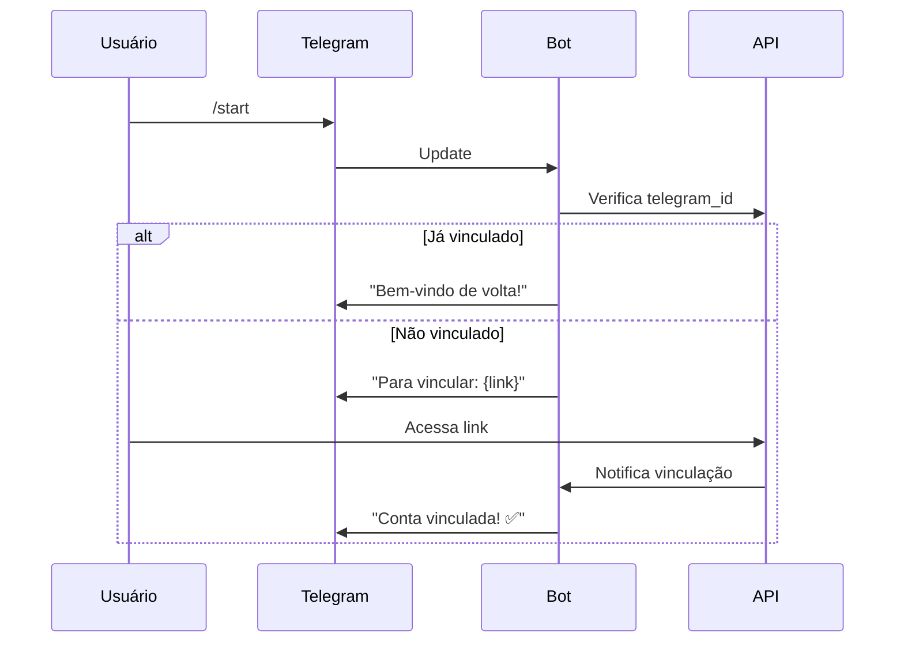

# Telegram Bot Integration

> Chat interface via Telegram Bot API.

---

## Overview

| Aspecto | Valor |
|---------|-------|
| **Propósito** | Interface de chat via Telegram |
| **Tipo** | Bot API (webhook em prod, polling em dev) |
| **API Version** | Bot API (mais recente) |

---

## Commands

| Comando | Descrição | Exemplo |
|---------|-----------|---------|
| `/start` | Iniciar/vincular bot | `/start` |
| `/help` | Lista de comandos | `/help` |
| `/peso <valor>` | Registrar peso | `/peso 82.5` |
| `/agua <valor>` | Registrar água (ml) | `/agua 500` |
| `/gasto <valor> <desc>` | Registrar gasto | `/gasto 50 mercado` |
| `/humor <1-10>` | Registrar humor | `/humor 7` |
| `/sono <horas>` | Registrar sono | `/sono 7.5` |
| `/exercicio <min>` | Registrar exercicio | `/exercicio 30` |
| `/nota <texto>` | Criar nota rápida | `/nota Ideia` |
| `/score` | Ver Life Balance Score | `/score` |
| `/resumo` | Resumo do dia | `/resumo` |
| `/config` | Configuracoes | `/config` |
| `/desvincular` | Desvincular conta | `/desvincular` |

---

## Message Processing

| Tipo | Comportamento |
|------|---------------|
| Texto livre | Conversa com IA |
| Áudio (voz) | Transcrição + processamento |
| Imagem | Análise pela IA (vision) |
| Documento | Salvo no vault ou notas |

---

## Linking Flow



---

## Notifications

| Tipo | Formato |
|------|---------|
| Morning Summary | Eventos do dia + lembretes |
| Weekly Report | Score + destaques |
| Alerts | Contas a vencer, aniversários |

Quiet hours são respeitados (default: 22h-08h).

---

## Bot Blocked Handling

Quando usuário bloqueia o bot:
1. Erro 403 detectado
2. Integração desativada automaticamente
3. Jobs cancelados
4. Notificação enviada no app web
5. Usuário pode reconectar após desbloquear

---

## Configuration

```typescript
export const telegramConfig = {
  botToken: process.env.TELEGRAM_BOT_TOKEN!,
  webhookUrl: process.env.TELEGRAM_WEBHOOK_URL,
  webhookSecret: process.env.TELEGRAM_WEBHOOK_SECRET,
  mode: process.env.NODE_ENV === 'production' ? 'webhook' : 'polling',
  maxMessagesPerSecond: 30,
  maxMessagesPerMinutePerChat: 20,
};
```

---

## Message Templates

### Morning Summary

```typescript
function formatMorningSummary(data: MorningSummaryData): string {
  return `
☀️ <b>Bom dia, ${data.userName}!</b>

📊 <b>Ontem</b>
${data.weight ? `• Peso: ${data.weight}kg` : ''}
${data.water ? `• Água: ${data.water}ml` : ''}
${data.exercise ? `• Exercício: ${data.exercise}min` : ''}
${data.mood ? `• Humor: ${data.mood}/10` : ''}

📅 <b>Hoje</b>
${data.events.length ? data.events.map(e => `• ${e.time} - ${e.title}`).join('\n') : '• Nenhum evento'}

${data.birthdays.length ? `🎂 <b>Aniversários</b>\n${data.birthdays.map(b => `• ${b.name}`).join('\n')}` : ''}

💪 <b>Life Balance</b>: ${data.score}/10 ${data.scoreTrend}

${data.suggestion ? `💡 ${data.suggestion}` : ''}
`.trim();
}
```

### Weekly Report

```typescript
function formatWeeklyReport(data: WeeklyReportData): string {
  return `
📊 <b>Relatório Semanal</b>
${data.startDate} a ${data.endDate}

🎯 <b>Life Balance Score</b>
${data.score}/10 (${data.scoreChange >= 0 ? '↑' : '↓'}${Math.abs(data.scoreChange)})

📈 <b>Por Área</b>
${data.areas.map(a => `• ${a.emoji} ${a.name}: ${a.score}/10 ${a.trend}`).join('\n')}

✅ <b>Destaques</b>
${data.highlights.map(h => `• ${h}`).join('\n')}

${data.alerts.length ? `⚠️ <b>Atenção</b>\n${data.alerts.map(a => `• ${a}`).join('\n')}` : ''}

💡 <b>Sugestão</b>
${data.suggestion}
`.trim();
}
```

---

## Webhook Setup

```typescript
// POST /api/telegram/webhook
router.post('/webhook', async (req, res) => {
  // Verificar secret token
  const secretToken = req.headers['x-telegram-bot-api-secret-token'];

  if (secretToken !== telegramConfig.webhookSecret) {
    return res.status(401).json({ error: 'Invalid secret token' });
  }

  try {
    await handleUpdate(req.body);
    res.status(200).json({ ok: true });
  } catch (error) {
    console.error('Telegram webhook error:', error);
    res.status(200).json({ ok: true }); // Sempre retornar 200 para não re-enviar
  }
});

// Setup webhook (chamado no deploy)
async function setupWebhook(): Promise<void> {
  const webhookUrl = `${telegramConfig.webhookUrl}/api/telegram/webhook`;

  await telegram.setWebhook({
    url: webhookUrl,
    secret_token: telegramConfig.webhookSecret,
    allowed_updates: ['message', 'callback_query'],
    drop_pending_updates: true,
  });
}
```

---

## Command Handlers

```typescript
async function handleTextMessage(userId: string, message: TelegramMessage): Promise<void> {
  const text = message.text!;

  // Verificar se é comando
  if (text.startsWith('/')) {
    const [command, ...args] = text.slice(1).split(' ');
    await handleCommand(userId, message.chat.id, command, args);
    return;
  }

  // Mensagem livre = conversa com IA
  const response = await chatService.sendMessage({
    userId,
    content: text,
    source: 'telegram',
    metadata: {
      telegramChatId: message.chat.id,
      telegramMessageId: message.message_id,
    },
  });

  // Enviar resposta
  await sendTelegramMessage(message.chat.id, response.content, {
    reply_to_message_id: message.message_id,
  });
}
```

### Voice Handler

```typescript
async function handleVoiceMessage(userId: string, message: TelegramMessage): Promise<void> {
  const voice = message.voice!;

  // Limite de 60 segundos
  if (voice.duration > 60) {
    await sendTelegramMessage(message.chat.id,
      "⚠️ Áudio muito longo. Limite: 60 segundos."
    );
    return;
  }

  // Download do arquivo
  const file = await telegram.getFile(voice.file_id);
  const audioBuffer = await downloadFile(file.file_path);

  // Transcrever
  const transcription = await transcribeAudio(audioBuffer);

  // Confirmar transcrição
  await sendTelegramMessage(message.chat.id,
    `🎤 Entendi: "${transcription}"\n\nProcessando...`
  );

  // Processar como texto
  await handleTextMessage(userId, { ...message, text: transcription });
}
```

### Image Handler

```typescript
async function handlePhotoMessage(userId: string, message: TelegramMessage): Promise<void> {
  const photo = message.photo!;

  // Pegar maior resolução
  const bestPhoto = photo[photo.length - 1];

  // Download
  const file = await telegram.getFile(bestPhoto.file_id);
  const imageBuffer = await downloadFile(file.file_path);

  // Analisar com IA (vision)
  const analysis = await analyzeImage(userId, imageBuffer, message.caption);

  // Responder
  await sendTelegramMessage(message.chat.id, analysis, {
    reply_to_message_id: message.message_id,
  });
}
```

### Document Handler

```typescript
async function handleDocumentMessage(userId: string, message: TelegramMessage): Promise<void> {
  const document = message.document!;

  // Download
  const file = await telegram.getFile(document.file_id);
  const fileBuffer = await downloadFile(file.file_path);

  // Salvar no vault (R2) com metadata básica
  const vaultItem = await vaultService.storeFromBuffer({
    userId,
    filename: document.file_name ?? 'documento',
    mimeType: document.mime_type,
    sizeBytes: document.file_size,
    buffer: fileBuffer,
    source: 'telegram',
    caption: message.caption,
  });

  await sendTelegramMessage(
    message.chat.id,
    `📎 Documento salvo no vault: ${vaultItem.title ?? vaultItem.id}`,
    { reply_to_message_id: message.message_id }
  );
}
```

---

## Error Handling

### Bot Blocked Detection

```typescript
async function sendTelegramMessage(
  chatId: number,
  text: string,
  options?: SendMessageOptions
): Promise<TelegramMessage> {
  try {
    return await telegram.sendMessage({ chat_id: chatId, text, ...options });
  } catch (error) {
    // Erro 403 = bot bloqueado pelo usuário
    if (error.response?.error_code === 403) {
      await handleBotBlocked(chatId, error.response?.description);
      throw new BotBlockedError(chatId);
    }
    throw error;
  }
}
```

### Automatic Deactivation

```typescript
async function handleBotBlocked(chatId: number, reason: string): Promise<void> {
  const integration = await findIntegrationByTelegramId(chatId);
  if (!integration) return;

  // Desativar integração automaticamente
  await db.update(userIntegrations)
    .set({
      isActive: false,
      deactivatedAt: new Date(),
      deactivationReason: `Bot blocked: ${reason}`,
    })
    .where(eq(userIntegrations.id, integration.id));

  // Cancelar jobs agendados
  await cancelTelegramJobs(integration.userId);

  // Notificar usuário no app web
  await createNotification({
    userId: integration.userId,
    type: 'warning',
    title: 'Telegram desconectado',
    body: 'O bot foi bloqueado. Reconecte nas configurações.',
    channel: 'web',
  });
}
```

### Reactivation

```typescript
async function reactivateTelegramIntegration(userId: string): Promise<ReactivationResult> {
  const integration = await findTelegramIntegration(userId);
  if (!integration) return { success: false, error: 'Integration not found' };

  // Rate limit: 1 tentativa por hora
  const lastAttempt = await redis.get(`telegram:reactivate:${userId}`);
  if (lastAttempt) {
    const timeRemaining = 60 * 60 * 1000 - (Date.now() - parseInt(lastAttempt));
    if (timeRemaining > 0) {
      return { success: false, error: 'Rate limited', retryAfter: Math.ceil(timeRemaining / 60000) };
    }
  }

  await redis.set(`telegram:reactivate:${userId}`, Date.now().toString(), 'EX', 3600);

  try {
    await telegram.sendMessage({
      chat_id: integration.externalId,
      text: '✅ Telegram reconectado com sucesso!',
    });

    await db.update(userIntegrations)
      .set({ isActive: true, deactivatedAt: null, deactivationReason: null })
      .where(eq(userIntegrations.id, integration.id));

    await scheduleTelegramJobs(userId);
    return { success: true };
  } catch (error) {
    if (error.response?.error_code === 403) {
      return { success: false, error: 'Bot still blocked. Unblock first.' };
    }
    throw error;
  }
}
```

---

## Definition of Done

- [ ] Bot responde a `/start` com instruções de vinculação
- [ ] Vinculação via link funciona
- [ ] Todos os comandos funcionam corretamente
- [ ] Mensagens de texto livre conversam com IA
- [ ] Áudio é transcrito e processado (limite 60s)
- [ ] Imagens são analisadas
- [ ] Morning summary enviado no horário correto
- [ ] Weekly report enviado domingo à noite
- [ ] Quiet hours respeitado (default: 22h-08h)
- [ ] Desvinculação funciona
- [ ] Bot bloqueado = integração desativada automaticamente
- [ ] Usuário recebe notificação no app web quando bot é bloqueado
- [ ] Reativação manual funciona após desbloquear bot
- [ ] Rate limit de 1 tentativa/hora para reativação
- [ ] Webhook com verificação de secret token

---

*Última atualização: 27 Janeiro 2026*
